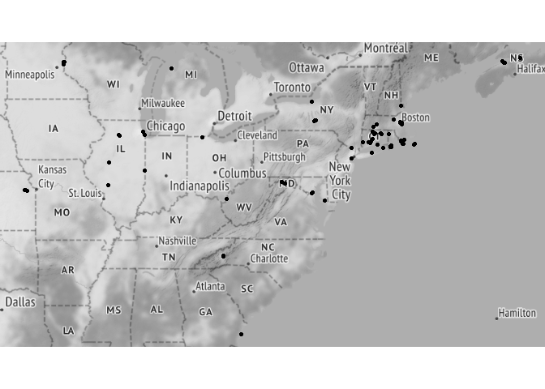
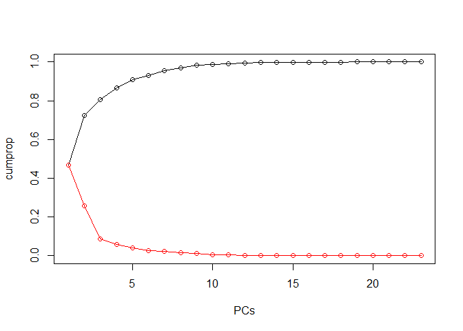
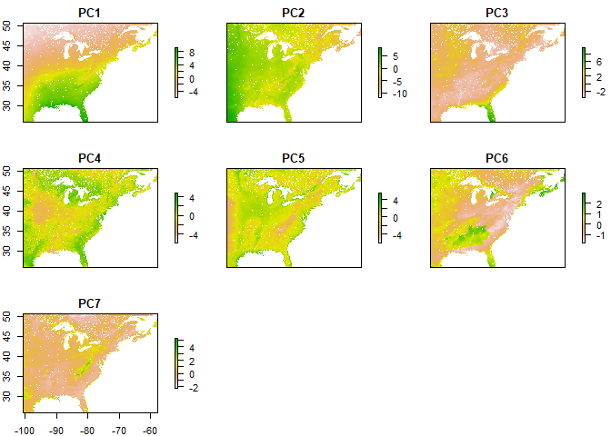
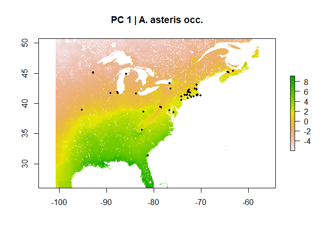
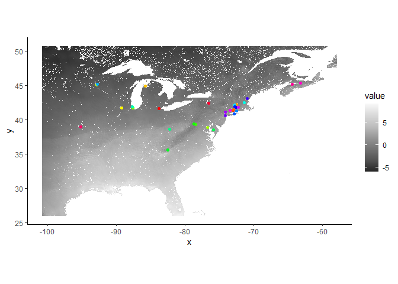
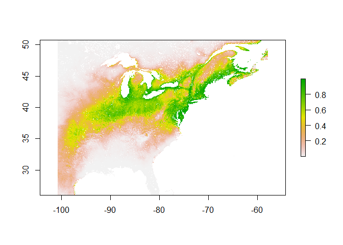
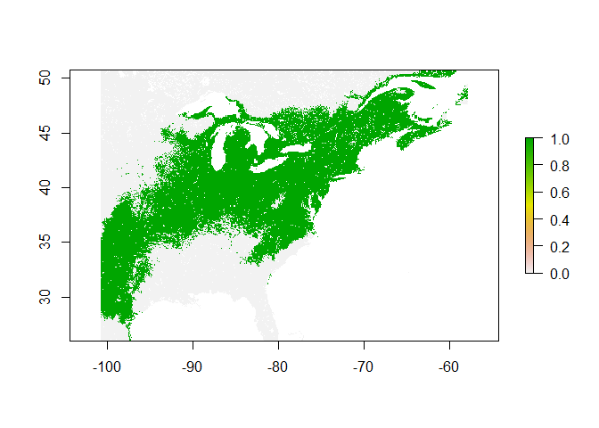
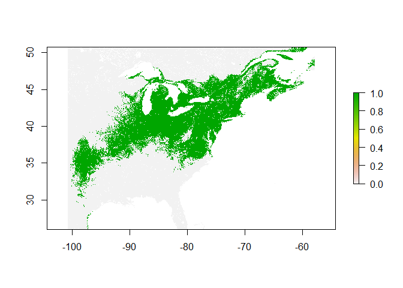
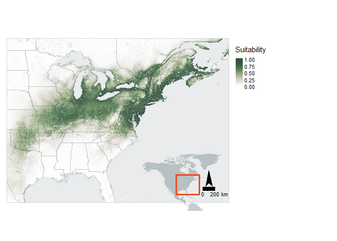

Andrena asteris
================
Mark Buckner
2022-03-07

-   [Load Pkgs and functions](#load-pkgs-and-functions)
    -   [Pkgs](#pkgs)
    -   [Functions](#functions)
-   [Load and process occ Data](#load-and-process-occ-data)
    -   [Load and filter by date](#load-and-filter-by-date)
    -   [Check for georeferencing
        errors](#check-for-georeferencing-errors)
    -   [Spatial Thinning w/ spThin](#spatial-thinning-w-spthin)
-   [Environmental Covariates](#environmental-covariates)
    -   [Define study area](#define-study-area)
    -   [Download and process env](#download-and-process-env)
    -   [PCA](#pca)
    -   [Extract env. and MESS](#extract-env-and-mess)
-   [SDM Model](#sdm-model)
    -   [Assign random background
        points](#assign-random-background-points)
    -   [Partition for Model
        Evaluation](#partition-for-model-evaluation)
    -   [Tune Model](#tune-model)
    -   [Model Selection](#model-selection)
-   [Predictions](#predictions)
    -   [Threshold](#threshold)
    -   [ENM Null](#enm-null)
-   [Visualize](#visualize)
-   [Session Info](#session-info)

## Load Pkgs and functions

Project directory structure:

Andrena_asteris_SDM -

 occ - occurrence datasets  
 pred - .txt/s containing URLs to environmental data  
 R - code

### Pkgs

``` r
if(!require(pacman)) install.packages("pacman")
library(pacman)

pacman::p_load(tidyverse, lubridate, ggmap, spThin, 
               CoordinateCleaner, curl, raster, sf, 
               RStoolbox, rgdal, ENMeval, rJava, rasterVis, tmap, 
               rnaturalearth, grid)

pacman::p_load_gh("SEEG-Oxford/seegSDM", "ropensci/rnaturalearthhires", "ropensci/rnaturalearthdata")
```

### Functions

``` r
#envLoad(): Downloads and processes environmental raster data from source. 
#--paths = urls for data sources read in from .txt file;
#--filedir = path to dir where the processed raw files are or will be stored.
#--ref = anticipated path of a reference .tif with the correct resolution and projection (eg. worldclim layer) in the paths .txt ["../pred/env/NAME.tif"]
#--bb = bounding box for study area (any object an extent can be extracted from)

envLoad <- function(paths, filedir, ref, bb, type = "cont") {
  
  savepaths <- sapply(paths, function (x) gsub("\\?.*", "", x))
  dest <- sapply(savepaths, function(x) paste(filedir,"/", gsub(".*/(\\w+)", "\\1", x), sep = "")) %>% 
    sort()
  names <- sapply(savepaths, function(x) paste( gsub(".*/(\\w+)", "\\1", x), sep = "")) %>% 
    sort() %>% 
    sapply(function(x) paste("../pred/env/",x, sep = ""))
  
  names <- str_replace(names, ".zip$", ".tif")
  
  for (i in 1:length(paths)) {
    if(file.exists(dest[i]) | file.exists(names[i])){
      if (file.exists(names[i])) {
        print(paste("File exists:",names[i]))
      } else {
        unproc_cont <- TRUE
        print(paste("File exists but is unprocessed:",dest[i]))
      }
      
    } else {
      
      print(paste("Downloading: ", paths[i]))
      
      unproc_cont <- TRUE
      
      file <- try(curl::curl_download(url = paths[i], destfile = dest[i]))
      
      if(class(file) == "try-error") {
        download.file(url = paths[i], destfile = dest[i], method = "curl")
      }
      
      if(grepl(".*zip", dest[i])) {
        unzip(dest[i], exdir = filedir)
        
      }
    }
  }
  
  if(!all(file.exists(names))) {
    print("Processing files")
    env.files <- list.files(filedir, recursive = TRUE, pattern = ".*tif$") %>% 
      sapply(function(x) paste(filedir, "/", x, sep = ""))
    
    r <- raster(ref) %>% 
      raster::crop(extent(bb)) %>% 
      projectRaster(crs = "+init=epsg:4326")
    
    method <- ifelse(type == "cont", "bilinear", "ngb")
    print(paste("Method:", method))
    
    env.stack <- lapply(env.files, raster) %>% 
      lapply(projectRaster, to = r, method = "ngb") %>% 
      stack()
    
    print("Saving stack")
    
    bylayer <- ifelse(nlayers(env.stack) > 1, TRUE, FALSE)
    writeRaster(env.stack, names, format = "GTiff", bylayer = bylayer, overwrite = TRUE)
    
  } else {
    print("Loading processed files")
    env.stack <- stack(names)
  }
  return(env.stack)
  
}
```

## Load and process occ Data

### Load and filter by date

``` r
gbif <- read_tsv("../occ/Aa_GBIF.txt")
scan <- read_csv("../occ/Aa_SCAN.csv")
amnh <- read_tsv("../occ/Aa_AMNH.txt")

t_scan <- scan %>% 
  dplyr::select(id, date = eventDate, lat = decimalLatitude, lon = decimalLongitude) %>% 
  drop_na() %>% 
  mutate(lat = round(lat,5), lon = round(lon,5)) %>%
  mutate(source = "SCAN")


t_gbif <- gbif %>% 
  dplyr::select(gbifID, eventDate, verbatimEventDate, lat = decimalLatitude, lon = decimalLongitude) %>% 
  separate(eventDate, c("date", NA), sep = " ") %>% 
  mutate(verbatimEventDate = ifelse(is.na(date), verbatimEventDate, NA)) %>% 
  unite(date, date, verbatimEventDate, na.rm = TRUE) %>% 
  mutate(date = parse_date_time(date, orders = c("mdy", "ymd", "dmy"))) %>% 
  drop_na() %>% 
  mutate(lat = round(lat,5), lon = round(lon,5)) %>%
  mutate(source = "GBIF")

t_amnh <- amnh %>% 
  mutate(date = parse_date_time(amnh$Start_Date, orders = c("mdy", "dmy"))) %>%
  filter(year(date) <= Det_Date) %>%    
  dplyr::select(PBIUSI, date, lat = Lat, lon = Lon) %>% 
  drop_na() %>% 
  mutate(lat = round(lat,5), lon = round(lon,5)) %>%
  mutate(source = "AMNH")

#Parsing errors for year only (old data) or "no date provided"

occ.joined <- full_join(t_scan, t_gbif, by = c("date", "lat", "lon")) %>% 
  full_join(t_amnh, by = c("date", "lat", "lon")) %>%
  filter(!duplicated(.[c("date", "lat", "lon")])) %>% 
  unite(data_source, source.x, source.y, source, sep = "/", na.rm = TRUE) %>% 
  dplyr::select(date, lat, lon, data_source, scanID = id, gbifID, PBIUSI)

date_start <- as.Date("1981-01-01")
date_end <- as.Date("2010-12-31")

occ <- occ.joined %>% 
  filter(date >= date_start & date <= date_end) %>%
  mutate(lat = floor(lat*10000)/10000, lon = floor(lon*10000)/10000) %>% 
  distinct(lat, lon, .keep_all = TRUE) %>% 
  mutate("spp" = "Aasteris")

qmplot(x = lon, y = lat, data = occ, maptype = "toner-lite", mapcolor = "bw", source = "stamen", force = T)
```

<!-- -->

### Check for georeferencing errors

``` r
flags <- clean_coordinates(x = occ, lon = "lon", 
                           lat = "lat", species = "spp",
                           tests = c("capitals", "centroids", 
                                     "equal", "gbif", "institutions", 
                                     "outliers", "seas", "zeros"))
```

    ## Testing coordinate validity

    ## Flagged 0 records.

    ## Testing equal lat/lon

    ## Flagged 0 records.

    ## Testing zero coordinates

    ## Flagged 0 records.

    ## Testing country capitals

    ## Flagged 0 records.

    ## Testing country centroids

    ## Flagged 0 records.

    ## Testing sea coordinates

    ## OGR data source with driver: ESRI Shapefile 
    ## Source: "C:\Users\mabuc\AppData\Local\Temp\RtmpobE5ST", layer: "ne_50m_land"
    ## with 1420 features
    ## It has 3 fields
    ## Integer64 fields read as strings:  scalerank

    ## Flagged 17 records.

    ## Testing geographic outliers

    ## Flagged 0 records.

    ## Testing GBIF headquarters, flagging records around Copenhagen

    ## Flagged 0 records.

    ## Testing biodiversity institutions

    ## Flagged 2 records.

    ## Flagged 19 of 69 records, EQ = 0.28.

``` r
summary(flags)
```

    ##     .val     .equ     .zer     .cap     .cen     .sea     .otl     .gbf 
    ##        0        0        0        0        0       17        0        0 
    ##    .inst .summary 
    ##        2       19

``` r
plot(flags, lon = "lon", lat = "lat")
```

<!-- -->

``` r
occ.flagged <- occ[!flags$.summary,]

write_csv(occ.flagged, file = "../occ/Aa_flagged.csv")
```

17 occurrences were flagged for potentially being in the sea. These
points are located on various Island which matches the metadata. The
georeferencing is sufficiently accurate for this analysis.

Two points match research institutions. The [occurrence
remarks](https://bugguide.net/node/view/370287) for 34630476 - Cornell
University provide no additional details this observation was excluded.
The metadata for 56951087 - Connecticut Agricultural Exp. list the
address of the station.

``` r
occs <- occ %>% 
  filter(is.na(scanID) | scanID != 56951087 & scanID != 34630476) %>% 
  write_csv(file = "../occ/Aa_combined.csv") %>% 
  dplyr::select(spp, lat, lon)
```

### Spatial Thinning w/ spThin

``` r
thinned <-
  thin( loc.data = occs, 
        lat.col = "lat", long.col = "lon", 
        spec.col = "spp", 
        thin.par = 10, reps = 100, 
        locs.thinned.list.return = TRUE, 
        write.files = TRUE, 
        max.files = 5, 
        out.dir = "../occ/Aa_thinned_full/", out.base = "Aa_thinned", 
        write.log.file = TRUE,
        log.file = "../occ/Aa_thinned_full_log_file.txt" )
```

    ## ********************************************** 
    ##  Beginning Spatial Thinning.
    ##  Script Started at: Mon Mar 07 08:58:28 2022
    ## lat.long.thin.count
    ##  42 
    ## 100 
    ## [1] "Maximum number of records after thinning: 42"
    ## [1] "Number of data.frames with max records: 100"
    ## [1] "Writing new *.csv files"

    ## Warning in thin(loc.data = occs, lat.col = "lat", long.col = "lon", spec.col =
    ## "spp", : Created new output directory: ../occ/Aa_thinned_full/

    ## [1] "Writing file: ../occ/Aa_thinned_full/Aa_thinned_thin1.csv"
    ## [1] "Writing file: ../occ/Aa_thinned_full/Aa_thinned_thin2.csv"
    ## [1] "Writing file: ../occ/Aa_thinned_full/Aa_thinned_thin3.csv"
    ## [1] "Writing file: ../occ/Aa_thinned_full/Aa_thinned_thin4.csv"
    ## [1] "Writing file: ../occ/Aa_thinned_full/Aa_thinned_thin5.csv"

``` r
plotThin(thinned)
```

<!-- --><!-- --><!-- -->

#### Load thinned occ data

``` r
occt <- read_csv("../occ/Aa_thinned_full/Aa_thinned_thin1.csv") %>% 
  dplyr::select(lon, lat)


qmplot(x = lon, y = lat, data = occt, maptype = "toner-lite", mapcolor = "bw", source = "stamen", force = T)
```

<!-- -->

Retained 42 after spatial thinning.

## Environmental Covariates

Bioclimatic Variables - [CHELSA Climate
v2.1](https://chelsa-climate.org/)

-   Bio 1 : Mean Annual Temperature
-   Bio 2 : Annual Mean Diurnal Range
-   Bio 3 : Isothermality
-   Bio 4 : Temperature Seasonality
-   Bio 5 : Max Temperature of Warmest Month
-   Bio 7 : Annual Temperature Range
-   Bio 8 : Mean Temperature of Wettest Quarter
-   Bio 9 : Mean Temperature of Driest Quarter
-   Bio 10 : Mean Temperature of Warmest Quarter
-   Bio 11 : Mean Temperature of Coldest Quarter
-   Bio 12 : Annual Precipitation
-   Bio 13 : Precipitation of Wettest Month
-   Bio 14 : Precipitation of Driest Month
-   Bio 15 : Precipitation Seasonality
-   Bio 16 : Precipitation of Wettest Quarter
-   Bio 17 : Precipitation of Driest Quarter
-   Bio 18 : Precipitation of Warmest Quarter
-   Bio 19 : Precipitation of Coldest Quarter

Other Climatologies - [CHELSA Climate v2.1](https://chelsa-climate.org/)

-   gddlgd0 : Last growing degree day above 0C

Topography - [WorldClim SRTM 5
arc-min](https://www.worldclim.org/data/worldclim21.html)

-   DEM

Other

-   [Soil sand at 0cm](https://zenodo.org/record/2525662#.YiISa3rMJOQ)
-   [Soil clay at 0cm](https://zenodo.org/record/2525663#.YiISZnrMJOQ)
-   [Land
    use](http://www.cec.org/north-american-environmental-atlas/land-cover-30m-2015-landsat-and-rapideye/)
    (excluded)

### Define study area

``` r
proj.res <- c(0.08333333,0.08333333)
proj.crs <- st_crs(4326)

occs.sf <- sf::st_as_sf(occt, coords = c("lon", "lat"), crs = proj.crs) %>% 
  st_cast("MULTIPOINT") %>% 
  st_union()

sa.bb <- st_bbox(occs.sf)
sa.bb[1:2] <- sa.bb[1:2] - 7
sa.bb[3:4] <- sa.bb[3:4] + 7
```

### Download and process env

``` r
dir.create("../pred/cat")
dir.create("../pred/cont")
dir.create("../pred/env")
```

    ## Warning in dir.create("../pred/env"): '..\pred\env' already exists

``` r
# Download and process continuous data
paths.cont <- read_delim("../pred/cov_paths_cont.txt", delim = "\\n", col_names = FALSE) %>% 
  pull()
```

    ## Rows: 23 Columns: 1
    ## -- Column specification --------------------------------------------------------
    ## Delimiter: "\\n"
    ## chr (1): X1
    ## 
    ## i Use `spec()` to retrieve the full column specification for this data.
    ## i Specify the column types or set `show_col_types = FALSE` to quiet this message.

``` r
env.cont <- envLoad(paths.cont, filedir = "../pred/cont", ref = "../pred/cont/wc2.1_5m_elev.tif", bb = sa.bb)
```

    ## [1] "File exists: ../pred/env/CHELSA_bio1_1981-2010_V.2.1.tif "
    ## [1] "File exists: ../pred/env/CHELSA_bio10_1981-2010_V.2.1.tif "
    ## [1] "File exists: ../pred/env/CHELSA_bio11_1981-2010_V.2.1.tif "
    ## [1] "File exists: ../pred/env/CHELSA_bio12_1981-2010_V.2.1.tif "
    ## [1] "File exists: ../pred/env/CHELSA_bio13_1981-2010_V.2.1.tif "
    ## [1] "File exists: ../pred/env/CHELSA_bio14_1981-2010_V.2.1.tif "
    ## [1] "File exists: ../pred/env/CHELSA_bio15_1981-2010_V.2.1.tif "
    ## [1] "File exists: ../pred/env/CHELSA_bio16_1981-2010_V.2.1.tif "
    ## [1] "File exists: ../pred/env/CHELSA_bio17_1981-2010_V.2.1.tif "
    ## [1] "File exists: ../pred/env/CHELSA_bio18_1981-2010_V.2.1.tif "
    ## [1] "File exists: ../pred/env/CHELSA_bio19_1981-2010_V.2.1.tif "
    ## [1] "File exists: ../pred/env/CHELSA_bio2_1981-2010_V.2.1.tif "
    ## [1] "File exists: ../pred/env/CHELSA_bio3_1981-2010_V.2.1.tif "
    ## [1] "File exists: ../pred/env/CHELSA_bio4_1981-2010_V.2.1.tif "
    ## [1] "File exists: ../pred/env/CHELSA_bio5_1981-2010_V.2.1.tif "
    ## [1] "File exists: ../pred/env/CHELSA_bio6_1981-2010_V.2.1.tif "
    ## [1] "File exists: ../pred/env/CHELSA_bio7_1981-2010_V.2.1.tif "
    ## [1] "File exists: ../pred/env/CHELSA_bio8_1981-2010_V.2.1.tif "
    ## [1] "File exists: ../pred/env/CHELSA_bio9_1981-2010_V.2.1.tif "
    ## [1] "File exists: ../pred/env/CHELSA_gddlgd0_1981-2010_V.2.1.tif "
    ## [1] "File exists: ../pred/env/sol_clay.wfraction_usda.3a1a1a_m_250m_b0..0cm_1950..2017_v0.2.tif"
    ## [1] "File exists: ../pred/env/sol_sand.wfraction_usda.3a1a1a_m_250m_b0..0cm_1950..2017_v0.2.tif"
    ## [1] "File exists: ../pred/env/wc2.1_5m_elev.tif"
    ## [1] "Loading processed files"

``` r
# Download and process categorical data
paths.cat <- read_delim("../pred/cov_paths_cat.txt", delim = "\\n", col_names = FALSE) %>% 
  pull()
```

    ## Rows: 1 Columns: 1
    ## -- Column specification --------------------------------------------------------
    ## Delimiter: "\\n"
    ## chr (1): X1
    ## 
    ## i Use `spec()` to retrieve the full column specification for this data.
    ## i Specify the column types or set `show_col_types = FALSE` to quiet this message.

``` r
env.cat <- envLoad(paths.cat, filedir = "../pred/cat", ref = "../pred/cont/wc2.1_5m_elev.tif", bb = sa.bb, type = "cat")%>% 
  `names<-`("LU")
```

    ## [1] "File exists: ../pred/env/north_america_2015_v2.tif"
    ## [1] "Loading processed files"

``` r
unlink("../pred/cat", recursive = TRUE)
unlink("../pred/cont", recursive = TRUE)
```

### PCA

``` r
#GDD data modification to allow proper masking
env.cont$CHELSA_gddlgd0_1981.2010_V.2.1[is.na(env.cont$CHELSA_gddlgd0_1981.2010_V.2.1)] <- 0

mmask <- masterMask(env.cont)

env.m <- mask(env.cont, mmask)
env.cat.m <- mask(env.cat, mmask)

dir.create("../pred/PCA")
pca <- rasterPCA(env.m, spca = TRUE, maskCheck = FALSE, filename = "../pred/PCA/envPCA.tif", overwrite = TRUE)

summary(pca$model)
```

    ## Importance of components:
    ##                          Comp.1    Comp.2     Comp.3     Comp.4     Comp.5
    ## Standard deviation     3.273579 2.4283101 1.40026590 1.15590054 0.98093012
    ## Proportion of Variance 0.465927 0.2563778 0.08524977 0.05809157 0.04183582
    ## Cumulative Proportion  0.465927 0.7223048 0.80755458 0.86564614 0.90748197
    ##                            Comp.6     Comp.7    Comp.8     Comp.9     Comp.10
    ## Standard deviation     0.75240800 0.71645352 0.6015950 0.55287585 0.335507138
    ## Proportion of Variance 0.02461382 0.02231764 0.0157355 0.01329007 0.004894132
    ## Cumulative Proportion  0.93209578 0.95441342 0.9701489 0.98343899 0.988333127
    ##                            Comp.11     Comp.12     Comp.13     Comp.14
    ## Standard deviation     0.302936735 0.258285028 0.212672731 0.154748337
    ## Proportion of Variance 0.003990029 0.002900485 0.001966508 0.001041176
    ## Cumulative Proportion  0.992323156 0.995223641 0.997190149 0.998231325
    ##                             Comp.15      Comp.16      Comp.17      Comp.18
    ## Standard deviation     0.1174087452 0.0954031748 0.0855662141 0.0713953354
    ## Proportion of Variance 0.0005993397 0.0003957289 0.0003183294 0.0002216215
    ## Cumulative Proportion  0.9988306646 0.9992263936 0.9995447230 0.9997663445
    ##                             Comp.19      Comp.20      Comp.21      Comp.22
    ## Standard deviation     0.0572040760 4.254521e-02 1.466703e-02 8.749498e-03
    ## Proportion of Variance 0.0001422742 7.869977e-05 9.353122e-06 3.328422e-06
    ## Cumulative Proportion  0.9999086187 9.999873e-01 9.999967e-01 1.000000e+00
    ##                             Comp.23
    ## Standard deviation     1.046154e-07
    ## Proportion of Variance 4.758424e-16
    ## Cumulative Proportion  1.000000e+00

``` r
loadings(pca$model)
```

    ## 
    ## Loadings:
    ##                                                               Comp.1 Comp.2
    ## CHELSA_bio1_1981.2010_V.2.1                                    0.271  0.184
    ## CHELSA_bio10_1981.2010_V.2.1                                   0.237  0.246
    ## CHELSA_bio11_1981.2010_V.2.1                                   0.282  0.145
    ## CHELSA_bio12_1981.2010_V.2.1                                   0.210 -0.282
    ## CHELSA_bio13_1981.2010_V.2.1                                   0.193 -0.185
    ## CHELSA_bio14_1981.2010_V.2.1                                   0.193 -0.282
    ## CHELSA_bio15_1981.2010_V.2.1                                  -0.140  0.248
    ## CHELSA_bio16_1981.2010_V.2.1                                   0.186 -0.219
    ## CHELSA_bio17_1981.2010_V.2.1                                   0.203 -0.276
    ## CHELSA_bio18_1981.2010_V.2.1                                   0.125 -0.214
    ## CHELSA_bio19_1981.2010_V.2.1                                   0.211 -0.258
    ## CHELSA_bio2_1981.2010_V.2.1                                           0.292
    ## CHELSA_bio3_1981.2010_V.2.1                                    0.245  0.194
    ## CHELSA_bio4_1981.2010_V.2.1                                   -0.290       
    ## CHELSA_bio5_1981.2010_V.2.1                                    0.208  0.285
    ## CHELSA_bio6_1981.2010_V.2.1                                    0.280  0.148
    ## CHELSA_bio7_1981.2010_V.2.1                                   -0.286       
    ## CHELSA_bio8_1981.2010_V.2.1                                           0.256
    ## CHELSA_bio9_1981.2010_V.2.1                                    0.280       
    ## CHELSA_gddlgd0_1981.2010_V.2.1                                -0.246       
    ## sol_clay.wfraction_usda.3a1a1a_m_250m_b0..0cm_1950..2017_v0.2         0.251
    ## sol_sand.wfraction_usda.3a1a1a_m_250m_b0..0cm_1950..2017_v0.2        -0.136
    ## wc2.1_5m_elev                                                 -0.156       
    ##                                                               Comp.3 Comp.4
    ## CHELSA_bio1_1981.2010_V.2.1                                                
    ## CHELSA_bio10_1981.2010_V.2.1                                               
    ## CHELSA_bio11_1981.2010_V.2.1                                               
    ## CHELSA_bio12_1981.2010_V.2.1                                         -0.175
    ## CHELSA_bio13_1981.2010_V.2.1                                   0.349 -0.281
    ## CHELSA_bio14_1981.2010_V.2.1                                  -0.201       
    ## CHELSA_bio15_1981.2010_V.2.1                                   0.388       
    ## CHELSA_bio16_1981.2010_V.2.1                                   0.340 -0.266
    ## CHELSA_bio17_1981.2010_V.2.1                                  -0.186       
    ## CHELSA_bio18_1981.2010_V.2.1                                   0.480 -0.200
    ## CHELSA_bio19_1981.2010_V.2.1                                  -0.200       
    ## CHELSA_bio2_1981.2010_V.2.1                                          -0.170
    ## CHELSA_bio3_1981.2010_V.2.1                                                
    ## CHELSA_bio4_1981.2010_V.2.1                                          -0.137
    ## CHELSA_bio5_1981.2010_V.2.1                                                
    ## CHELSA_bio6_1981.2010_V.2.1                                                
    ## CHELSA_bio7_1981.2010_V.2.1                                          -0.139
    ## CHELSA_bio8_1981.2010_V.2.1                                    0.328       
    ## CHELSA_bio9_1981.2010_V.2.1                                   -0.138       
    ## CHELSA_gddlgd0_1981.2010_V.2.1                                       -0.105
    ## sol_clay.wfraction_usda.3a1a1a_m_250m_b0..0cm_1950..2017_v0.2 -0.185 -0.458
    ## sol_sand.wfraction_usda.3a1a1a_m_250m_b0..0cm_1950..2017_v0.2  0.294  0.665
    ## wc2.1_5m_elev                                                        -0.145
    ##                                                               Comp.5 Comp.6
    ## CHELSA_bio1_1981.2010_V.2.1                                                
    ## CHELSA_bio10_1981.2010_V.2.1                                               
    ## CHELSA_bio11_1981.2010_V.2.1                                               
    ## CHELSA_bio12_1981.2010_V.2.1                                               
    ## CHELSA_bio13_1981.2010_V.2.1                                          0.181
    ## CHELSA_bio14_1981.2010_V.2.1                                         -0.202
    ## CHELSA_bio15_1981.2010_V.2.1                                          0.414
    ## CHELSA_bio16_1981.2010_V.2.1                                          0.139
    ## CHELSA_bio17_1981.2010_V.2.1                                         -0.180
    ## CHELSA_bio18_1981.2010_V.2.1                                         -0.156
    ## CHELSA_bio19_1981.2010_V.2.1                                  -0.108       
    ## CHELSA_bio2_1981.2010_V.2.1                                   -0.534 -0.133
    ## CHELSA_bio3_1981.2010_V.2.1                                   -0.261       
    ## CHELSA_bio4_1981.2010_V.2.1                                                
    ## CHELSA_bio5_1981.2010_V.2.1                                                
    ## CHELSA_bio6_1981.2010_V.2.1                                                
    ## CHELSA_bio7_1981.2010_V.2.1                                                
    ## CHELSA_bio8_1981.2010_V.2.1                                    0.153 -0.747
    ## CHELSA_bio9_1981.2010_V.2.1                                           0.262
    ## CHELSA_gddlgd0_1981.2010_V.2.1                                       -0.112
    ## sol_clay.wfraction_usda.3a1a1a_m_250m_b0..0cm_1950..2017_v0.2  0.250       
    ## sol_sand.wfraction_usda.3a1a1a_m_250m_b0..0cm_1950..2017_v0.2 -0.143       
    ## wc2.1_5m_elev                                                 -0.694       
    ##                                                               Comp.7 Comp.8
    ## CHELSA_bio1_1981.2010_V.2.1                                           0.101
    ## CHELSA_bio10_1981.2010_V.2.1                                          0.198
    ## CHELSA_bio11_1981.2010_V.2.1                                   0.120       
    ## CHELSA_bio12_1981.2010_V.2.1                                               
    ## CHELSA_bio13_1981.2010_V.2.1                                               
    ## CHELSA_bio14_1981.2010_V.2.1                                               
    ## CHELSA_bio15_1981.2010_V.2.1                                               
    ## CHELSA_bio16_1981.2010_V.2.1                                               
    ## CHELSA_bio17_1981.2010_V.2.1                                               
    ## CHELSA_bio18_1981.2010_V.2.1                                               
    ## CHELSA_bio19_1981.2010_V.2.1                                         -0.110
    ## CHELSA_bio2_1981.2010_V.2.1                                   -0.507       
    ## CHELSA_bio3_1981.2010_V.2.1                                          -0.184
    ## CHELSA_bio4_1981.2010_V.2.1                                   -0.266       
    ## CHELSA_bio5_1981.2010_V.2.1                                   -0.179  0.212
    ## CHELSA_bio6_1981.2010_V.2.1                                    0.155       
    ## CHELSA_bio7_1981.2010_V.2.1                                   -0.380       
    ## CHELSA_bio8_1981.2010_V.2.1                                                
    ## CHELSA_bio9_1981.2010_V.2.1                                                
    ## CHELSA_gddlgd0_1981.2010_V.2.1                                 0.140  0.305
    ## sol_clay.wfraction_usda.3a1a1a_m_250m_b0..0cm_1950..2017_v0.2  0.178 -0.718
    ## sol_sand.wfraction_usda.3a1a1a_m_250m_b0..0cm_1950..2017_v0.2 -0.112 -0.454
    ## wc2.1_5m_elev                                                  0.599       
    ##                                                               Comp.9 Comp.10
    ## CHELSA_bio1_1981.2010_V.2.1                                                 
    ## CHELSA_bio10_1981.2010_V.2.1                                          0.168 
    ## CHELSA_bio11_1981.2010_V.2.1                                                
    ## CHELSA_bio12_1981.2010_V.2.1                                          0.103 
    ## CHELSA_bio13_1981.2010_V.2.1                                  -0.120        
    ## CHELSA_bio14_1981.2010_V.2.1                                                
    ## CHELSA_bio15_1981.2010_V.2.1                                          0.149 
    ## CHELSA_bio16_1981.2010_V.2.1                                                
    ## CHELSA_bio17_1981.2010_V.2.1                                          0.108 
    ## CHELSA_bio18_1981.2010_V.2.1                                         -0.186 
    ## CHELSA_bio19_1981.2010_V.2.1                                          0.252 
    ## CHELSA_bio2_1981.2010_V.2.1                                    0.215        
    ## CHELSA_bio3_1981.2010_V.2.1                                    0.239 -0.314 
    ## CHELSA_bio4_1981.2010_V.2.1                                   -0.186  0.234 
    ## CHELSA_bio5_1981.2010_V.2.1                                           0.202 
    ## CHELSA_bio6_1981.2010_V.2.1                                                 
    ## CHELSA_bio7_1981.2010_V.2.1                                   -0.117  0.185 
    ## CHELSA_bio8_1981.2010_V.2.1                                   -0.213  0.312 
    ## CHELSA_bio9_1981.2010_V.2.1                                           0.519 
    ## CHELSA_gddlgd0_1981.2010_V.2.1                                 0.823  0.300 
    ## sol_clay.wfraction_usda.3a1a1a_m_250m_b0..0cm_1950..2017_v0.2  0.166  0.116 
    ## sol_sand.wfraction_usda.3a1a1a_m_250m_b0..0cm_1950..2017_v0.2  0.151  0.295 
    ## wc2.1_5m_elev                                                 -0.182  0.174 
    ##                                                               Comp.11 Comp.12
    ## CHELSA_bio1_1981.2010_V.2.1                                    0.153         
    ## CHELSA_bio10_1981.2010_V.2.1                                   0.336   0.153 
    ## CHELSA_bio11_1981.2010_V.2.1                                                 
    ## CHELSA_bio12_1981.2010_V.2.1                                   0.122         
    ## CHELSA_bio13_1981.2010_V.2.1                                   0.125  -0.595 
    ## CHELSA_bio14_1981.2010_V.2.1                                                 
    ## CHELSA_bio15_1981.2010_V.2.1                                  -0.136         
    ## CHELSA_bio16_1981.2010_V.2.1                                                 
    ## CHELSA_bio17_1981.2010_V.2.1                                   0.103         
    ## CHELSA_bio18_1981.2010_V.2.1                                           0.669 
    ## CHELSA_bio19_1981.2010_V.2.1                                  -0.116   0.227 
    ## CHELSA_bio2_1981.2010_V.2.1                                                  
    ## CHELSA_bio3_1981.2010_V.2.1                                   -0.259  -0.138 
    ## CHELSA_bio4_1981.2010_V.2.1                                    0.122   0.114 
    ## CHELSA_bio5_1981.2010_V.2.1                                    0.359   0.130 
    ## CHELSA_bio6_1981.2010_V.2.1                                    0.116         
    ## CHELSA_bio7_1981.2010_V.2.1                                                  
    ## CHELSA_bio8_1981.2010_V.2.1                                   -0.201  -0.157 
    ## CHELSA_bio9_1981.2010_V.2.1                                   -0.609         
    ## CHELSA_gddlgd0_1981.2010_V.2.1                                               
    ## sol_clay.wfraction_usda.3a1a1a_m_250m_b0..0cm_1950..2017_v0.2  0.166         
    ## sol_sand.wfraction_usda.3a1a1a_m_250m_b0..0cm_1950..2017_v0.2  0.282         
    ## wc2.1_5m_elev                                                  0.132         
    ##                                                               Comp.13 Comp.14
    ## CHELSA_bio1_1981.2010_V.2.1                                                  
    ## CHELSA_bio10_1981.2010_V.2.1                                                 
    ## CHELSA_bio11_1981.2010_V.2.1                                                 
    ## CHELSA_bio12_1981.2010_V.2.1                                   0.124   0.210 
    ## CHELSA_bio13_1981.2010_V.2.1                                                 
    ## CHELSA_bio14_1981.2010_V.2.1                                  -0.455  -0.476 
    ## CHELSA_bio15_1981.2010_V.2.1                                  -0.689         
    ## CHELSA_bio16_1981.2010_V.2.1                                   0.193         
    ## CHELSA_bio17_1981.2010_V.2.1                                  -0.278  -0.189 
    ## CHELSA_bio18_1981.2010_V.2.1                                          -0.209 
    ## CHELSA_bio19_1981.2010_V.2.1                                  -0.251   0.705 
    ## CHELSA_bio2_1981.2010_V.2.1                                                  
    ## CHELSA_bio3_1981.2010_V.2.1                                            0.150 
    ## CHELSA_bio4_1981.2010_V.2.1                                                  
    ## CHELSA_bio5_1981.2010_V.2.1                                                  
    ## CHELSA_bio6_1981.2010_V.2.1                                                  
    ## CHELSA_bio7_1981.2010_V.2.1                                                  
    ## CHELSA_bio8_1981.2010_V.2.1                                            0.125 
    ## CHELSA_bio9_1981.2010_V.2.1                                    0.271  -0.318 
    ## CHELSA_gddlgd0_1981.2010_V.2.1                                               
    ## sol_clay.wfraction_usda.3a1a1a_m_250m_b0..0cm_1950..2017_v0.2                
    ## sol_sand.wfraction_usda.3a1a1a_m_250m_b0..0cm_1950..2017_v0.2  0.111         
    ## wc2.1_5m_elev                                                                
    ##                                                               Comp.15 Comp.16
    ## CHELSA_bio1_1981.2010_V.2.1                                                  
    ## CHELSA_bio10_1981.2010_V.2.1                                   0.145   0.229 
    ## CHELSA_bio11_1981.2010_V.2.1                                                 
    ## CHELSA_bio12_1981.2010_V.2.1                                  -0.286  -0.248 
    ## CHELSA_bio13_1981.2010_V.2.1                                   0.502  -0.152 
    ## CHELSA_bio14_1981.2010_V.2.1                                           0.290 
    ## CHELSA_bio15_1981.2010_V.2.1                                  -0.146  -0.108 
    ## CHELSA_bio16_1981.2010_V.2.1                                  -0.626   0.390 
    ## CHELSA_bio17_1981.2010_V.2.1                                          -0.180 
    ## CHELSA_bio18_1981.2010_V.2.1                                   0.280  -0.114 
    ## CHELSA_bio19_1981.2010_V.2.1                                   0.119         
    ## CHELSA_bio2_1981.2010_V.2.1                                   -0.151  -0.338 
    ## CHELSA_bio3_1981.2010_V.2.1                                    0.213   0.536 
    ## CHELSA_bio4_1981.2010_V.2.1                                    0.172   0.345 
    ## CHELSA_bio5_1981.2010_V.2.1                                                  
    ## CHELSA_bio6_1981.2010_V.2.1                                                  
    ## CHELSA_bio7_1981.2010_V.2.1                                            0.127 
    ## CHELSA_bio8_1981.2010_V.2.1                                                  
    ## CHELSA_bio9_1981.2010_V.2.1                                                  
    ## CHELSA_gddlgd0_1981.2010_V.2.1                                               
    ## sol_clay.wfraction_usda.3a1a1a_m_250m_b0..0cm_1950..2017_v0.2                
    ## sol_sand.wfraction_usda.3a1a1a_m_250m_b0..0cm_1950..2017_v0.2                
    ## wc2.1_5m_elev                                                                
    ##                                                               Comp.17 Comp.18
    ## CHELSA_bio1_1981.2010_V.2.1                                                  
    ## CHELSA_bio10_1981.2010_V.2.1                                                 
    ## CHELSA_bio11_1981.2010_V.2.1                                                 
    ## CHELSA_bio12_1981.2010_V.2.1                                   0.753         
    ## CHELSA_bio13_1981.2010_V.2.1                                           0.114 
    ## CHELSA_bio14_1981.2010_V.2.1                                           0.492 
    ## CHELSA_bio15_1981.2010_V.2.1                                   0.173         
    ## CHELSA_bio16_1981.2010_V.2.1                                  -0.310  -0.130 
    ## CHELSA_bio17_1981.2010_V.2.1                                          -0.778 
    ## CHELSA_bio18_1981.2010_V.2.1                                                 
    ## CHELSA_bio19_1981.2010_V.2.1                                  -0.283   0.160 
    ## CHELSA_bio2_1981.2010_V.2.1                                   -0.215         
    ## CHELSA_bio3_1981.2010_V.2.1                                    0.337  -0.192 
    ## CHELSA_bio4_1981.2010_V.2.1                                           -0.166 
    ## CHELSA_bio5_1981.2010_V.2.1                                                  
    ## CHELSA_bio6_1981.2010_V.2.1                                   -0.112         
    ## CHELSA_bio7_1981.2010_V.2.1                                    0.188         
    ## CHELSA_bio8_1981.2010_V.2.1                                                  
    ## CHELSA_bio9_1981.2010_V.2.1                                                  
    ## CHELSA_gddlgd0_1981.2010_V.2.1                                               
    ## sol_clay.wfraction_usda.3a1a1a_m_250m_b0..0cm_1950..2017_v0.2                
    ## sol_sand.wfraction_usda.3a1a1a_m_250m_b0..0cm_1950..2017_v0.2                
    ## wc2.1_5m_elev                                                                
    ##                                                               Comp.19 Comp.20
    ## CHELSA_bio1_1981.2010_V.2.1                                    0.214   0.451 
    ## CHELSA_bio10_1981.2010_V.2.1                                   0.429   0.128 
    ## CHELSA_bio11_1981.2010_V.2.1                                           0.278 
    ## CHELSA_bio12_1981.2010_V.2.1                                   0.147  -0.125 
    ## CHELSA_bio13_1981.2010_V.2.1                                                 
    ## CHELSA_bio14_1981.2010_V.2.1                                                 
    ## CHELSA_bio15_1981.2010_V.2.1                                                 
    ## CHELSA_bio16_1981.2010_V.2.1                                                 
    ## CHELSA_bio17_1981.2010_V.2.1                                           0.120 
    ## CHELSA_bio18_1981.2010_V.2.1                                                 
    ## CHELSA_bio19_1981.2010_V.2.1                                                 
    ## CHELSA_bio2_1981.2010_V.2.1                                    0.256         
    ## CHELSA_bio3_1981.2010_V.2.1                                   -0.155         
    ## CHELSA_bio4_1981.2010_V.2.1                                    0.340  -0.409 
    ## CHELSA_bio5_1981.2010_V.2.1                                   -0.616  -0.275 
    ## CHELSA_bio6_1981.2010_V.2.1                                           -0.429 
    ## CHELSA_bio7_1981.2010_V.2.1                                   -0.381   0.471 
    ## CHELSA_bio8_1981.2010_V.2.1                                                  
    ## CHELSA_bio9_1981.2010_V.2.1                                                  
    ## CHELSA_gddlgd0_1981.2010_V.2.1                                               
    ## sol_clay.wfraction_usda.3a1a1a_m_250m_b0..0cm_1950..2017_v0.2                
    ## sol_sand.wfraction_usda.3a1a1a_m_250m_b0..0cm_1950..2017_v0.2                
    ## wc2.1_5m_elev                                                                
    ##                                                               Comp.21 Comp.22
    ## CHELSA_bio1_1981.2010_V.2.1                                    0.758         
    ## CHELSA_bio10_1981.2010_V.2.1                                  -0.510   0.353 
    ## CHELSA_bio11_1981.2010_V.2.1                                  -0.297  -0.821 
    ## CHELSA_bio12_1981.2010_V.2.1                                                 
    ## CHELSA_bio13_1981.2010_V.2.1                                                 
    ## CHELSA_bio14_1981.2010_V.2.1                                                 
    ## CHELSA_bio15_1981.2010_V.2.1                                                 
    ## CHELSA_bio16_1981.2010_V.2.1                                                 
    ## CHELSA_bio17_1981.2010_V.2.1                                                 
    ## CHELSA_bio18_1981.2010_V.2.1                                                 
    ## CHELSA_bio19_1981.2010_V.2.1                                                 
    ## CHELSA_bio2_1981.2010_V.2.1                                                  
    ## CHELSA_bio3_1981.2010_V.2.1                                                  
    ## CHELSA_bio4_1981.2010_V.2.1                                    0.212  -0.447 
    ## CHELSA_bio5_1981.2010_V.2.1                                                  
    ## CHELSA_bio6_1981.2010_V.2.1                                    0.102         
    ## CHELSA_bio7_1981.2010_V.2.1                                                  
    ## CHELSA_bio8_1981.2010_V.2.1                                                  
    ## CHELSA_bio9_1981.2010_V.2.1                                                  
    ## CHELSA_gddlgd0_1981.2010_V.2.1                                               
    ## sol_clay.wfraction_usda.3a1a1a_m_250m_b0..0cm_1950..2017_v0.2                
    ## sol_sand.wfraction_usda.3a1a1a_m_250m_b0..0cm_1950..2017_v0.2                
    ## wc2.1_5m_elev                                                                
    ##                                                               Comp.23
    ## CHELSA_bio1_1981.2010_V.2.1                                          
    ## CHELSA_bio10_1981.2010_V.2.1                                         
    ## CHELSA_bio11_1981.2010_V.2.1                                         
    ## CHELSA_bio12_1981.2010_V.2.1                                         
    ## CHELSA_bio13_1981.2010_V.2.1                                         
    ## CHELSA_bio14_1981.2010_V.2.1                                         
    ## CHELSA_bio15_1981.2010_V.2.1                                         
    ## CHELSA_bio16_1981.2010_V.2.1                                         
    ## CHELSA_bio17_1981.2010_V.2.1                                         
    ## CHELSA_bio18_1981.2010_V.2.1                                         
    ## CHELSA_bio19_1981.2010_V.2.1                                         
    ## CHELSA_bio2_1981.2010_V.2.1                                          
    ## CHELSA_bio3_1981.2010_V.2.1                                          
    ## CHELSA_bio4_1981.2010_V.2.1                                          
    ## CHELSA_bio5_1981.2010_V.2.1                                   -0.373 
    ## CHELSA_bio6_1981.2010_V.2.1                                    0.784 
    ## CHELSA_bio7_1981.2010_V.2.1                                    0.496 
    ## CHELSA_bio8_1981.2010_V.2.1                                          
    ## CHELSA_bio9_1981.2010_V.2.1                                          
    ## CHELSA_gddlgd0_1981.2010_V.2.1                                       
    ## sol_clay.wfraction_usda.3a1a1a_m_250m_b0..0cm_1950..2017_v0.2        
    ## sol_sand.wfraction_usda.3a1a1a_m_250m_b0..0cm_1950..2017_v0.2        
    ## wc2.1_5m_elev                                                        
    ## 
    ##                Comp.1 Comp.2 Comp.3 Comp.4 Comp.5 Comp.6 Comp.7 Comp.8 Comp.9
    ## SS loadings     1.000  1.000  1.000  1.000  1.000  1.000  1.000  1.000  1.000
    ## Proportion Var  0.043  0.043  0.043  0.043  0.043  0.043  0.043  0.043  0.043
    ## Cumulative Var  0.043  0.087  0.130  0.174  0.217  0.261  0.304  0.348  0.391
    ##                Comp.10 Comp.11 Comp.12 Comp.13 Comp.14 Comp.15 Comp.16 Comp.17
    ## SS loadings      1.000   1.000   1.000   1.000   1.000   1.000   1.000   1.000
    ## Proportion Var   0.043   0.043   0.043   0.043   0.043   0.043   0.043   0.043
    ## Cumulative Var   0.435   0.478   0.522   0.565   0.609   0.652   0.696   0.739
    ##                Comp.18 Comp.19 Comp.20 Comp.21 Comp.22 Comp.23
    ## SS loadings      1.000   1.000   1.000   1.000   1.000   1.000
    ## Proportion Var   0.043   0.043   0.043   0.043   0.043   0.043
    ## Cumulative Var   0.783   0.826   0.870   0.913   0.957   1.000

``` r
propvar <- summary(pca$model)$sdev^2/sum(summary(pca$model)$sdev^2)
cumprop <- cumsum(propvar)
plot(1:23,cumprop, type = "o", xlab = "PCs", ylim = c(0,1))
points(1:23, propvar, type = "o", col = "red")
```

<!-- -->

``` r
features <- cumprop < 0.96
env.pca <- subset(pca$map, which(features))

plot(env.pca)
```

<!-- -->

``` r
env <- env.pca #addLayer(env.pca, env.cat.m)

plot(env[[1]], main = "PC 1 | A. asteris occ.")
points(occt, pch = 16, cex = 0.5)
```

<!-- -->

### Extract env. and MESS

``` r
occp <- st_as_sf(occt, coords = c("lon", "lat"), crs = proj.crs)
occe <- raster::extract(env, occp)


occ.sim <- similarity(env, occe)
occ.mess <- occ.sim$similarity_min
occ.sp <- as_Spatial(occp)

myScale <- seq(cellStats(occ.mess, min), cellStats(occ.mess, max), length.out = 100)
rasterVis::levelplot(occ.mess, main = "Environmental similarity", at = myScale, margin = FALSE) + 
  latticeExtra::layer(sp.points(occ.sp, col="black"))
```

<!-- -->

``` r
### Remove occ which correspond to NA env
occ.nna <- raster::extract(env, occp, sp = TRUE) %>% 
  as.data.frame() %>% 
  filter(!is.na(PC1))

occe <- occ.nna[,1:(ncol(occ.nna)-2)]
occp <- occ.nna[,(ncol(occ.nna)-1):ncol(occ.nna)]
```

In total 0 observations fall occur where the environmental data is NA.
These correspond to islands and shoreline sites which are lost during
masking due to the resolution used.

## SDM Model

### Assign random background points

Model performance improved using background points sampled from full
study area over buffered convex hull.

``` r
 # crs(env) <- crs(proj.crs)
 # sa.bg <- st_convex_hull(occs.sf) %>% 
 #   st_buffer(occs.sf, dist = 100000) %>% 
 #   st_sf()
 # 
 # env.bg <- raster::mask(env, sa.bg)

(points <- sum(!is.na(getValues(env[[1]])))*0.3)
```

    ## [1] 24664.5

``` r
bg <- dismo::randomPoints(env, n = points) %>% 
  as.data.frame()
colnames(bg) <- colnames(occp)

plot(env[[1]], main="PC1 | Background Points")
points(bg, pch = 20, cex = 0.05)
```

<!-- -->

### Partition for Model Evaluation

Use block partitioning since n = 31.

``` r
block <- get.block(occp, bg)
evalplot.grps(pts = occp, pts.grp = block$occs.grp, envs = env)
```

    ## Plotting first raster in stack...

<!-- -->

### Tune Model

``` r
e.mx <- ENMevaluate(occs = occp, envs = env, bg = bg, #categoricals = names(env.cat), 
                    algorithm = 'maxent.jar', partitions = 'jackknife', parallel = TRUE, 
                    tune.args = list(fc = c("L","Q","LQ","LQH","H"), rm = 1:5))
```

    ## Package ecospat is not installed, so Continuous Boyce Index (CBI) cannot be calculated.

    ## *** Running initial checks... ***

    ## * Clamping predictor variable rasters...

    ## * Model evaluations with k-1 jackknife (leave-one-out) cross validation...

    ## 
    ## *** Running ENMeval v2.0.3 with maxent.jar v3.4.3 from dismo package v1.3.5 ***

    ##   |                                                                              |                                                                      |   0%

    ## 
    ## Of 16 total cores using 16...

    ## Running in parallel using doSNOW...

    ##   |                                                                              |===                                                                   |   4%  |                                                                              |======                                                                |   8%  |                                                                              |========                                                              |  12%  |                                                                              |===========                                                           |  16%  |                                                                              |==============                                                        |  20%  |                                                                              |=================                                                     |  24%  |                                                                              |====================                                                  |  28%  |                                                                              |======================                                                |  32%  |                                                                              |=========================                                             |  36%  |                                                                              |============================                                          |  40%  |                                                                              |===============================                                       |  44%  |                                                                              |==================================                                    |  48%  |                                                                              |====================================                                  |  52%  |                                                                              |=======================================                               |  56%  |                                                                              |==========================================                            |  60%  |                                                                              |=============================================                         |  64%  |                                                                              |================================================                      |  68%  |                                                                              |==================================================                    |  72%  |                                                                              |=====================================================                 |  76%  |                                                                              |========================================================              |  80%  |                                                                              |===========================================================           |  84%  |                                                                              |==============================================================        |  88%  |                                                                              |================================================================      |  92%  |                                                                              |===================================================================   |  96%  |                                                                              |======================================================================| 100%

    ## ENMevaluate completed in 10 minutes 46.5 seconds.

``` r
e.mx
```

    ## An object of class:  ENMevaluation 
    ##  occurrence/background points:  31 / 24664 
    ##  partition method:  jackknife 
    ##  partition settings:  none 
    ##  clamp:  left: PC1, PC2, PC3, PC4, PC5, PC6, PC7
    ##          right: PC1, PC2, PC3, PC4, PC5, PC6, PC7 
    ##  categoricals:   
    ##  algorithm:  maxent.jar 
    ##  tune settings:  fc: L,Q,LQ,LQH,H
    ##                  rm: 1,2,3,4,5 
    ##  overlap:  TRUE 
    ## Refer to ?ENMevaluation for information on slots.

### Model Selection

AUC: Radosavljevic and Anderson 2013

``` r
evalplot.stats(e = e.mx, stats = c("auc.val"), color = "fc", x.var = "rm", 
               error.bars = FALSE)
```

<!-- -->

``` r
res <- eval.results(e.mx)
kable(res)
```

| fc  | rm  | tune.args   | auc.train | cbi.train | auc.diff.avg | auc.diff.sd | auc.val.avg | auc.val.sd | cbi.val.avg | cbi.val.sd | or.10p.avg | or.10p.sd | or.mtp.avg | or.mtp.sd |     AICc | delta.AICc |     w.AIC | ncoef |
|:----|:----|:------------|----------:|:----------|-------------:|------------:|------------:|-----------:|------------:|-----------:|-----------:|----------:|-----------:|----------:|---------:|-----------:|----------:|------:|
| L   | 1   | fc.L_rm.1   | 0.8306314 | NA        |    0.1874912 |   1.0467487 |   0.8074672 |  1.4141088 |          NA |         NA |  0.1290323 |  1.836161 |  0.0645161 | 1.3455906 | 667.2121 |  28.910339 | 0.0000004 |     7 |
| Q   | 1   | fc.Q_rm.1   | 0.8231293 | NA        |    0.1228826 |   0.5100826 |   0.7926735 |  0.8029480 |          NA |         NA |  0.1612903 |  2.014515 |  0.0645161 | 1.3455906 | 670.7501 |  32.448328 | 0.0000001 |     6 |
| LQ  | 1   | fc.LQ_rm.1  | 0.9093187 | NA        |    0.1263061 |   0.7378538 |   0.8721455 |  0.9642112 |          NA |         NA |  0.1290323 |  1.836161 |  0.0967742 | 1.6193420 | 655.6836 |  17.381865 | 0.0001127 |    14 |
| LQH | 1   | fc.LQH_rm.1 | 0.9129232 | NA        |    0.1245205 |   0.7233000 |   0.8711947 |  0.9420027 |          NA |         NA |  0.1290323 |  1.836161 |  0.0967742 | 1.6193420 | 845.2766 | 206.974795 | 0.0000000 |    24 |
| H   | 1   | fc.H_rm.1   | 0.9095842 | NA        |    0.1306626 |   0.7658582 |   0.8733331 |  1.0035549 |          NA |         NA |  0.1612903 |  2.014515 |  0.0967742 | 1.6193420 |       NA |         NA |        NA |    50 |
| L   | 2   | fc.L_rm.2   | 0.8311180 | NA        |    0.1855644 |   1.0515691 |   0.8075954 |  1.4090777 |          NA |         NA |  0.1290323 |  1.836161 |  0.0645161 | 1.3455906 | 668.5454 |  30.243646 | 0.0000002 |     7 |
| Q   | 2   | fc.Q_rm.2   | 0.8169063 | NA        |    0.1231451 |   0.4972523 |   0.7836542 |  0.7916425 |          NA |         NA |  0.1612903 |  2.014515 |  0.0645161 | 1.3455906 | 668.9498 |  30.648072 | 0.0000001 |     5 |
| LQ  | 2   | fc.LQ_rm.2  | 0.9062922 | NA        |    0.1219796 |   0.7201085 |   0.8765688 |  0.9401109 |          NA |         NA |  0.1290323 |  1.836161 |  0.0645161 | 1.3455906 | 638.3018 |   0.000000 | 0.6707055 |    10 |
| LQH | 2   | fc.LQH_rm.2 | 0.9069265 | NA        |    0.1217317 |   0.7240530 |   0.8753499 |  0.9408876 |          NA |         NA |  0.1290323 |  1.836161 |  0.0645161 | 1.3455906 | 642.8198 |   4.518067 | 0.0700561 |    11 |
| H   | 2   | fc.H_rm.2   | 0.9022560 | NA        |    0.1332209 |   0.7601600 |   0.8722606 |  1.0164314 |          NA |         NA |  0.1612903 |  2.014515 |  0.0967742 | 1.6193420 |       NA |         NA |        NA |    31 |
| L   | 3   | fc.L_rm.3   | 0.8306458 | NA        |    0.1841702 |   1.0408750 |   0.8085593 |  1.3965128 |          NA |         NA |  0.1290323 |  1.836161 |  0.0322581 | 0.9677419 | 666.5333 |  28.231563 | 0.0000005 |     6 |
| Q   | 3   | fc.Q_rm.3   | 0.8092302 | NA        |    0.1212110 |   0.4852791 |   0.7790413 |  0.7772825 |          NA |         NA |  0.1935484 |  2.163937 |  0.0645161 | 1.3455906 | 667.8434 |  29.541624 | 0.0000003 |     4 |
| LQ  | 3   | fc.LQ_rm.3  | 0.9051975 | NA        |    0.1188533 |   0.7105388 |   0.8766473 |  0.9219910 |          NA |         NA |  0.1290323 |  1.836161 |  0.0645161 | 1.3455906 | 643.8549 |   5.553087 | 0.0417536 |    10 |
| LQH | 3   | fc.LQH_rm.3 | 0.9051988 | NA        |    0.1188561 |   0.7104878 |   0.8766473 |  0.9219675 |          NA |         NA |  0.1290323 |  1.836161 |  0.0645161 | 1.3455906 | 643.8549 |   5.553099 | 0.0417534 |    10 |
| H   | 3   | fc.H_rm.3   | 0.8944504 | NA        |    0.1368581 |   0.7789954 |   0.8662312 |  1.0440025 |          NA |         NA |  0.1612903 |  2.014515 |  0.0322581 | 0.9677419 |       NA |         NA |        NA |    62 |
| L   | 4   | fc.L_rm.4   | 0.8299160 | NA        |    0.1833380 |   1.0221171 |   0.8081499 |  1.3799851 |          NA |         NA |  0.1290323 |  1.836161 |  0.0322581 | 0.9677419 | 668.2202 |  29.918428 | 0.0000002 |     6 |
| Q   | 4   | fc.Q_rm.4   | 0.8053903 | NA        |    0.1220967 |   0.4715959 |   0.7720584 |  0.7723190 |          NA |         NA |  0.2580645 |  2.396668 |  0.0322581 | 0.9677419 | 672.1243 |  33.822550 | 0.0000000 |     5 |
| LQ  | 4   | fc.LQ_rm.4  | 0.9032539 | NA        |    0.1178652 |   0.6921371 |   0.8771705 |  0.9066821 |          NA |         NA |  0.1290323 |  1.836161 |  0.0645161 | 1.3455906 | 645.4915 |   7.189698 | 0.0184208 |     9 |
| LQH | 4   | fc.LQH_rm.4 | 0.9032487 | NA        |    0.1178552 |   0.6921622 |   0.8771678 |  0.9066585 |          NA |         NA |  0.1290323 |  1.836161 |  0.0645161 | 1.3455906 | 645.4911 |   7.189372 | 0.0184238 |     9 |
| H   | 4   | fc.H_rm.4   | 0.8824505 | NA        |    0.1456586 |   0.8227853 |   0.8501401 |  1.1073259 |          NA |         NA |  0.1290323 |  1.836161 |  0.0322581 | 0.9677419 |       NA |         NA |        NA |    48 |
| L   | 5   | fc.L_rm.5   | 0.8290410 | NA        |    0.1826114 |   1.0077394 |   0.8070958 |  1.3672228 |          NA |         NA |  0.1290323 |  1.836161 |  0.0322581 | 0.9677419 | 670.2592 |  31.957446 | 0.0000001 |     6 |
| Q   | 5   | fc.Q_rm.5   | 0.7960335 | NA        |    0.1252023 |   0.4461105 |   0.7702130 |  0.7772677 |          NA |         NA |  0.2580645 |  2.396668 |  0.0322581 | 0.9677419 | 674.0785 |  35.776690 | 0.0000000 |     5 |
| LQ  | 5   | fc.LQ_rm.5  | 0.9008853 | NA        |    0.1167531 |   0.6720896 |   0.8773366 |  0.8893431 |          NA |         NA |  0.1290323 |  1.836161 |  0.0645161 | 1.3455906 | 642.8393 |   4.537477 | 0.0693795 |     7 |
| LQH | 5   | fc.LQH_rm.5 | 0.9008840 | NA        |    0.1167510 |   0.6721018 |   0.8773353 |  0.8893460 |          NA |         NA |  0.1290323 |  1.836161 |  0.0645161 | 1.3455906 | 642.8389 |   4.537099 | 0.0693926 |     7 |
| H   | 5   | fc.H_rm.5   | 0.8694159 | NA        |    0.1643669 |   0.8709527 |   0.8309519 |  1.2146938 |          NA |         NA |  0.1290323 |  1.836161 |  0.0322581 | 0.9677419 | 769.3986 | 131.096819 | 0.0000000 |    19 |

``` r
opt.auc <- res %>% 
  slice_max(auc.val.avg)
kable(opt.auc)
```

| fc  | rm  | tune.args  | auc.train | cbi.train | auc.diff.avg | auc.diff.sd | auc.val.avg | auc.val.sd | cbi.val.avg | cbi.val.sd | or.10p.avg | or.10p.sd | or.mtp.avg | or.mtp.sd |     AICc | delta.AICc |     w.AIC | ncoef |
|:----|:----|:-----------|----------:|:----------|-------------:|------------:|------------:|-----------:|------------:|-----------:|-----------:|----------:|-----------:|----------:|---------:|-----------:|----------:|------:|
| LQ  | 5   | fc.LQ_rm.5 | 0.9008853 | NA        |    0.1167531 |   0.6720896 |   0.8773366 |  0.8893431 |          NA |         NA |  0.1290323 |  1.836161 |  0.0645161 |  1.345591 | 642.8393 |   4.537477 | 0.0693795 |     7 |

``` r
dismo::response(eval.models(e.mx)[[opt.auc$tune.args]])
```

<!-- -->

``` r
plot(eval.models(e.mx)[[opt.auc$tune.args]])
```

<!-- -->

## Predictions

``` r
dir.create("../pred/dist")
pred <- eval.predictions(e.mx)[[opt.auc$tune.args]]
plot(pred)
```

<!-- -->

``` r
writeRaster(pred, "../pred/dist/Aa_dist.tif", overwrite = TRUE)
```

### Threshold

``` r
pred.vals <- raster::extract(pred, occp)
or.min.threshold <- pred > min(pred.vals)
writeRaster(or.min.threshold, "../pred/dist/Aa_dist_min.tif", overwrite = TRUE)
plot(or.min.threshold)
```

<!-- -->

``` r
n10 <- ceiling(length(pred.vals) * 0.1)
or.10.threshold <- pred > sort(pred.vals)[n10]
writeRaster(or.10.threshold, "../pred/dist/Aa_dist_p10.tif", overwrite = TRUE)
plot(or.10.threshold)
```

<!-- -->

### ENM Null

``` r
mod.null <- ENMnulls(e.mx, mod.settings = list(fc = as.character(opt.auc$fc), rm = as.numeric(opt.auc$rm)), no.iter = 100, parallel = TRUE, quiet = TRUE)
null.results(mod.null)
```

    ##     fc rm  tune.args auc.train cbi.train auc.diff.avg auc.diff.sd auc.val.avg
    ## 1   LQ  5 fc.LQ_rm.5 0.5336562        NA   0.26366506  0.16467921   0.4480364
    ## 2   LQ  5 fc.LQ_rm.5 0.6789346        NA   0.37623784  0.18812849   0.3728165
    ## 3   LQ  5 fc.LQ_rm.5 0.6147794        NA   0.35769458  0.18132546   0.3059814
    ## 4   LQ  5 fc.LQ_rm.5 0.6304749        NA   0.37372831  0.16677416   0.3295675
    ## 5   LQ  5 fc.LQ_rm.5 0.6482355        NA   0.25315448  0.18606093   0.4431632
    ## 6   LQ  5 fc.LQ_rm.5 0.6236365        NA   0.23906798  0.13792217   0.6405614
    ## 7   LQ  5 fc.LQ_rm.5 0.6553668        NA   0.23915766  0.12999897   0.6940670
    ## 8   LQ  5 fc.LQ_rm.5 0.5504843        NA   0.24381651  0.16204172   0.4670775
    ## 9   LQ  5 fc.LQ_rm.5 0.5807943        NA   0.22030331  0.11726501   0.6481374
    ## 10  LQ  5 fc.LQ_rm.5 0.5459537        NA   0.25392510  0.15327623   0.4771281
    ## 11  LQ  5 fc.LQ_rm.5 0.6625394        NA   0.16169082  0.10722901   0.6871639
    ## 12  LQ  5 fc.LQ_rm.5 0.5833028        NA   0.26529065  0.15502706   0.4476702
    ## 13  LQ  5 fc.LQ_rm.5 0.6202935        NA   0.27344329  0.08739485   0.6585143
    ## 14  LQ  5 fc.LQ_rm.5 0.6535090        NA   0.29561812  0.20909561   0.4816305
    ## 15  LQ  5 fc.LQ_rm.5 0.6041501        NA   0.17693218  0.09975094   0.4580844
    ## 16  LQ  5 fc.LQ_rm.5 0.5663550        NA   0.33674344  0.16858493   0.3871988
    ## 17  LQ  5 fc.LQ_rm.5 0.6057863        NA   0.28065970  0.12582519   0.6383190
    ## 18  LQ  5 fc.LQ_rm.5 0.6498514        NA   0.29259833  0.19811308   0.4794823
    ## 19  LQ  5 fc.LQ_rm.5 0.6155720        NA   0.25092002  0.14486131   0.6819584
    ## 20  LQ  5 fc.LQ_rm.5 0.6075951        NA   0.23480490  0.16086482   0.6459009
    ## 21  LQ  5 fc.LQ_rm.5 0.5886646        NA   0.32107558  0.16907893   0.3140002
    ## 22  LQ  5 fc.LQ_rm.5 0.6261725        NA   0.20894449  0.15145076   0.6149507
    ## 23  LQ  5 fc.LQ_rm.5 0.6156897        NA   0.39796770  0.13297243   0.2180552
    ## 24  LQ  5 fc.LQ_rm.5 0.5521002        NA   0.26139328  0.15587626   0.4431384
    ## 25  LQ  5 fc.LQ_rm.5 0.6327356        NA   0.21526996  0.18664231   0.5250404
    ## 26  LQ  5 fc.LQ_rm.5 0.5691801        NA   0.20898626  0.15051805   0.4931191
    ## 27  LQ  5 fc.LQ_rm.5 0.6184304        NA   0.26752471  0.13572367   0.4147903
    ## 28  LQ  5 fc.LQ_rm.5 0.5729057        NA   0.12441400  0.15091941   0.5951256
    ## 29  LQ  5 fc.LQ_rm.5 0.5787840        NA   0.32527501  0.15133911   0.3680439
    ## 30  LQ  5 fc.LQ_rm.5 0.6633117        NA   0.33158659  0.17891510   0.3722528
    ## 31  LQ  5 fc.LQ_rm.5 0.6817282        NA   0.39549600  0.20816887   0.2927625
    ## 32  LQ  5 fc.LQ_rm.5 0.6027363        NA   0.32184260  0.17651003   0.4819150
    ## 33  LQ  5 fc.LQ_rm.5 0.6246717        NA   0.16192274  0.15039156   0.5920703
    ## 34  LQ  5 fc.LQ_rm.5 0.6982287        NA   0.35033131  0.22718352   0.3927855
    ## 35  LQ  5 fc.LQ_rm.5 0.5770242        NA   0.28877660  0.15560342   0.3234537
    ## 36  LQ  5 fc.LQ_rm.5 0.6022785        NA   0.20273425  0.12679638   0.5816980
    ## 37  LQ  5 fc.LQ_rm.5 0.6732517        NA   0.32977000  0.20136322   0.3502212
    ## 38  LQ  5 fc.LQ_rm.5 0.6455739        NA   0.16770540  0.09851204   0.6845559
    ## 39  LQ  5 fc.LQ_rm.5 0.7607424        NA   0.17086483  0.17717685   0.7137077
    ## 40  LQ  5 fc.LQ_rm.5 0.5769431        NA   0.29189638  0.18598722   0.4631787
    ## 41  LQ  5 fc.LQ_rm.5 0.6641906        NA   0.28877876  0.19690323   0.4387654
    ## 42  LQ  5 fc.LQ_rm.5 0.5515849        NA   0.27500240  0.17267440   0.4043035
    ## 43  LQ  5 fc.LQ_rm.5 0.6778699        NA   0.21650887  0.18139358   0.6106321
    ## 44  LQ  5 fc.LQ_rm.5 0.5687779        NA   0.32012922  0.16394860   0.3375882
    ## 45  LQ  5 fc.LQ_rm.5 0.5942676        NA   0.33025879  0.18773701   0.3350757
    ## 46  LQ  5 fc.LQ_rm.5 0.6358105        NA   0.32498978  0.17152318   0.4233995
    ## 47  LQ  5 fc.LQ_rm.5 0.7025356        NA   0.30728289  0.20245892   0.5011045
    ## 48  LQ  5 fc.LQ_rm.5 0.6063068        NA   0.34855935  0.14039929   0.6469328
    ## 49  LQ  5 fc.LQ_rm.5 0.5957181        NA   0.10530081  0.10899917   0.5507171
    ## 50  LQ  5 fc.LQ_rm.5 0.6409937        NA   0.16980064  0.11694893   0.5925255
    ## 51  LQ  5 fc.LQ_rm.5 0.6430118        NA   0.22382749  0.16332706   0.5211259
    ## 52  LQ  5 fc.LQ_rm.5 0.6264158        NA   0.29835141  0.17367644   0.5072595
    ## 53  LQ  5 fc.LQ_rm.5 0.6466235        NA   0.16737751  0.12792965   0.6612550
    ## 54  LQ  5 fc.LQ_rm.5 0.6241087        NA   0.15217125  0.14234165   0.6218722
    ## 55  LQ  5 fc.LQ_rm.5 0.6792406        NA   0.14867536  0.09536019   0.7057949
    ## 56  LQ  5 fc.LQ_rm.5 0.6158440        NA   0.22970646  0.15623571   0.4755409
    ## 57  LQ  5 fc.LQ_rm.5 0.5739906        NA   0.23206240  0.14869552   0.5699125
    ## 58  LQ  5 fc.LQ_rm.5 0.7101555        NA   0.23667234  0.16022469   0.6513771
    ## 59  LQ  5 fc.LQ_rm.5 0.6457355        NA   0.48564843  0.14043247   0.1661093
    ## 60  LQ  5 fc.LQ_rm.5 0.4978452        NA   0.27007538  0.16092727   0.3720461
    ## 61  LQ  5 fc.LQ_rm.5 0.5142005        NA   0.26150257  0.13164312   0.4082828
    ## 62  LQ  5 fc.LQ_rm.5 0.6598183        NA   0.27118679  0.23489624   0.4308192
    ## 63  LQ  5 fc.LQ_rm.5 0.6459316        NA   0.31168527  0.19039559   0.3723142
    ## 64  LQ  5 fc.LQ_rm.5 0.7074900        NA   0.19663931  0.15408870   0.6685145
    ## 65  LQ  5 fc.LQ_rm.5 0.6730412        NA   0.28161815  0.20129426   0.5850064
    ## 66  LQ  5 fc.LQ_rm.5 0.6169983        NA   0.25954301  0.15314068   0.5200449
    ## 67  LQ  5 fc.LQ_rm.5 0.6694549        NA   0.41627146  0.17463156   0.2960911
    ## 68  LQ  5 fc.LQ_rm.5 0.6640605        NA   0.29652133  0.19282807   0.4698012
    ## 69  LQ  5 fc.LQ_rm.5 0.5696778        NA   0.31086231  0.15387725   0.3348409
    ## 70  LQ  5 fc.LQ_rm.5 0.6491183        NA   0.31811650  0.18649874   0.4268982
    ## 71  LQ  5 fc.LQ_rm.5 0.6833003        NA   0.37549886  0.18604515   0.3064863
    ## 72  LQ  5 fc.LQ_rm.5 0.5600686        NA   0.21202196  0.14758632   0.5179117
    ## 73  LQ  5 fc.LQ_rm.5 0.6734087        NA   0.34563748  0.17791894   0.3614246
    ## 74  LQ  5 fc.LQ_rm.5 0.6301642        NA   0.26927918  0.17848963   0.5135721
    ## 75  LQ  5 fc.LQ_rm.5 0.5756346        NA   0.14460301  0.07765320   0.5317186
    ## 76  LQ  5 fc.LQ_rm.5 0.6423983        NA   0.26633705  0.14912264   0.6640716
    ## 77  LQ  5 fc.LQ_rm.5 0.5618702        NA   0.33394131  0.17829819   0.3155598
    ## 78  LQ  5 fc.LQ_rm.5 0.6511430        NA   0.26543138  0.16013532   0.6514608
    ## 79  LQ  5 fc.LQ_rm.5 0.5802188        NA   0.26903153  0.16917703   0.4995135
    ## 80  LQ  5 fc.LQ_rm.5 0.6404195        NA   0.24740872  0.16423540   0.4922252
    ## 81  LQ  5 fc.LQ_rm.5 0.6650617        NA   0.28403136  0.20674012   0.4655519
    ## 82  LQ  5 fc.LQ_rm.5 0.5882761        NA   0.28940443  0.18623408   0.4081769
    ## 83  LQ  5 fc.LQ_rm.5 0.6158728        NA   0.26145309  0.14562841   0.4507896
    ## 84  LQ  5 fc.LQ_rm.5 0.6237686        NA   0.30653700  0.19079271   0.4969729
    ## 85  LQ  5 fc.LQ_rm.5 0.6100932        NA   0.23592104  0.13820617   0.5135675
    ## 86  LQ  5 fc.LQ_rm.5 0.5610142        NA   0.24953729  0.19899757   0.3675312
    ## 87  LQ  5 fc.LQ_rm.5 0.6009706        NA   0.30790336  0.16081338   0.3274075
    ## 88  LQ  5 fc.LQ_rm.5 0.5000000        NA   0.03283991  0.12718027   0.4714178
    ## 89  LQ  5 fc.LQ_rm.5 0.5428069        NA   0.24271124  0.11825138   0.7779629
    ## 90  LQ  5 fc.LQ_rm.5 0.6299543        NA   0.28189309  0.15787356   0.4653995
    ## 91  LQ  5 fc.LQ_rm.5 0.6444923        NA   0.26498693  0.15349697   0.5942598
    ## 92  LQ  5 fc.LQ_rm.5 0.6726050        NA   0.23464326  0.18321213   0.5341643
    ## 93  LQ  5 fc.LQ_rm.5 0.6347314        NA   0.27121953  0.14544005   0.6044732
    ## 94  LQ  5 fc.LQ_rm.5 0.7205415        NA   0.32550496  0.23126432   0.4187709
    ## 95  LQ  5 fc.LQ_rm.5 0.6226759        NA   0.22242269  0.12521124   0.7588342
    ## 96  LQ  5 fc.LQ_rm.5 0.6399127        NA   0.28337752  0.15905859   0.5207296
    ## 97  LQ  5 fc.LQ_rm.5 0.5362079        NA   0.20173550  0.14696746   0.5470341
    ## 98  LQ  5 fc.LQ_rm.5 0.6274163        NA   0.23951510  0.16107931   0.4304779
    ## 99  LQ  5 fc.LQ_rm.5 0.6227929        NA   0.20634229  0.10932820   0.6758270
    ## 100 LQ  5 fc.LQ_rm.5 0.6132936        NA   0.26547432  0.15718349   0.3854952
    ##     auc.val.sd cbi.val.avg cbi.val.sd or.10p.avg or.10p.sd or.mtp.avg or.mtp.sd
    ## 1    0.2965123          NA         NA 0.22580645 0.4250237 0.12903226 0.3407771
    ## 2    0.2814483          NA         NA 0.45161290 0.5058794 0.35483871 0.4863735
    ## 3    0.2506077          NA         NA 0.48387097 0.5080005 0.12903226 0.3407771
    ## 4    0.2831554          NA         NA 0.51612903 0.5080005 0.16129032 0.3738783
    ## 5    0.2429408          NA         NA 0.22580645 0.4250237 0.06451613 0.2497310
    ## 6    0.2790351          NA         NA 0.16129032 0.3738783 0.03225806 0.1796053
    ## 7    0.2764607          NA         NA 0.09677419 0.3005372 0.00000000 0.0000000
    ## 8    0.2756653          NA         NA 0.16129032 0.3738783 0.00000000 0.0000000
    ## 9    0.2424447          NA         NA 0.06451613 0.2497310 0.03225806 0.1796053
    ## 10   0.2645559          NA         NA 0.19354839 0.4016097 0.06451613 0.2497310
    ## 11   0.1939829          NA         NA 0.06451613 0.2497310 0.00000000 0.0000000
    ## 12   0.2792107          NA         NA 0.35483871 0.4863735 0.09677419 0.3005372
    ## 13   0.2857514          NA         NA 0.29032258 0.4614144 0.16129032 0.3738783
    ## 14   0.3145744          NA         NA 0.38709677 0.4951376 0.25806452 0.4448027
    ## 15   0.1398510          NA         NA 0.09677419 0.3005372 0.00000000 0.0000000
    ## 16   0.3167686          NA         NA 0.35483871 0.4863735 0.19354839 0.4016097
    ## 17   0.3074956          NA         NA 0.09677419 0.3005372 0.00000000 0.0000000
    ## 18   0.3060045          NA         NA 0.45161290 0.5058794 0.22580645 0.4250237
    ## 19   0.2874056          NA         NA 0.12903226 0.3407771 0.03225806 0.1796053
    ## 20   0.2808642          NA         NA 0.12903226 0.3407771 0.03225806 0.1796053
    ## 21   0.2306392          NA         NA 0.45161290 0.5058794 0.22580645 0.4250237
    ## 22   0.2581237          NA         NA 0.19354839 0.4016097 0.12903226 0.3407771
    ## 23   0.1319102          NA         NA 0.25806452 0.4448027 0.06451613 0.2497310
    ## 24   0.2885396          NA         NA 0.29032258 0.4614144 0.16129032 0.3738783
    ## 25   0.2662574          NA         NA 0.16129032 0.3738783 0.09677419 0.3005372
    ## 26   0.2466038          NA         NA 0.12903226 0.3407771 0.03225806 0.1796053
    ## 27   0.2278009          NA         NA 0.29032258 0.4614144 0.00000000 0.0000000
    ## 28   0.2067268          NA         NA 0.03225806 0.1796053 0.00000000 0.0000000
    ## 29   0.2880660          NA         NA 0.45161290 0.5058794 0.03225806 0.1796053
    ## 30   0.2385399          NA         NA 0.54838710 0.5058794 0.19354839 0.4016097
    ## 31   0.2198103          NA         NA 0.67741935 0.4751910 0.61290323 0.4951376
    ## 32   0.3517804          NA         NA 0.38709677 0.4951376 0.22580645 0.4250237
    ## 33   0.2158377          NA         NA 0.09677419 0.3005372 0.00000000 0.0000000
    ## 34   0.2859550          NA         NA 0.32258065 0.4751910 0.25806452 0.4448027
    ## 35   0.2082669          NA         NA 0.29032258 0.4614144 0.16129032 0.3738783
    ## 36   0.2384154          NA         NA 0.00000000 0.0000000 0.00000000 0.0000000
    ## 37   0.2132247          NA         NA 0.51612903 0.5080005 0.00000000 0.0000000
    ## 38   0.1892003          NA         NA 0.00000000 0.0000000 0.00000000 0.0000000
    ## 39   0.2420631          NA         NA 0.12903226 0.3407771 0.09677419 0.3005372
    ## 40   0.3279440          NA         NA 0.32258065 0.4751910 0.25806452 0.4448027
    ## 41   0.2635405          NA         NA 0.38709677 0.4951376 0.16129032 0.3738783
    ## 42   0.2786575          NA         NA 0.38709677 0.4951376 0.19354839 0.4016097
    ## 43   0.2741392          NA         NA 0.16129032 0.3738783 0.12903226 0.3407771
    ## 44   0.2681410          NA         NA 0.41935484 0.5016103 0.32258065 0.4751910
    ## 45   0.2827576          NA         NA 0.41935484 0.5016103 0.25806452 0.4448027
    ## 46   0.3099610          NA         NA 0.41935484 0.5016103 0.25806452 0.4448027
    ## 47   0.3102907          NA         NA 0.38709677 0.4951376 0.06451613 0.2497310
    ## 48   0.3792232          NA         NA 0.25806452 0.4448027 0.25806452 0.4448027
    ## 49   0.1443800          NA         NA 0.09677419 0.3005372 0.00000000 0.0000000
    ## 50   0.2017155          NA         NA 0.03225806 0.1796053 0.00000000 0.0000000
    ## 51   0.2547124          NA         NA 0.22580645 0.4250237 0.03225806 0.1796053
    ## 52   0.3290011          NA         NA 0.32258065 0.4751910 0.03225806 0.1796053
    ## 53   0.2108745          NA         NA 0.09677419 0.3005372 0.00000000 0.0000000
    ## 54   0.2104183          NA         NA 0.06451613 0.2497310 0.00000000 0.0000000
    ## 55   0.1798932          NA         NA 0.03225806 0.1796053 0.00000000 0.0000000
    ## 56   0.2387196          NA         NA 0.22580645 0.4250237 0.00000000 0.0000000
    ## 57   0.2872523          NA         NA 0.09677419 0.3005372 0.03225806 0.1796053
    ## 58   0.2844612          NA         NA 0.19354839 0.4016097 0.03225806 0.1796053
    ## 59   0.1560518          NA         NA 0.90322581 0.3005372 0.41935484 0.5016103
    ## 60   0.2710304          NA         NA 0.32258065 0.4751910 0.16129032 0.3738783
    ## 61   0.2514821          NA         NA 0.09677419 0.3005372 0.03225806 0.1796053
    ## 62   0.2849664          NA         NA 0.38709677 0.4951376 0.25806452 0.4448027
    ## 63   0.2421083          NA         NA 0.35483871 0.4863735 0.16129032 0.3738783
    ## 64   0.2430431          NA         NA 0.09677419 0.3005372 0.00000000 0.0000000
    ## 65   0.3359983          NA         NA 0.29032258 0.4614144 0.16129032 0.3738783
    ## 66   0.3074825          NA         NA 0.22580645 0.4250237 0.03225806 0.1796053
    ## 67   0.2538490          NA         NA 0.45161290 0.5058794 0.09677419 0.3005372
    ## 68   0.3170171          NA         NA 0.38709677 0.4951376 0.09677419 0.3005372
    ## 69   0.2492986          NA         NA 0.45161290 0.5058794 0.00000000 0.0000000
    ## 70   0.2930322          NA         NA 0.45161290 0.5058794 0.29032258 0.4614144
    ## 71   0.2350003          NA         NA 0.35483871 0.4863735 0.12903226 0.3407771
    ## 72   0.2575395          NA         NA 0.09677419 0.3005372 0.03225806 0.1796053
    ## 73   0.2309462          NA         NA 0.51612903 0.5080005 0.22580645 0.4250237
    ## 74   0.3066783          NA         NA 0.29032258 0.4614144 0.12903226 0.3407771
    ## 75   0.1669547          NA         NA 0.06451613 0.2497310 0.00000000 0.0000000
    ## 76   0.3080295          NA         NA 0.16129032 0.3738783 0.09677419 0.3005372
    ## 77   0.2664428          NA         NA 0.45161290 0.5058794 0.09677419 0.3005372
    ## 78   0.3147534          NA         NA 0.25806452 0.4448027 0.09677419 0.3005372
    ## 79   0.3250614          NA         NA 0.22580645 0.4250237 0.09677419 0.3005372
    ## 80   0.2559980          NA         NA 0.29032258 0.4614144 0.06451613 0.2497310
    ## 81   0.2956981          NA         NA 0.29032258 0.4614144 0.16129032 0.3738783
    ## 82   0.2926198          NA         NA 0.38709677 0.4951376 0.25806452 0.4448027
    ## 83   0.2657264          NA         NA 0.16129032 0.3738783 0.09677419 0.3005372
    ## 84   0.3391149          NA         NA 0.35483871 0.4863735 0.29032258 0.4614144
    ## 85   0.2619786          NA         NA 0.25806452 0.4448027 0.03225806 0.1796053
    ## 86   0.2550812          NA         NA 0.35483871 0.4863735 0.03225806 0.1796053
    ## 87   0.2179447          NA         NA 0.45161290 0.5058794 0.19354839 0.4016097
    ## 88   0.1114133          NA         NA 0.06451613 0.2497310 0.03225806 0.1796053
    ## 89   0.1413517          NA         NA 0.00000000 0.0000000 0.00000000 0.0000000
    ## 90   0.2781854          NA         NA 0.16129032 0.3738783 0.00000000 0.0000000
    ## 91   0.3066187          NA         NA 0.16129032 0.3738783 0.06451613 0.2497310
    ## 92   0.2645568          NA         NA 0.29032258 0.4614144 0.03225806 0.1796053
    ## 93   0.3101164          NA         NA 0.25806452 0.4448027 0.09677419 0.3005372
    ## 94   0.2569264          NA         NA 0.48387097 0.5080005 0.32258065 0.4751910
    ## 95   0.2207461          NA         NA 0.09677419 0.3005372 0.00000000 0.0000000
    ## 96   0.3114558          NA         NA 0.25806452 0.4448027 0.03225806 0.1796053
    ## 97   0.2503368          NA         NA 0.12903226 0.3407771 0.03225806 0.1796053
    ## 98   0.2164798          NA         NA 0.19354839 0.4016097 0.06451613 0.2497310
    ## 99   0.2299271          NA         NA 0.09677419 0.3005372 0.00000000 0.0000000
    ## 100  0.2019858          NA         NA 0.16129032 0.3738783 0.06451613 0.2497310
    ##     ncoef
    ## 1       2
    ## 2       5
    ## 3       3
    ## 4       3
    ## 5       4
    ## 6       4
    ## 7       4
    ## 8       2
    ## 9       2
    ## 10      2
    ## 11      3
    ## 12      2
    ## 13      3
    ## 14      3
    ## 15      2
    ## 16      4
    ## 17      4
    ## 18      8
    ## 19      2
    ## 20      4
    ## 21      2
    ## 22      4
    ## 23      2
    ## 24      2
    ## 25      4
    ## 26      1
    ## 27      4
    ## 28      1
    ## 29      1
    ## 30      3
    ## 31      4
    ## 32      3
    ## 33      3
    ## 34      7
    ## 35      1
    ## 36      3
    ## 37      4
    ## 38      3
    ## 39      5
    ## 40      4
    ## 41      4
    ## 42      4
    ## 43      4
    ## 44      2
    ## 45      3
    ## 46      4
    ## 47      6
    ## 48      5
    ## 49      1
    ## 50      2
    ## 51      3
    ## 52      1
    ## 53      4
    ## 54      4
    ## 55      4
    ## 56      3
    ## 57      1
    ## 58      4
    ## 59      3
    ## 60      1
    ## 61      1
    ## 62      3
    ## 63      4
    ## 64      5
    ## 65      4
    ## 66      2
    ## 67      3
    ## 68      4
    ## 69      1
    ## 70      6
    ## 71      7
    ## 72      1
    ## 73      5
    ## 74      6
    ## 75      3
    ## 76      4
    ## 77      2
    ## 78      4
    ## 79      3
    ## 80      6
    ## 81      5
    ## 82      3
    ## 83      4
    ## 84      4
    ## 85      2
    ## 86      1
    ## 87      4
    ## 88      0
    ## 89      1
    ## 90      1
    ## 91      2
    ## 92      3
    ## 93      4
    ## 94      5
    ## 95      3
    ## 96      3
    ## 97      1
    ## 98      3
    ## 99      2
    ## 100     2

``` r
evalplot.nulls(mod.null, stats = "auc.val", plot.type = "histogram")
```

    ## `stat_bin()` using `bins = 30`. Pick better value with `binwidth`.

<!-- -->

## Visualize

``` r
pal <- c("#ffffff","#dad7cd","#a3b18a","#588157","#3a5a40","#344e41")

ref <- ne_countries(continent = c("North America", "South America"), scale = 50, returnclass = "sf") %>% 
  st_crop(xmin = -170, ymin = 0, xmax = -11, ymax = 83)
```

    ## Warning: attribute variables are assumed to be spatially constant throughout all
    ## geometries

``` r
adm <- ne_states(country = c("United States of America", "Canada"), returnclass = "sf") %>% 
  st_crop(xmin = -102, ymin = 24, xmax = -56, ymax = 52) 
```

    ## Warning: attribute variables are assumed to be spatially constant throughout all
    ## geometries

``` r
bb <- sa.bb %>% 
  st_as_sfc()

refmap <- tm_shape(ref) +
  tm_polygons(alpha = 0.3, col = "#405F63", border.alpha = 0) +
  tm_shape(bb) +
  tm_polygons(alpha = 0, border.col = "#EC4E20", lwd = 3) +
  tm_layout(inner.margins = 0, bg.color = NA, frame = FALSE)


names(pred) <- "Suitability"

predmap <- tm_shape(pred) +
    tm_raster(palette = pal, style = "cont", colorNA = "#E9EBEC", showNA = FALSE, 
            alpha = 1, legend.reverse = TRUE, breaks = c(0, 0.25, 0.50, 0.75, 1)) +
  tm_shape(adm) +
    tm_polygons(alpha = 0.1, border.col = "#405F63", border.alpha = 0.2, col = "#EAEAEC") +
  tm_compass(type = "arrow", show.labels = 0, color.light = "#000000", position = c(0.875, 0.1)) +
  tm_scale_bar(breaks = c(0, 200), color.light = "#000000", text.size = 0.7,
               position = c(0.872, 0.01)) +
  tm_layout(inner.margins = 0, bg.color = "#ffffff", frame = "#D3D7D9",
            legend.outside = T, legend.outside.position = "right")


predmap
print(refmap, vp = grid::viewport(0.54, 0.243, width = 0.25, height = 0.3))
```

<!-- -->

``` r
ext <- extent(pred)
asp <- (ext[4] - ext[3])/(abs(ext[1]) - abs(ext[2]))
vp <- grid::viewport(0.54, 0.225, width = 0.25, height = 0.3)

tmap_save(predmap, filename = "../pred/dist/Aa_figure.png",
          dpi = 600, insets_tm = refmap, insets_vp = vp,
          height = asp*200, width = 200, units = "mm")
```

    ## Map saved to Z:\Github\Andrena_asteris_SDM\pred\dist\Aa_figure.png

    ## Resolution: 4724.409 by 2724.562 pixels

    ## Size: 7.874016 by 4.540937 inches (600 dpi)

## Session Info

``` r
sessionInfo()
```

    ## R version 4.1.2 (2021-11-01)
    ## Platform: x86_64-w64-mingw32/x64 (64-bit)
    ## Running under: Windows 10 x64 (build 22000)
    ## 
    ## Matrix products: default
    ## 
    ## locale:
    ## [1] LC_COLLATE=English_United States.1252 
    ## [2] LC_CTYPE=English_United States.1252   
    ## [3] LC_MONETARY=English_United States.1252
    ## [4] LC_NUMERIC=C                          
    ## [5] LC_TIME=English_United States.1252    
    ## 
    ## attached base packages:
    ## [1] grid      stats     graphics  grDevices utils     datasets  methods  
    ## [8] base     
    ## 
    ## other attached packages:
    ##  [1] rnaturalearthdata_0.2.0  rnaturalearthhires_0.2.0 seegSDM_0.1-9           
    ##  [4] snowfall_1.84-6.1        snow_0.4-4               rgeos_0.5-9             
    ##  [7] rnaturalearth_0.1.0      tmap_3.3-3               rasterVis_0.51.2        
    ## [10] lattice_0.20-45          rJava_1.0-6              ENMeval_2.0.3           
    ## [13] magrittr_2.0.2           rgdal_1.5-28             RStoolbox_0.2.6         
    ## [16] sf_1.0-6                 raster_3.5-15            sp_1.4-6                
    ## [19] curl_4.3.2               CoordinateCleaner_2.0-20 spThin_0.2.0            
    ## [22] knitr_1.37               fields_13.3              viridis_0.6.2           
    ## [25] viridisLite_0.4.0        spam_2.8-0               ggmap_3.0.0             
    ## [28] lubridate_1.8.0          forcats_0.5.1            stringr_1.4.0           
    ## [31] dplyr_1.0.8              purrr_0.3.4              readr_2.1.2             
    ## [34] tidyr_1.2.0              tibble_3.1.6             ggplot2_3.3.5           
    ## [37] tidyverse_1.3.1          pacman_0.5.1            
    ## 
    ## loaded via a namespace (and not attached):
    ##   [1] utf8_1.2.2               tidyselect_1.1.2         rgbif_3.7.0             
    ##   [4] htmlwidgets_1.5.4        pROC_1.18.0              munsell_0.5.0           
    ##   [7] codetools_0.2-18         units_0.8-0              future_1.24.0           
    ##  [10] withr_2.5.0              colorspace_2.0-3         highr_0.9               
    ##  [13] uuid_1.0-3               rstudioapi_0.13          stats4_4.1.2            
    ##  [16] wk_0.6.0                 listenv_0.8.0            labeling_0.4.2          
    ##  [19] conditionz_0.1.0         RgoogleMaps_1.4.5.3      oai_0.3.2               
    ##  [22] bit64_4.0.5              farver_2.1.0             parallelly_1.30.0       
    ##  [25] vctrs_0.3.8              generics_0.1.2           ipred_0.9-12            
    ##  [28] xfun_0.29                R6_2.5.1                 doParallel_1.0.17       
    ##  [31] bitops_1.0-7             assertthat_0.2.1         scales_1.1.1            
    ##  [34] vroom_1.5.7              nnet_7.3-16              gtable_0.3.0            
    ##  [37] wellknown_0.7.4          globals_0.14.0           lwgeom_0.2-8            
    ##  [40] timeDate_3043.102        rlang_1.0.1              splines_4.1.2           
    ##  [43] lazyeval_0.2.2           ModelMetrics_1.2.2.2     dichromat_2.0-0         
    ##  [46] hexbin_1.28.2            broom_0.7.12             s2_1.0.7                
    ##  [49] yaml_2.3.5               reshape2_1.4.4           abind_1.4-5             
    ##  [52] modelr_0.1.8             crosstalk_1.2.0          backports_1.4.1         
    ##  [55] caret_6.0-90             tools_4.1.2              lava_1.6.10             
    ##  [58] ellipsis_0.3.2           RColorBrewer_1.1-2       proxy_0.4-26            
    ##  [61] Rcpp_1.0.8               plyr_1.8.6               base64enc_0.1-3         
    ##  [64] classInt_0.4-3           rpart_4.1-15             tmaptools_3.1-1         
    ##  [67] zoo_1.8-9                haven_2.4.3              fs_1.5.2                
    ##  [70] leafem_0.1.6             data.table_1.14.2        reprex_2.0.1            
    ##  [73] whisker_0.4              hms_1.1.1                evaluate_0.15           
    ##  [76] XML_3.99-0.9             leaflet_2.1.0            jpeg_0.1-9              
    ##  [79] readxl_1.3.1             gridExtra_2.3            compiler_4.1.2          
    ##  [82] maps_3.4.0               KernSmooth_2.23-20       crayon_1.5.0            
    ##  [85] rangeModelMetadata_0.1.4 htmltools_0.5.2          tzdb_0.2.0              
    ##  [88] DBI_1.1.2                dbplyr_2.1.1             MASS_7.3-54             
    ##  [91] Matrix_1.3-4             cli_3.2.0                parallel_4.1.2          
    ##  [94] dotCall64_1.0-1          gower_1.0.0              pkgconfig_2.0.3         
    ##  [97] geosphere_1.5-14         terra_1.5-21             recipes_0.2.0           
    ## [100] xml2_1.3.3               foreach_1.5.2            hardhat_0.2.0           
    ## [103] prodlim_2019.11.13       rvest_1.0.2              digest_0.6.29           
    ## [106] rmarkdown_2.12           cellranger_1.1.0         leafsync_0.1.0          
    ## [109] PresenceAbsence_1.1.10   gtools_3.9.2             rjson_0.2.21            
    ## [112] lifecycle_1.0.1          nlme_3.1-153             dismo_1.3-5             
    ## [115] jsonlite_1.8.0           fansi_1.0.2              pillar_1.7.0            
    ## [118] fastmap_1.1.0            httr_1.4.2               survival_3.2-13         
    ## [121] glue_1.6.2               gbm_2.1.8                png_0.1-7               
    ## [124] iterators_1.0.14         bit_4.0.4                class_7.3-19            
    ## [127] stringi_1.7.6            doSNOW_1.0.20            latticeExtra_0.6-29     
    ## [130] stars_0.5-5              e1071_1.7-9              future.apply_1.8.1
