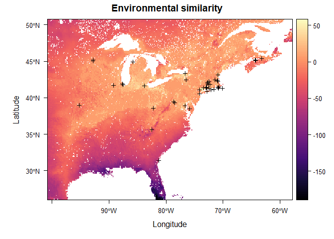

Andrena asteris
================
Mark Buckner
2022-03-08

-   [Load Pkgs and functions](#load-pkgs-and-functions)
    -   [Pkgs](#pkgs)
    -   [Functions](#functions)
-   [Load and process occ Data](#load-and-process-occ-data)
    -   [Load and filter by date](#load-and-filter-by-date)
    -   [Check for georeferencing
        errors](#check-for-georeferencing-errors)
    -   [Spatial Thinning w/ spThin](#spatial-thinning-w-spthin)
-   [Environmental Covariates](#environmental-covariates)
    -   [Define study area](#define-study-area)
    -   [Download and process env](#download-and-process-env)
    -   [PCA](#pca)
    -   [Extract env. and MESS](#extract-env-and-mess)
-   [SDM Model](#sdm-model)
    -   [Assign random background
        points](#assign-random-background-points)
    -   [Partition for Model
        Evaluation](#partition-for-model-evaluation)
    -   [Tune Model](#tune-model)
    -   [Model Selection](#model-selection)
-   [Predictions](#predictions)
    -   [Threshold](#threshold)
    -   [ENM Null](#enm-null)
-   [Visualize](#visualize)
-   [Session Info](#session-info)

## Load Pkgs and functions

Project directory structure:

Andrena_asteris_SDM -

 occ - occurrence datasets  
 pred - .txt/s containing URLs to environmental data  
 R - code

### Pkgs

``` r
if(!require(pacman)) install.packages("pacman")
library(pacman)

pacman::p_load(tidyverse, lubridate, ggmap, spThin, 
               CoordinateCleaner, curl, raster, sf, 
               RStoolbox, rgdal, ENMeval, rJava, rasterVis, tmap, 
               rnaturalearth, grid)

pacman::p_load_gh("SEEG-Oxford/seegSDM", "ropensci/rnaturalearthhires", "ropensci/rnaturalearthdata")
```

### Functions

``` r
#envLoad(): Downloads and processes environmental raster data from source. 
#--paths = urls for data sources read in from .txt file;
#--filedir = path to dir where the processed raw files are or will be stored.
#--ref = anticipated path of a reference .tif with the correct resolution and projection (eg. worldclim layer) in the paths .txt ["../pred/env/NAME.tif"]
#--bb = bounding box for study area (any object an extent can be extracted from)

envLoad <- function(paths, filedir, ref, bb, type = "cont") {
  
  savepaths <- sapply(paths, function (x) gsub("\\?.*", "", x))
  dest <- sapply(savepaths, function(x) paste(filedir,"/", gsub(".*/(\\w+)", "\\1", x), sep = "")) %>% 
    sort()
  names <- sapply(savepaths, function(x) paste( gsub(".*/(\\w+)", "\\1", x), sep = "")) %>% 
    sort() %>% 
    sapply(function(x) paste("../pred/env/",x, sep = ""))
  
  names <- str_replace(names, ".zip$", ".tif")
  
  for (i in 1:length(paths)) {
    if(file.exists(dest[i]) | file.exists(names[i])){
      if (file.exists(names[i])) {
        print(paste("File exists:",names[i]))
      } else {
        unproc_cont <- TRUE
        print(paste("File exists but is unprocessed:",dest[i]))
      }
      
    } else {
      
      print(paste("Downloading: ", paths[i]))
      
      unproc_cont <- TRUE
      
      file <- try(curl::curl_download(url = paths[i], destfile = dest[i]))
      
      if(class(file) == "try-error") {
        download.file(url = paths[i], destfile = dest[i], method = "curl")
      }
      
      if(grepl(".*zip", dest[i])) {
        unzip(dest[i], exdir = filedir)
        
      }
    }
  }
  
  if(!all(file.exists(names))) {
    print("Processing files")
    env.files <- list.files(filedir, recursive = TRUE, pattern = ".*tif$") %>% 
      sapply(function(x) paste(filedir, "/", x, sep = ""))
    
    r <- raster(ref) %>% 
      raster::crop(extent(bb)) %>% 
      projectRaster(crs = "+init=epsg:4326")
    
    method <- ifelse(type == "cont", "bilinear", "ngb")
    print(paste("Method:", method))
    
    env.stack <- lapply(env.files, raster) %>% 
      lapply(projectRaster, to = r, method = "ngb") %>% 
      stack()
    
    print("Saving stack")
    
    bylayer <- ifelse(nlayers(env.stack) > 1, TRUE, FALSE)
    writeRaster(env.stack, names, format = "GTiff", bylayer = bylayer, overwrite = TRUE)
    
  } else {
    print("Loading processed files")
    env.stack <- stack(names)
  }
  return(env.stack)
  
}
```

## Load and process occ Data

### Load and filter by date

``` r
gbif <- read_tsv("../occ/Aa_GBIF.txt")
scan <- read_csv("../occ/Aa_SCAN.csv")
amnh <- read_tsv("../occ/Aa_AMNH.txt")

t_scan <- scan %>% 
  dplyr::select(id, date = eventDate, lat = decimalLatitude, lon = decimalLongitude) %>% 
  drop_na() %>% 
  mutate(lat = round(lat,5), lon = round(lon,5)) %>%
  mutate(source = "SCAN")


t_gbif <- gbif %>% 
  dplyr::select(gbifID, eventDate, verbatimEventDate, lat = decimalLatitude, lon = decimalLongitude) %>% 
  separate(eventDate, c("date", NA), sep = " ") %>% 
  mutate(verbatimEventDate = ifelse(is.na(date), verbatimEventDate, NA)) %>% 
  unite(date, date, verbatimEventDate, na.rm = TRUE) %>% 
  mutate(date = parse_date_time(date, orders = c("mdy", "ymd", "dmy"))) %>% 
  drop_na() %>% 
  mutate(lat = round(lat,5), lon = round(lon,5)) %>%
  mutate(source = "GBIF")

t_amnh <- amnh %>% 
  mutate(date = parse_date_time(amnh$Start_Date, orders = c("mdy", "dmy"))) %>%
  filter(year(date) <= Det_Date) %>%    
  dplyr::select(PBIUSI, date, lat = Lat, lon = Lon) %>% 
  drop_na() %>% 
  mutate(lat = round(lat,5), lon = round(lon,5)) %>%
  mutate(source = "AMNH")

#Parsing errors for year only (old data) or "no date provided"

occ.joined <- full_join(t_scan, t_gbif, by = c("date", "lat", "lon")) %>% 
  full_join(t_amnh, by = c("date", "lat", "lon")) %>%
  filter(!duplicated(.[c("date", "lat", "lon")])) %>% 
  unite(data_source, source.x, source.y, source, sep = "/", na.rm = TRUE) %>% 
  dplyr::select(date, lat, lon, data_source, scanID = id, gbifID, PBIUSI)

date_start <- as.Date("1981-01-01")
date_end <- as.Date("2010-12-31")

occ <- occ.joined %>% 
  filter(date >= date_start & date <= date_end) %>%
  mutate(lat = floor(lat*10000)/10000, lon = floor(lon*10000)/10000) %>% 
  distinct(lat, lon, .keep_all = TRUE) %>% 
  mutate("spp" = "Aasteris")

qmplot(x = lon, y = lat, data = occ, maptype = "toner-lite", mapcolor = "bw", source = "stamen", force = T)
```

<!-- -->

### Check for georeferencing errors

``` r
flags <- clean_coordinates(x = occ, lon = "lon", 
                           lat = "lat", species = "spp",
                           tests = c("capitals", "centroids", 
                                     "equal", "gbif", "institutions", 
                                     "outliers", "seas", "zeros"))
```

    ## Testing coordinate validity

    ## Flagged 0 records.

    ## Testing equal lat/lon

    ## Flagged 0 records.

    ## Testing zero coordinates

    ## Flagged 0 records.

    ## Testing country capitals

    ## Flagged 0 records.

    ## Testing country centroids

    ## Flagged 0 records.

    ## Testing sea coordinates

    ## OGR data source with driver: ESRI Shapefile 
    ## Source: "C:\Users\mabuc\AppData\Local\Temp\Rtmp48ASDx", layer: "ne_50m_land"
    ## with 1420 features
    ## It has 3 fields
    ## Integer64 fields read as strings:  scalerank

    ## Flagged 17 records.

    ## Testing geographic outliers

    ## Flagged 0 records.

    ## Testing GBIF headquarters, flagging records around Copenhagen

    ## Flagged 0 records.

    ## Testing biodiversity institutions

    ## Flagged 2 records.

    ## Flagged 19 of 69 records, EQ = 0.28.

``` r
summary(flags)
```

    ##     .val     .equ     .zer     .cap     .cen     .sea     .otl     .gbf 
    ##        0        0        0        0        0       17        0        0 
    ##    .inst .summary 
    ##        2       19

``` r
plot(flags, lon = "lon", lat = "lat")
```

<!-- -->

``` r
occ.flagged <- occ[!flags$.summary,]

write_csv(occ.flagged, file = "../occ/Aa_flagged.csv")
```

17 occurrences were flagged for potentially being in the sea. These
points are located on various Island which matches the metadata. The
georeferencing is sufficiently accurate for this analysis.

Two points match research institutions. The [occurrence
remarks](https://bugguide.net/node/view/370287) for 34630476 - Cornell
University provide no additional details this observation was excluded.
The metadata for 56951087 - Connecticut Agricultural Exp. list the
address of the station.

``` r
occs <- occ %>% 
  filter(is.na(scanID) | scanID != 56951087 & scanID != 34630476) %>% 
  write_csv(file = "../occ/Aa_combined.csv") %>% 
  dplyr::select(spp, lat, lon)
```

### Spatial Thinning w/ spThin

``` r
thinned <-
  thin( loc.data = occs, 
        lat.col = "lat", long.col = "lon", 
        spec.col = "spp", 
        thin.par = 10, reps = 100, 
        locs.thinned.list.return = TRUE, 
        write.files = TRUE, 
        max.files = 5, 
        out.dir = "../occ/Aa_thinned_full/", out.base = "Aa_thinned", 
        write.log.file = TRUE,
        log.file = "../occ/Aa_thinned_full_log_file.txt" )
```

    ## ********************************************** 
    ##  Beginning Spatial Thinning.
    ##  Script Started at: Tue Mar 08 08:35:42 2022
    ## lat.long.thin.count
    ##  42 
    ## 100 
    ## [1] "Maximum number of records after thinning: 42"
    ## [1] "Number of data.frames with max records: 100"
    ## [1] "Writing new *.csv files"

    ## Warning in thin(loc.data = occs, lat.col = "lat", long.col = "lon", spec.col =
    ## "spp", : Created new output directory: ../occ/Aa_thinned_full/

    ## [1] "Writing file: ../occ/Aa_thinned_full/Aa_thinned_thin1.csv"
    ## [1] "Writing file: ../occ/Aa_thinned_full/Aa_thinned_thin2.csv"
    ## [1] "Writing file: ../occ/Aa_thinned_full/Aa_thinned_thin3.csv"
    ## [1] "Writing file: ../occ/Aa_thinned_full/Aa_thinned_thin4.csv"
    ## [1] "Writing file: ../occ/Aa_thinned_full/Aa_thinned_thin5.csv"

``` r
plotThin(thinned)
```

<!-- --><!-- --><!-- -->

#### Load thinned occ data

``` r
occt <- read_csv("../occ/Aa_thinned_full/Aa_thinned_thin1.csv") %>% 
  dplyr::select(lon, lat)


qmplot(x = lon, y = lat, data = occt, maptype = "toner-lite", mapcolor = "bw", source = "stamen", force = T)
```

<!-- -->

Retained 42 after spatial thinning.

## Environmental Covariates

Bioclimatic Variables - [CHELSA Climate
v2.1](https://chelsa-climate.org/)

-   Bio 1 : Mean Annual Temperature
-   Bio 2 : Annual Mean Diurnal Range
-   Bio 3 : Isothermality
-   Bio 4 : Temperature Seasonality
-   Bio 5 : Max Temperature of Warmest Month
-   Bio 7 : Annual Temperature Range
-   Bio 8 : Mean Temperature of Wettest Quarter
-   Bio 9 : Mean Temperature of Driest Quarter
-   Bio 10 : Mean Temperature of Warmest Quarter
-   Bio 11 : Mean Temperature of Coldest Quarter
-   Bio 12 : Annual Precipitation
-   Bio 13 : Precipitation of Wettest Month
-   Bio 14 : Precipitation of Driest Month
-   Bio 15 : Precipitation Seasonality
-   Bio 16 : Precipitation of Wettest Quarter
-   Bio 17 : Precipitation of Driest Quarter
-   Bio 18 : Precipitation of Warmest Quarter
-   Bio 19 : Precipitation of Coldest Quarter

Other Climatologies - [CHELSA Climate v2.1](https://chelsa-climate.org/)

-   gddlgd0 : Last growing degree day above 0C

Topography - [WorldClim SRTM 5
arc-min](https://www.worldclim.org/data/worldclim21.html)

-   DEM

Other

-   [Soil sand at 0cm](https://zenodo.org/record/2525662#.YiISa3rMJOQ)
-   [Soil clay at 0cm](https://zenodo.org/record/2525663#.YiISZnrMJOQ)
-   [Land
    use](http://www.cec.org/north-american-environmental-atlas/land-cover-30m-2015-landsat-and-rapideye/)
    (excluded)

### Define study area

``` r
proj.res <- c(0.08333333,0.08333333)
proj.crs <- st_crs(4326)

occs.sf <- sf::st_as_sf(occt, coords = c("lon", "lat"), crs = proj.crs) %>% 
  st_cast("MULTIPOINT") %>% 
  st_union()

sa.bb <- st_bbox(occs.sf)
sa.bb[1:2] <- sa.bb[1:2] - 7
sa.bb[3:4] <- sa.bb[3:4] + 7
```

### Download and process env

``` r
dir.create("../pred/cat")
dir.create("../pred/cont")
dir.create("../pred/env")
```

    ## Warning in dir.create("../pred/env"): '..\pred\env' already exists

``` r
# Download and process continuous data
paths.cont <- read_delim("../pred/cov_paths_cont.txt", delim = "\\n", col_names = FALSE) %>% 
  pull()
```

    ## Rows: 23 Columns: 1
    ## -- Column specification --------------------------------------------------------
    ## Delimiter: "\\n"
    ## chr (1): X1
    ## 
    ## i Use `spec()` to retrieve the full column specification for this data.
    ## i Specify the column types or set `show_col_types = FALSE` to quiet this message.

``` r
env.cont <- envLoad(paths.cont, filedir = "../pred/cont", ref = "../pred/cont/wc2.1_5m_elev.tif", bb = sa.bb)
```

    ## [1] "File exists: ../pred/env/CHELSA_bio1_1981-2010_V.2.1.tif "
    ## [1] "File exists: ../pred/env/CHELSA_bio10_1981-2010_V.2.1.tif "
    ## [1] "File exists: ../pred/env/CHELSA_bio11_1981-2010_V.2.1.tif "
    ## [1] "File exists: ../pred/env/CHELSA_bio12_1981-2010_V.2.1.tif "
    ## [1] "File exists: ../pred/env/CHELSA_bio13_1981-2010_V.2.1.tif "
    ## [1] "File exists: ../pred/env/CHELSA_bio14_1981-2010_V.2.1.tif "
    ## [1] "File exists: ../pred/env/CHELSA_bio15_1981-2010_V.2.1.tif "
    ## [1] "File exists: ../pred/env/CHELSA_bio16_1981-2010_V.2.1.tif "
    ## [1] "File exists: ../pred/env/CHELSA_bio17_1981-2010_V.2.1.tif "
    ## [1] "File exists: ../pred/env/CHELSA_bio18_1981-2010_V.2.1.tif "
    ## [1] "File exists: ../pred/env/CHELSA_bio19_1981-2010_V.2.1.tif "
    ## [1] "File exists: ../pred/env/CHELSA_bio2_1981-2010_V.2.1.tif "
    ## [1] "File exists: ../pred/env/CHELSA_bio3_1981-2010_V.2.1.tif "
    ## [1] "File exists: ../pred/env/CHELSA_bio4_1981-2010_V.2.1.tif "
    ## [1] "File exists: ../pred/env/CHELSA_bio5_1981-2010_V.2.1.tif "
    ## [1] "File exists: ../pred/env/CHELSA_bio6_1981-2010_V.2.1.tif "
    ## [1] "File exists: ../pred/env/CHELSA_bio7_1981-2010_V.2.1.tif "
    ## [1] "File exists: ../pred/env/CHELSA_bio8_1981-2010_V.2.1.tif "
    ## [1] "File exists: ../pred/env/CHELSA_bio9_1981-2010_V.2.1.tif "
    ## [1] "File exists: ../pred/env/CHELSA_gddlgd0_1981-2010_V.2.1.tif "
    ## [1] "File exists: ../pred/env/sol_clay.wfraction_usda.3a1a1a_m_250m_b0..0cm_1950..2017_v0.2.tif"
    ## [1] "File exists: ../pred/env/sol_sand.wfraction_usda.3a1a1a_m_250m_b0..0cm_1950..2017_v0.2.tif"
    ## [1] "File exists: ../pred/env/wc2.1_5m_elev.tif"
    ## [1] "Loading processed files"

``` r
# Download and process categorical data
paths.cat <- read_delim("../pred/cov_paths_cat.txt", delim = "\\n", col_names = FALSE) %>% 
  pull()
```

    ## Rows: 1 Columns: 1
    ## -- Column specification --------------------------------------------------------
    ## Delimiter: "\\n"
    ## chr (1): X1
    ## 
    ## i Use `spec()` to retrieve the full column specification for this data.
    ## i Specify the column types or set `show_col_types = FALSE` to quiet this message.

``` r
env.cat <- envLoad(paths.cat, filedir = "../pred/cat", ref = "../pred/cont/wc2.1_5m_elev.tif", bb = sa.bb, type = "cat")%>% 
  `names<-`("LU")
```

    ## [1] "File exists: ../pred/env/north_america_2015_v2.tif"
    ## [1] "Loading processed files"

``` r
unlink("../pred/cat", recursive = TRUE)
unlink("../pred/cont", recursive = TRUE)
```

### PCA

``` r
#GDD data modification to allow proper masking
env.cont$CHELSA_gddlgd0_1981.2010_V.2.1[is.na(env.cont$CHELSA_gddlgd0_1981.2010_V.2.1)] <- 0

mmask <- masterMask(env.cont)

env.m <- mask(env.cont, mmask)
env.cat.m <- mask(env.cat, mmask)

dir.create("../pred/PCA")
pca <- rasterPCA(env.m, spca = TRUE, maskCheck = FALSE, filename = "../pred/PCA/envPCA.tif", overwrite = TRUE)

summary(pca$model)
```

    ## Importance of components:
    ##                          Comp.1    Comp.2     Comp.3     Comp.4     Comp.5
    ## Standard deviation     3.273579 2.4283101 1.40026590 1.15590054 0.98093012
    ## Proportion of Variance 0.465927 0.2563778 0.08524977 0.05809157 0.04183582
    ## Cumulative Proportion  0.465927 0.7223048 0.80755458 0.86564614 0.90748197
    ##                            Comp.6     Comp.7    Comp.8     Comp.9     Comp.10
    ## Standard deviation     0.75240800 0.71645352 0.6015950 0.55287585 0.335507138
    ## Proportion of Variance 0.02461382 0.02231764 0.0157355 0.01329007 0.004894132
    ## Cumulative Proportion  0.93209578 0.95441342 0.9701489 0.98343899 0.988333127
    ##                            Comp.11     Comp.12     Comp.13     Comp.14
    ## Standard deviation     0.302936735 0.258285028 0.212672731 0.154748337
    ## Proportion of Variance 0.003990029 0.002900485 0.001966508 0.001041176
    ## Cumulative Proportion  0.992323156 0.995223641 0.997190149 0.998231325
    ##                             Comp.15      Comp.16      Comp.17      Comp.18
    ## Standard deviation     0.1174087452 0.0954031748 0.0855662141 0.0713953354
    ## Proportion of Variance 0.0005993397 0.0003957289 0.0003183294 0.0002216215
    ## Cumulative Proportion  0.9988306646 0.9992263936 0.9995447230 0.9997663445
    ##                             Comp.19      Comp.20      Comp.21      Comp.22
    ## Standard deviation     0.0572040760 4.254521e-02 1.466703e-02 8.749498e-03
    ## Proportion of Variance 0.0001422742 7.869977e-05 9.353122e-06 3.328422e-06
    ## Cumulative Proportion  0.9999086187 9.999873e-01 9.999967e-01 1.000000e+00
    ##                             Comp.23
    ## Standard deviation     1.046154e-07
    ## Proportion of Variance 4.758424e-16
    ## Cumulative Proportion  1.000000e+00

``` r
loadings(pca$model)
```

    ## 
    ## Loadings:
    ##                                                               Comp.1 Comp.2
    ## CHELSA_bio1_1981.2010_V.2.1                                    0.271  0.184
    ## CHELSA_bio10_1981.2010_V.2.1                                   0.237  0.246
    ## CHELSA_bio11_1981.2010_V.2.1                                   0.282  0.145
    ## CHELSA_bio12_1981.2010_V.2.1                                   0.210 -0.282
    ## CHELSA_bio13_1981.2010_V.2.1                                   0.193 -0.185
    ## CHELSA_bio14_1981.2010_V.2.1                                   0.193 -0.282
    ## CHELSA_bio15_1981.2010_V.2.1                                  -0.140  0.248
    ## CHELSA_bio16_1981.2010_V.2.1                                   0.186 -0.219
    ## CHELSA_bio17_1981.2010_V.2.1                                   0.203 -0.276
    ## CHELSA_bio18_1981.2010_V.2.1                                   0.125 -0.214
    ## CHELSA_bio19_1981.2010_V.2.1                                   0.211 -0.258
    ## CHELSA_bio2_1981.2010_V.2.1                                           0.292
    ## CHELSA_bio3_1981.2010_V.2.1                                    0.245  0.194
    ## CHELSA_bio4_1981.2010_V.2.1                                   -0.290       
    ## CHELSA_bio5_1981.2010_V.2.1                                    0.208  0.285
    ## CHELSA_bio6_1981.2010_V.2.1                                    0.280  0.148
    ## CHELSA_bio7_1981.2010_V.2.1                                   -0.286       
    ## CHELSA_bio8_1981.2010_V.2.1                                           0.256
    ## CHELSA_bio9_1981.2010_V.2.1                                    0.280       
    ## CHELSA_gddlgd0_1981.2010_V.2.1                                -0.246       
    ## sol_clay.wfraction_usda.3a1a1a_m_250m_b0..0cm_1950..2017_v0.2         0.251
    ## sol_sand.wfraction_usda.3a1a1a_m_250m_b0..0cm_1950..2017_v0.2        -0.136
    ## wc2.1_5m_elev                                                 -0.156       
    ##                                                               Comp.3 Comp.4
    ## CHELSA_bio1_1981.2010_V.2.1                                                
    ## CHELSA_bio10_1981.2010_V.2.1                                               
    ## CHELSA_bio11_1981.2010_V.2.1                                               
    ## CHELSA_bio12_1981.2010_V.2.1                                         -0.175
    ## CHELSA_bio13_1981.2010_V.2.1                                   0.349 -0.281
    ## CHELSA_bio14_1981.2010_V.2.1                                  -0.201       
    ## CHELSA_bio15_1981.2010_V.2.1                                   0.388       
    ## CHELSA_bio16_1981.2010_V.2.1                                   0.340 -0.266
    ## CHELSA_bio17_1981.2010_V.2.1                                  -0.186       
    ## CHELSA_bio18_1981.2010_V.2.1                                   0.480 -0.200
    ## CHELSA_bio19_1981.2010_V.2.1                                  -0.200       
    ## CHELSA_bio2_1981.2010_V.2.1                                          -0.170
    ## CHELSA_bio3_1981.2010_V.2.1                                                
    ## CHELSA_bio4_1981.2010_V.2.1                                          -0.137
    ## CHELSA_bio5_1981.2010_V.2.1                                                
    ## CHELSA_bio6_1981.2010_V.2.1                                                
    ## CHELSA_bio7_1981.2010_V.2.1                                          -0.139
    ## CHELSA_bio8_1981.2010_V.2.1                                    0.328       
    ## CHELSA_bio9_1981.2010_V.2.1                                   -0.138       
    ## CHELSA_gddlgd0_1981.2010_V.2.1                                       -0.105
    ## sol_clay.wfraction_usda.3a1a1a_m_250m_b0..0cm_1950..2017_v0.2 -0.185 -0.458
    ## sol_sand.wfraction_usda.3a1a1a_m_250m_b0..0cm_1950..2017_v0.2  0.294  0.665
    ## wc2.1_5m_elev                                                        -0.145
    ##                                                               Comp.5 Comp.6
    ## CHELSA_bio1_1981.2010_V.2.1                                                
    ## CHELSA_bio10_1981.2010_V.2.1                                               
    ## CHELSA_bio11_1981.2010_V.2.1                                               
    ## CHELSA_bio12_1981.2010_V.2.1                                               
    ## CHELSA_bio13_1981.2010_V.2.1                                          0.181
    ## CHELSA_bio14_1981.2010_V.2.1                                         -0.202
    ## CHELSA_bio15_1981.2010_V.2.1                                          0.414
    ## CHELSA_bio16_1981.2010_V.2.1                                          0.139
    ## CHELSA_bio17_1981.2010_V.2.1                                         -0.180
    ## CHELSA_bio18_1981.2010_V.2.1                                         -0.156
    ## CHELSA_bio19_1981.2010_V.2.1                                  -0.108       
    ## CHELSA_bio2_1981.2010_V.2.1                                   -0.534 -0.133
    ## CHELSA_bio3_1981.2010_V.2.1                                   -0.261       
    ## CHELSA_bio4_1981.2010_V.2.1                                                
    ## CHELSA_bio5_1981.2010_V.2.1                                                
    ## CHELSA_bio6_1981.2010_V.2.1                                                
    ## CHELSA_bio7_1981.2010_V.2.1                                                
    ## CHELSA_bio8_1981.2010_V.2.1                                    0.153 -0.747
    ## CHELSA_bio9_1981.2010_V.2.1                                           0.262
    ## CHELSA_gddlgd0_1981.2010_V.2.1                                       -0.112
    ## sol_clay.wfraction_usda.3a1a1a_m_250m_b0..0cm_1950..2017_v0.2  0.250       
    ## sol_sand.wfraction_usda.3a1a1a_m_250m_b0..0cm_1950..2017_v0.2 -0.143       
    ## wc2.1_5m_elev                                                 -0.694       
    ##                                                               Comp.7 Comp.8
    ## CHELSA_bio1_1981.2010_V.2.1                                           0.101
    ## CHELSA_bio10_1981.2010_V.2.1                                          0.198
    ## CHELSA_bio11_1981.2010_V.2.1                                   0.120       
    ## CHELSA_bio12_1981.2010_V.2.1                                               
    ## CHELSA_bio13_1981.2010_V.2.1                                               
    ## CHELSA_bio14_1981.2010_V.2.1                                               
    ## CHELSA_bio15_1981.2010_V.2.1                                               
    ## CHELSA_bio16_1981.2010_V.2.1                                               
    ## CHELSA_bio17_1981.2010_V.2.1                                               
    ## CHELSA_bio18_1981.2010_V.2.1                                               
    ## CHELSA_bio19_1981.2010_V.2.1                                         -0.110
    ## CHELSA_bio2_1981.2010_V.2.1                                   -0.507       
    ## CHELSA_bio3_1981.2010_V.2.1                                          -0.184
    ## CHELSA_bio4_1981.2010_V.2.1                                   -0.266       
    ## CHELSA_bio5_1981.2010_V.2.1                                   -0.179  0.212
    ## CHELSA_bio6_1981.2010_V.2.1                                    0.155       
    ## CHELSA_bio7_1981.2010_V.2.1                                   -0.380       
    ## CHELSA_bio8_1981.2010_V.2.1                                                
    ## CHELSA_bio9_1981.2010_V.2.1                                                
    ## CHELSA_gddlgd0_1981.2010_V.2.1                                 0.140  0.305
    ## sol_clay.wfraction_usda.3a1a1a_m_250m_b0..0cm_1950..2017_v0.2  0.178 -0.718
    ## sol_sand.wfraction_usda.3a1a1a_m_250m_b0..0cm_1950..2017_v0.2 -0.112 -0.454
    ## wc2.1_5m_elev                                                  0.599       
    ##                                                               Comp.9 Comp.10
    ## CHELSA_bio1_1981.2010_V.2.1                                                 
    ## CHELSA_bio10_1981.2010_V.2.1                                          0.168 
    ## CHELSA_bio11_1981.2010_V.2.1                                                
    ## CHELSA_bio12_1981.2010_V.2.1                                          0.103 
    ## CHELSA_bio13_1981.2010_V.2.1                                  -0.120        
    ## CHELSA_bio14_1981.2010_V.2.1                                                
    ## CHELSA_bio15_1981.2010_V.2.1                                          0.149 
    ## CHELSA_bio16_1981.2010_V.2.1                                                
    ## CHELSA_bio17_1981.2010_V.2.1                                          0.108 
    ## CHELSA_bio18_1981.2010_V.2.1                                         -0.186 
    ## CHELSA_bio19_1981.2010_V.2.1                                          0.252 
    ## CHELSA_bio2_1981.2010_V.2.1                                    0.215        
    ## CHELSA_bio3_1981.2010_V.2.1                                    0.239 -0.314 
    ## CHELSA_bio4_1981.2010_V.2.1                                   -0.186  0.234 
    ## CHELSA_bio5_1981.2010_V.2.1                                           0.202 
    ## CHELSA_bio6_1981.2010_V.2.1                                                 
    ## CHELSA_bio7_1981.2010_V.2.1                                   -0.117  0.185 
    ## CHELSA_bio8_1981.2010_V.2.1                                   -0.213  0.312 
    ## CHELSA_bio9_1981.2010_V.2.1                                           0.519 
    ## CHELSA_gddlgd0_1981.2010_V.2.1                                 0.823  0.300 
    ## sol_clay.wfraction_usda.3a1a1a_m_250m_b0..0cm_1950..2017_v0.2  0.166  0.116 
    ## sol_sand.wfraction_usda.3a1a1a_m_250m_b0..0cm_1950..2017_v0.2  0.151  0.295 
    ## wc2.1_5m_elev                                                 -0.182  0.174 
    ##                                                               Comp.11 Comp.12
    ## CHELSA_bio1_1981.2010_V.2.1                                    0.153         
    ## CHELSA_bio10_1981.2010_V.2.1                                   0.336   0.153 
    ## CHELSA_bio11_1981.2010_V.2.1                                                 
    ## CHELSA_bio12_1981.2010_V.2.1                                   0.122         
    ## CHELSA_bio13_1981.2010_V.2.1                                   0.125  -0.595 
    ## CHELSA_bio14_1981.2010_V.2.1                                                 
    ## CHELSA_bio15_1981.2010_V.2.1                                  -0.136         
    ## CHELSA_bio16_1981.2010_V.2.1                                                 
    ## CHELSA_bio17_1981.2010_V.2.1                                   0.103         
    ## CHELSA_bio18_1981.2010_V.2.1                                           0.669 
    ## CHELSA_bio19_1981.2010_V.2.1                                  -0.116   0.227 
    ## CHELSA_bio2_1981.2010_V.2.1                                                  
    ## CHELSA_bio3_1981.2010_V.2.1                                   -0.259  -0.138 
    ## CHELSA_bio4_1981.2010_V.2.1                                    0.122   0.114 
    ## CHELSA_bio5_1981.2010_V.2.1                                    0.359   0.130 
    ## CHELSA_bio6_1981.2010_V.2.1                                    0.116         
    ## CHELSA_bio7_1981.2010_V.2.1                                                  
    ## CHELSA_bio8_1981.2010_V.2.1                                   -0.201  -0.157 
    ## CHELSA_bio9_1981.2010_V.2.1                                   -0.609         
    ## CHELSA_gddlgd0_1981.2010_V.2.1                                               
    ## sol_clay.wfraction_usda.3a1a1a_m_250m_b0..0cm_1950..2017_v0.2  0.166         
    ## sol_sand.wfraction_usda.3a1a1a_m_250m_b0..0cm_1950..2017_v0.2  0.282         
    ## wc2.1_5m_elev                                                  0.132         
    ##                                                               Comp.13 Comp.14
    ## CHELSA_bio1_1981.2010_V.2.1                                                  
    ## CHELSA_bio10_1981.2010_V.2.1                                                 
    ## CHELSA_bio11_1981.2010_V.2.1                                                 
    ## CHELSA_bio12_1981.2010_V.2.1                                   0.124   0.210 
    ## CHELSA_bio13_1981.2010_V.2.1                                                 
    ## CHELSA_bio14_1981.2010_V.2.1                                  -0.455  -0.476 
    ## CHELSA_bio15_1981.2010_V.2.1                                  -0.689         
    ## CHELSA_bio16_1981.2010_V.2.1                                   0.193         
    ## CHELSA_bio17_1981.2010_V.2.1                                  -0.278  -0.189 
    ## CHELSA_bio18_1981.2010_V.2.1                                          -0.209 
    ## CHELSA_bio19_1981.2010_V.2.1                                  -0.251   0.705 
    ## CHELSA_bio2_1981.2010_V.2.1                                                  
    ## CHELSA_bio3_1981.2010_V.2.1                                            0.150 
    ## CHELSA_bio4_1981.2010_V.2.1                                                  
    ## CHELSA_bio5_1981.2010_V.2.1                                                  
    ## CHELSA_bio6_1981.2010_V.2.1                                                  
    ## CHELSA_bio7_1981.2010_V.2.1                                                  
    ## CHELSA_bio8_1981.2010_V.2.1                                            0.125 
    ## CHELSA_bio9_1981.2010_V.2.1                                    0.271  -0.318 
    ## CHELSA_gddlgd0_1981.2010_V.2.1                                               
    ## sol_clay.wfraction_usda.3a1a1a_m_250m_b0..0cm_1950..2017_v0.2                
    ## sol_sand.wfraction_usda.3a1a1a_m_250m_b0..0cm_1950..2017_v0.2  0.111         
    ## wc2.1_5m_elev                                                                
    ##                                                               Comp.15 Comp.16
    ## CHELSA_bio1_1981.2010_V.2.1                                                  
    ## CHELSA_bio10_1981.2010_V.2.1                                   0.145   0.229 
    ## CHELSA_bio11_1981.2010_V.2.1                                                 
    ## CHELSA_bio12_1981.2010_V.2.1                                  -0.286  -0.248 
    ## CHELSA_bio13_1981.2010_V.2.1                                   0.502  -0.152 
    ## CHELSA_bio14_1981.2010_V.2.1                                           0.290 
    ## CHELSA_bio15_1981.2010_V.2.1                                  -0.146  -0.108 
    ## CHELSA_bio16_1981.2010_V.2.1                                  -0.626   0.390 
    ## CHELSA_bio17_1981.2010_V.2.1                                          -0.180 
    ## CHELSA_bio18_1981.2010_V.2.1                                   0.280  -0.114 
    ## CHELSA_bio19_1981.2010_V.2.1                                   0.119         
    ## CHELSA_bio2_1981.2010_V.2.1                                   -0.151  -0.338 
    ## CHELSA_bio3_1981.2010_V.2.1                                    0.213   0.536 
    ## CHELSA_bio4_1981.2010_V.2.1                                    0.172   0.345 
    ## CHELSA_bio5_1981.2010_V.2.1                                                  
    ## CHELSA_bio6_1981.2010_V.2.1                                                  
    ## CHELSA_bio7_1981.2010_V.2.1                                            0.127 
    ## CHELSA_bio8_1981.2010_V.2.1                                                  
    ## CHELSA_bio9_1981.2010_V.2.1                                                  
    ## CHELSA_gddlgd0_1981.2010_V.2.1                                               
    ## sol_clay.wfraction_usda.3a1a1a_m_250m_b0..0cm_1950..2017_v0.2                
    ## sol_sand.wfraction_usda.3a1a1a_m_250m_b0..0cm_1950..2017_v0.2                
    ## wc2.1_5m_elev                                                                
    ##                                                               Comp.17 Comp.18
    ## CHELSA_bio1_1981.2010_V.2.1                                                  
    ## CHELSA_bio10_1981.2010_V.2.1                                                 
    ## CHELSA_bio11_1981.2010_V.2.1                                                 
    ## CHELSA_bio12_1981.2010_V.2.1                                   0.753         
    ## CHELSA_bio13_1981.2010_V.2.1                                           0.114 
    ## CHELSA_bio14_1981.2010_V.2.1                                           0.492 
    ## CHELSA_bio15_1981.2010_V.2.1                                   0.173         
    ## CHELSA_bio16_1981.2010_V.2.1                                  -0.310  -0.130 
    ## CHELSA_bio17_1981.2010_V.2.1                                          -0.778 
    ## CHELSA_bio18_1981.2010_V.2.1                                                 
    ## CHELSA_bio19_1981.2010_V.2.1                                  -0.283   0.160 
    ## CHELSA_bio2_1981.2010_V.2.1                                   -0.215         
    ## CHELSA_bio3_1981.2010_V.2.1                                    0.337  -0.192 
    ## CHELSA_bio4_1981.2010_V.2.1                                           -0.166 
    ## CHELSA_bio5_1981.2010_V.2.1                                                  
    ## CHELSA_bio6_1981.2010_V.2.1                                   -0.112         
    ## CHELSA_bio7_1981.2010_V.2.1                                    0.188         
    ## CHELSA_bio8_1981.2010_V.2.1                                                  
    ## CHELSA_bio9_1981.2010_V.2.1                                                  
    ## CHELSA_gddlgd0_1981.2010_V.2.1                                               
    ## sol_clay.wfraction_usda.3a1a1a_m_250m_b0..0cm_1950..2017_v0.2                
    ## sol_sand.wfraction_usda.3a1a1a_m_250m_b0..0cm_1950..2017_v0.2                
    ## wc2.1_5m_elev                                                                
    ##                                                               Comp.19 Comp.20
    ## CHELSA_bio1_1981.2010_V.2.1                                    0.214   0.451 
    ## CHELSA_bio10_1981.2010_V.2.1                                   0.429   0.128 
    ## CHELSA_bio11_1981.2010_V.2.1                                           0.278 
    ## CHELSA_bio12_1981.2010_V.2.1                                   0.147  -0.125 
    ## CHELSA_bio13_1981.2010_V.2.1                                                 
    ## CHELSA_bio14_1981.2010_V.2.1                                                 
    ## CHELSA_bio15_1981.2010_V.2.1                                                 
    ## CHELSA_bio16_1981.2010_V.2.1                                                 
    ## CHELSA_bio17_1981.2010_V.2.1                                           0.120 
    ## CHELSA_bio18_1981.2010_V.2.1                                                 
    ## CHELSA_bio19_1981.2010_V.2.1                                                 
    ## CHELSA_bio2_1981.2010_V.2.1                                    0.256         
    ## CHELSA_bio3_1981.2010_V.2.1                                   -0.155         
    ## CHELSA_bio4_1981.2010_V.2.1                                    0.340  -0.409 
    ## CHELSA_bio5_1981.2010_V.2.1                                   -0.616  -0.275 
    ## CHELSA_bio6_1981.2010_V.2.1                                           -0.429 
    ## CHELSA_bio7_1981.2010_V.2.1                                   -0.381   0.471 
    ## CHELSA_bio8_1981.2010_V.2.1                                                  
    ## CHELSA_bio9_1981.2010_V.2.1                                                  
    ## CHELSA_gddlgd0_1981.2010_V.2.1                                               
    ## sol_clay.wfraction_usda.3a1a1a_m_250m_b0..0cm_1950..2017_v0.2                
    ## sol_sand.wfraction_usda.3a1a1a_m_250m_b0..0cm_1950..2017_v0.2                
    ## wc2.1_5m_elev                                                                
    ##                                                               Comp.21 Comp.22
    ## CHELSA_bio1_1981.2010_V.2.1                                    0.758         
    ## CHELSA_bio10_1981.2010_V.2.1                                  -0.510   0.353 
    ## CHELSA_bio11_1981.2010_V.2.1                                  -0.297  -0.821 
    ## CHELSA_bio12_1981.2010_V.2.1                                                 
    ## CHELSA_bio13_1981.2010_V.2.1                                                 
    ## CHELSA_bio14_1981.2010_V.2.1                                                 
    ## CHELSA_bio15_1981.2010_V.2.1                                                 
    ## CHELSA_bio16_1981.2010_V.2.1                                                 
    ## CHELSA_bio17_1981.2010_V.2.1                                                 
    ## CHELSA_bio18_1981.2010_V.2.1                                                 
    ## CHELSA_bio19_1981.2010_V.2.1                                                 
    ## CHELSA_bio2_1981.2010_V.2.1                                                  
    ## CHELSA_bio3_1981.2010_V.2.1                                                  
    ## CHELSA_bio4_1981.2010_V.2.1                                    0.212  -0.447 
    ## CHELSA_bio5_1981.2010_V.2.1                                                  
    ## CHELSA_bio6_1981.2010_V.2.1                                    0.102         
    ## CHELSA_bio7_1981.2010_V.2.1                                                  
    ## CHELSA_bio8_1981.2010_V.2.1                                                  
    ## CHELSA_bio9_1981.2010_V.2.1                                                  
    ## CHELSA_gddlgd0_1981.2010_V.2.1                                               
    ## sol_clay.wfraction_usda.3a1a1a_m_250m_b0..0cm_1950..2017_v0.2                
    ## sol_sand.wfraction_usda.3a1a1a_m_250m_b0..0cm_1950..2017_v0.2                
    ## wc2.1_5m_elev                                                                
    ##                                                               Comp.23
    ## CHELSA_bio1_1981.2010_V.2.1                                          
    ## CHELSA_bio10_1981.2010_V.2.1                                         
    ## CHELSA_bio11_1981.2010_V.2.1                                         
    ## CHELSA_bio12_1981.2010_V.2.1                                         
    ## CHELSA_bio13_1981.2010_V.2.1                                         
    ## CHELSA_bio14_1981.2010_V.2.1                                         
    ## CHELSA_bio15_1981.2010_V.2.1                                         
    ## CHELSA_bio16_1981.2010_V.2.1                                         
    ## CHELSA_bio17_1981.2010_V.2.1                                         
    ## CHELSA_bio18_1981.2010_V.2.1                                         
    ## CHELSA_bio19_1981.2010_V.2.1                                         
    ## CHELSA_bio2_1981.2010_V.2.1                                          
    ## CHELSA_bio3_1981.2010_V.2.1                                          
    ## CHELSA_bio4_1981.2010_V.2.1                                          
    ## CHELSA_bio5_1981.2010_V.2.1                                   -0.373 
    ## CHELSA_bio6_1981.2010_V.2.1                                    0.784 
    ## CHELSA_bio7_1981.2010_V.2.1                                    0.496 
    ## CHELSA_bio8_1981.2010_V.2.1                                          
    ## CHELSA_bio9_1981.2010_V.2.1                                          
    ## CHELSA_gddlgd0_1981.2010_V.2.1                                       
    ## sol_clay.wfraction_usda.3a1a1a_m_250m_b0..0cm_1950..2017_v0.2        
    ## sol_sand.wfraction_usda.3a1a1a_m_250m_b0..0cm_1950..2017_v0.2        
    ## wc2.1_5m_elev                                                        
    ## 
    ##                Comp.1 Comp.2 Comp.3 Comp.4 Comp.5 Comp.6 Comp.7 Comp.8 Comp.9
    ## SS loadings     1.000  1.000  1.000  1.000  1.000  1.000  1.000  1.000  1.000
    ## Proportion Var  0.043  0.043  0.043  0.043  0.043  0.043  0.043  0.043  0.043
    ## Cumulative Var  0.043  0.087  0.130  0.174  0.217  0.261  0.304  0.348  0.391
    ##                Comp.10 Comp.11 Comp.12 Comp.13 Comp.14 Comp.15 Comp.16 Comp.17
    ## SS loadings      1.000   1.000   1.000   1.000   1.000   1.000   1.000   1.000
    ## Proportion Var   0.043   0.043   0.043   0.043   0.043   0.043   0.043   0.043
    ## Cumulative Var   0.435   0.478   0.522   0.565   0.609   0.652   0.696   0.739
    ##                Comp.18 Comp.19 Comp.20 Comp.21 Comp.22 Comp.23
    ## SS loadings      1.000   1.000   1.000   1.000   1.000   1.000
    ## Proportion Var   0.043   0.043   0.043   0.043   0.043   0.043
    ## Cumulative Var   0.783   0.826   0.870   0.913   0.957   1.000

``` r
propvar <- summary(pca$model)$sdev^2/sum(summary(pca$model)$sdev^2)
cumprop <- cumsum(propvar)
plot(1:23,cumprop, type = "o", xlab = "PCs", ylim = c(0,1))
points(1:23, propvar, type = "o", col = "red")
```

<!-- -->

``` r
features <- cumprop < 0.96
env.pca <- subset(pca$map, which(features))

plot(env.pca)
```

<!-- -->

``` r
env <- env.pca #addLayer(env.pca, env.cat.m)

plot(env[[1]], main = "PC 1 | A. asteris occ.")
points(occt, pch = 16, cex = 0.5)
```

<!-- -->

### Extract env. and MESS

``` r
occp <- st_as_sf(occt, coords = c("lon", "lat"), crs = proj.crs)
occe <- raster::extract(env, occp)


occ.sim <- similarity(env, occe)
occ.mess <- occ.sim$similarity_min
occ.sp <- as_Spatial(occp)

myScale <- seq(cellStats(occ.mess, min), cellStats(occ.mess, max), length.out = 100)
rasterVis::levelplot(occ.mess, main = "Environmental similarity", at = myScale, margin = FALSE) + 
  latticeExtra::layer(sp.points(occ.sp, col="black"))
```

<!-- -->

``` r
### Remove occ which correspond to NA env
occ.nna <- raster::extract(env, occp, sp = TRUE) %>% 
  as.data.frame() %>% 
  filter(!is.na(PC1))

occe <- occ.nna[,1:(ncol(occ.nna)-2)]
occp <- occ.nna[,(ncol(occ.nna)-1):ncol(occ.nna)]
```

In total 0 observations fall occur where the environmental data is NA.
These correspond to islands and shoreline sites which are lost during
masking due to the resolution used.

## SDM Model

### Assign random background points

Model performance improved using background points sampled from full
study area over buffered convex hull.

``` r
 # crs(env) <- crs(proj.crs)
 # sa.bg <- st_convex_hull(occs.sf) %>% 
 #   st_buffer(occs.sf, dist = 100000) %>% 
 #   st_sf()
 # 
 # env.bg <- raster::mask(env, sa.bg)

(points <- sum(!is.na(getValues(env[[1]])))*0.3)
```

    ## [1] 24664.5

``` r
bg <- dismo::randomPoints(env, n = points) %>% 
  as.data.frame()
colnames(bg) <- colnames(occp)

plot(env[[1]], main="PC1 | Background Points")
points(bg, pch = 20, cex = 0.05)
```

<!-- -->

### Partition for Model Evaluation

n = 31.

``` r
part <- get.jackknife(occp, bg)
evalplot.grps(pts = occp, pts.grp = part$occs.grp, envs = env)
```

    ## Warning: `guides(<scale> = FALSE)` is deprecated. Please use `guides(<scale> =
    ## "none")` instead.

    ## Plotting first raster in stack...

<!-- -->

### Tune Model

``` r
e.mx <- ENMevaluate(occs = occp, envs = env, bg = bg, #categoricals = names(env.cat), 
                    algorithm = 'maxent.jar', partitions = 'jackknife', parallel = TRUE, 
                    tune.args = list(fc = c("L","Q","LQ","LQH","H"), rm = 1:5))
```

    ## Package ecospat is not installed, so Continuous Boyce Index (CBI) cannot be calculated.

    ## *** Running initial checks... ***

    ## * Clamping predictor variable rasters...

    ## * Model evaluations with k-1 jackknife (leave-one-out) cross validation...

    ## 
    ## *** Running ENMeval v2.0.3 with maxent.jar v3.4.3 from dismo package v1.3.5 ***

    ##   |                                                                              |                                                                      |   0%

    ## 
    ## Of 16 total cores using 16...

    ## Running in parallel using doSNOW...

    ##   |                                                                              |===                                                                   |   4%  |                                                                              |======                                                                |   8%  |                                                                              |========                                                              |  12%  |                                                                              |===========                                                           |  16%  |                                                                              |==============                                                        |  20%  |                                                                              |=================                                                     |  24%  |                                                                              |====================                                                  |  28%  |                                                                              |======================                                                |  32%  |                                                                              |=========================                                             |  36%  |                                                                              |============================                                          |  40%  |                                                                              |===============================                                       |  44%  |                                                                              |==================================                                    |  48%  |                                                                              |====================================                                  |  52%  |                                                                              |=======================================                               |  56%  |                                                                              |==========================================                            |  60%  |                                                                              |=============================================                         |  64%  |                                                                              |================================================                      |  68%  |                                                                              |==================================================                    |  72%  |                                                                              |=====================================================                 |  76%  |                                                                              |========================================================              |  80%  |                                                                              |===========================================================           |  84%  |                                                                              |==============================================================        |  88%  |                                                                              |================================================================      |  92%  |                                                                              |===================================================================   |  96%  |                                                                              |======================================================================| 100%

    ## ENMevaluate completed in 12 minutes 24.2 seconds.

``` r
e.mx
```

    ## An object of class:  ENMevaluation 
    ##  occurrence/background points:  31 / 24664 
    ##  partition method:  jackknife 
    ##  partition settings:  none 
    ##  clamp:  left: PC1, PC2, PC3, PC4, PC5, PC6, PC7
    ##          right: PC1, PC2, PC3, PC4, PC5, PC6, PC7 
    ##  categoricals:   
    ##  algorithm:  maxent.jar 
    ##  tune settings:  fc: L,Q,LQ,LQH,H
    ##                  rm: 1,2,3,4,5 
    ##  overlap:  TRUE 
    ## Refer to ?ENMevaluation for information on slots.

### Model Selection

AUC: Radosavljevic and Anderson 2013

``` r
evalplot.stats(e = e.mx, stats = c("auc.val"), color = "fc", x.var = "rm", 
               error.bars = FALSE)
```

<!-- -->

``` r
res <- eval.results(e.mx)
kable(res)
```

| fc  | rm  | tune.args   | auc.train | cbi.train | auc.diff.avg | auc.diff.sd | auc.val.avg | auc.val.sd | cbi.val.avg | cbi.val.sd | or.10p.avg | or.10p.sd | or.mtp.avg | or.mtp.sd |      AICc |  delta.AICc |     w.AIC | ncoef |
|:----|:----|:------------|----------:|:----------|-------------:|------------:|------------:|-----------:|------------:|-----------:|-----------:|----------:|-----------:|----------:|----------:|------------:|----------:|------:|
| L   | 1   | fc.L_rm.1   | 0.8328071 | NA        |    0.1879065 |   1.0464131 |   0.8096311 |  1.4155354 |          NA |         NA |  0.1290323 |  1.836161 |  0.0645161 | 1.3455906 |  665.9189 |  29.0860377 | 0.0000002 |     7 |
| Q   | 1   | fc.Q_rm.1   | 0.8284754 | NA        |    0.1237815 |   0.5104109 |   0.7991960 |  0.8087717 |          NA |         NA |  0.1612903 |  2.014515 |  0.0645161 | 1.3455906 |  669.5978 |  32.7649783 | 0.0000000 |     6 |
| LQ  | 1   | fc.LQ_rm.1  | 0.9114747 | NA        |    0.1251979 |   0.7464334 |   0.8748470 |  0.9675178 |          NA |         NA |  0.1290323 |  1.836161 |  0.0967742 | 1.6193420 |  647.1276 |  10.2947659 | 0.0021871 |    13 |
| LQH | 1   | fc.LQH_rm.1 | 0.9150558 | NA        |    0.1222960 |   0.7507061 |   0.8738857 |  0.9545579 |          NA |         NA |  0.1290323 |  1.836161 |  0.0967742 | 1.6193420 |  765.6598 | 128.8270048 | 0.0000000 |    22 |
| H   | 1   | fc.H_rm.1   | 0.9111151 | NA        |    0.1306507 |   0.7791582 |   0.8760149 |  1.0174406 |          NA |         NA |  0.1290323 |  1.836161 |  0.0967742 | 1.6193420 |        NA |          NA |        NA |    45 |
| L   | 2   | fc.L_rm.2   | 0.8331518 | NA        |    0.1860712 |   1.0541100 |   0.8091550 |  1.4123591 |          NA |         NA |  0.1290323 |  1.836161 |  0.0645161 | 1.3455906 |  667.1443 |  30.3114426 | 0.0000001 |     7 |
| Q   | 2   | fc.Q_rm.2   | 0.8230201 | NA        |    0.1240736 |   0.4989201 |   0.7911073 |  0.7992388 |          NA |         NA |  0.1612903 |  2.014515 |  0.0645161 | 1.3455906 |  667.7619 |  30.9290398 | 0.0000001 |     5 |
| LQ  | 2   | fc.LQ_rm.2  | 0.9082560 | NA        |    0.1217659 |   0.7223849 |   0.8788975 |  0.9414843 |          NA |         NA |  0.1290323 |  1.836161 |  0.0645161 | 1.3455906 |  636.8328 |   0.0000000 | 0.3761317 |    10 |
| LQH | 2   | fc.LQH_rm.2 | 0.9083122 | NA        |    0.1214950 |   0.7236969 |   0.8784581 |  0.9411709 |          NA |         NA |  0.1290323 |  1.836161 |  0.0645161 | 1.3455906 |  641.6802 |   4.8473507 | 0.0333235 |    11 |
| H   | 2   | fc.H_rm.2   | 0.9035502 | NA        |    0.1338219 |   0.7530085 |   0.8784816 |  1.0177303 |          NA |         NA |  0.1612903 |  2.014515 |  0.0645161 | 1.3455906 |        NA |          NA |        NA |    34 |
| L   | 3   | fc.L_rm.3   | 0.8327143 | NA        |    0.1846864 |   1.0427820 |   0.8104355 |  1.3995963 |          NA |         NA |  0.1290323 |  1.836161 |  0.0322581 | 0.9677419 |  665.1411 |  28.3082324 | 0.0000003 |     6 |
| Q   | 3   | fc.Q_rm.3   | 0.8162465 | NA        |    0.1232269 |   0.4845706 |   0.7878847 |  0.7885112 |          NA |         NA |  0.1935484 |  2.163937 |  0.0322581 | 0.9677419 |  666.6401 |  29.8072454 | 0.0000001 |     4 |
| LQ  | 3   | fc.LQ_rm.3  | 0.9073862 | NA        |    0.1195705 |   0.7103585 |   0.8807077 |  0.9267384 |          NA |         NA |  0.1290323 |  1.836161 |  0.0645161 | 1.3455906 |  637.8214 |   0.9885984 | 0.2294397 |     9 |
| LQH | 3   | fc.LQH_rm.3 | 0.9073967 | NA        |    0.1195794 |   0.7103466 |   0.8807129 |  0.9267618 |          NA |         NA |  0.1290323 |  1.836161 |  0.0645161 | 1.3455906 |  637.8272 |   0.9944105 | 0.2287739 |     9 |
| H   | 3   | fc.H_rm.3   | 0.8981119 | NA        |    0.1333797 |   0.7480635 |   0.8782266 |  1.0139416 |          NA |         NA |  0.1612903 |  2.014515 |  0.0645161 | 1.3455906 |  826.5219 | 189.6891092 | 0.0000000 |    23 |
| L   | 4   | fc.L_rm.4   | 0.8318968 | NA        |    0.1837361 |   1.0259012 |   0.8098875 |  1.3839681 |          NA |         NA |  0.1290323 |  1.836161 |  0.0322581 | 0.9677419 |  666.7794 |  29.9465626 | 0.0000001 |     6 |
| Q   | 4   | fc.Q_rm.4   | 0.8118689 | NA        |    0.1244488 |   0.4766496 |   0.7815348 |  0.7887017 |          NA |         NA |  0.2258065 |  2.290095 |  0.0322581 | 0.9677419 |  668.0628 |  31.2299869 | 0.0000001 |     4 |
| LQ  | 4   | fc.LQ_rm.4  | 0.9058285 | NA        |    0.1186030 |   0.6966095 |   0.8802865 |  0.9132409 |          NA |         NA |  0.1290323 |  1.836161 |  0.0645161 | 1.3455906 |  643.2611 |   6.4282803 | 0.0151167 |     9 |
| LQH | 4   | fc.LQH_rm.4 | 0.9058338 | NA        |    0.1185983 |   0.6966790 |   0.8802787 |  0.9132626 |          NA |         NA |  0.1290323 |  1.836161 |  0.0645161 | 1.3455906 |  643.2607 |   6.4278284 | 0.0151201 |     9 |
| H   | 4   | fc.H_rm.4   | 0.8914194 | NA        |    0.1420922 |   0.8071260 |   0.8620021 |  1.0826053 |          NA |         NA |  0.1612903 |  2.014515 |  0.0322581 | 0.9677419 |        NA |          NA |        NA |    41 |
| L   | 5   | fc.L_rm.5   | 0.8311814 | NA        |    0.1827136 |   1.0065107 |   0.8091982 |  1.3667083 |          NA |         NA |  0.1290323 |  1.836161 |  0.0322581 | 0.9677419 |  668.7764 |  31.9435855 | 0.0000000 |     6 |
| Q   | 5   | fc.Q_rm.5   | 0.8043145 | NA        |    0.1269566 |   0.4573503 |   0.7797534 |  0.7927220 |          NA |         NA |  0.2580645 |  2.396668 |  0.0322581 | 0.9677419 |  672.8944 |  36.0615212 | 0.0000000 |     5 |
| LQ  | 5   | fc.LQ_rm.5  | 0.9033880 | NA        |    0.1173344 |   0.6768812 |   0.8800014 |  0.8950138 |          NA |         NA |  0.1290323 |  1.836161 |  0.0645161 | 1.3455906 |  640.8706 |   4.0377340 | 0.0499525 |     7 |
| LQH | 5   | fc.LQH_rm.5 | 0.9033893 | NA        |    0.1173340 |   0.6768761 |   0.8800014 |  0.8950138 |          NA |         NA |  0.1290323 |  1.836161 |  0.0645161 | 1.3455906 |  640.8705 |   4.0376801 | 0.0499538 |     7 |
| H   | 5   | fc.H_rm.5   | 0.8782946 | NA        |    0.1634883 |   0.9101352 |   0.8297309 |  1.2257603 |          NA |         NA |  0.1290323 |  1.836161 |  0.0322581 | 0.9677419 | 1526.6306 | 889.7977467 | 0.0000000 |    28 |

``` r
opt.auc <- res %>% 
  slice_max(auc.val.avg)
kable(opt.auc)
```

| fc  | rm  | tune.args   | auc.train | cbi.train | auc.diff.avg | auc.diff.sd | auc.val.avg | auc.val.sd | cbi.val.avg | cbi.val.sd | or.10p.avg | or.10p.sd | or.mtp.avg | or.mtp.sd |     AICc | delta.AICc |     w.AIC | ncoef |
|:----|:----|:------------|----------:|:----------|-------------:|------------:|------------:|-----------:|------------:|-----------:|-----------:|----------:|-----------:|----------:|---------:|-----------:|----------:|------:|
| LQH | 3   | fc.LQH_rm.3 | 0.9073967 | NA        |    0.1195794 |   0.7103466 |   0.8807129 |  0.9267618 |          NA |         NA |  0.1290323 |  1.836161 |  0.0645161 |  1.345591 | 637.8272 |  0.9944105 | 0.2287739 |     9 |

``` r
dismo::response(eval.models(e.mx)[[opt.auc[1,]$tune.args]])
```

<!-- -->

``` r
plot(eval.models(e.mx)[[opt.auc[1,]$tune.args]])
```

<!-- -->

## Predictions

``` r
dir.create("../pred/dist")
pred <- eval.predictions(e.mx)[[opt.auc[1,]$tune.args]]
plot(pred)
```

<!-- -->

``` r
writeRaster(pred, "../pred/dist/Aa_dist.tif", overwrite = TRUE)
```

### Threshold

``` r
pred.vals <- raster::extract(pred, occp)
or.min.threshold <- pred > min(pred.vals)
writeRaster(or.min.threshold, "../pred/dist/Aa_dist_min.tif", overwrite = TRUE)
plot(or.min.threshold)
```

<!-- -->

``` r
n10 <- ceiling(length(pred.vals) * 0.1)
or.10.threshold <- pred > sort(pred.vals)[n10]
writeRaster(or.10.threshold, "../pred/dist/Aa_dist_p10.tif", overwrite = TRUE)
plot(or.10.threshold)
```

<!-- -->

### ENM Null

``` r
mod.null <- ENMnulls(e.mx, mod.settings = list(fc = as.character(opt.auc[1,]$fc), rm = as.numeric(opt.auc[1,]$rm)), no.iter = 100, parallel = TRUE, quiet = TRUE)
null.results(mod.null)
```

    ##      fc rm   tune.args auc.train cbi.train auc.diff.avg auc.diff.sd auc.val.avg
    ## 1   LQH  3 fc.LQH_rm.3 0.6890263        NA    0.2645866  0.16409555   0.6021680
    ## 2   LQH  3 fc.LQH_rm.3 0.6462436        NA    0.3575314  0.21821183   0.3783195
    ## 3   LQH  3 fc.LQH_rm.3 0.7005293        NA    0.2665861  0.18702795   0.5589641
    ## 4   LQH  3 fc.LQH_rm.3 0.6447696        NA    0.3227353  0.20521533   0.3926148
    ## 5   LQH  3 fc.LQH_rm.3 0.7349022        NA    0.2982942  0.22698027   0.5162821
    ## 6   LQH  3 fc.LQH_rm.3 0.6540923        NA    0.2697458  0.17732532   0.5345423
    ## 7   LQH  3 fc.LQH_rm.3 0.6025780        NA    0.3043600  0.19307640   0.3616738
    ## 8   LQH  3 fc.LQH_rm.3 0.6268396        NA    0.2504937  0.17267391   0.5957187
    ## 9   LQH  3 fc.LQH_rm.3 0.6473939        NA    0.2734530  0.14755454   0.4004452
    ## 10  LQH  3 fc.LQH_rm.3 0.6693149        NA    0.3566267  0.20334473   0.4523309
    ## 11  LQH  3 fc.LQH_rm.3 0.6498102        NA    0.2910191  0.19190790   0.4945134
    ## 12  LQH  3 fc.LQH_rm.3 0.6688493        NA    0.3327787  0.23707143   0.3917372
    ## 13  LQH  3 fc.LQH_rm.3 0.6585097        NA    0.3309932  0.22697897   0.3437072
    ## 14  LQH  3 fc.LQH_rm.3 0.6875307        NA    0.2769084  0.19185063   0.4929203
    ## 15  LQH  3 fc.LQH_rm.3 0.6662675        NA    0.2021846  0.13774091   0.5463808
    ## 16  LQH  3 fc.LQH_rm.3 0.6861254        NA    0.3335832  0.18681316   0.3688463
    ## 17  LQH  3 fc.LQH_rm.3 0.6525182        NA    0.3010896  0.18360461   0.4218896
    ## 18  LQH  3 fc.LQH_rm.3 0.6891440        NA    0.2702579  0.18878450   0.5131431
    ## 19  LQH  3 fc.LQH_rm.3 0.6191870        NA    0.2195617  0.14254594   0.6765365
    ## 20  LQH  3 fc.LQH_rm.3 0.6362107        NA    0.1655798  0.10229707   0.6041154
    ## 21  LQH  3 fc.LQH_rm.3 0.7278396        NA    0.2917732  0.21100203   0.5730659
    ## 22  LQH  3 fc.LQH_rm.3 0.5715134        NA    0.2094472  0.12813616   0.6645666
    ## 23  LQH  3 fc.LQH_rm.3 0.6735042        NA    0.2985184  0.19353355   0.4527285
    ## 24  LQH  3 fc.LQH_rm.3 0.7086645        NA    0.2607061  0.19119396   0.5862364
    ## 25  LQH  3 fc.LQH_rm.3 0.6650329        NA    0.2120710  0.08938587   0.8107324
    ## 26  LQH  3 fc.LQH_rm.3 0.6819427        NA    0.2188334  0.11412158   0.8234439
    ## 27  LQH  3 fc.LQH_rm.3 0.6207944        NA    0.3124297  0.15960082   0.5342350
    ## 28  LQH  3 fc.LQH_rm.3 0.6382785        NA    0.2607872  0.19294718   0.4289522
    ## 29  LQH  3 fc.LQH_rm.3 0.6961694        NA    0.3303892  0.18672531   0.4501559
    ## 30  LQH  3 fc.LQH_rm.3 0.7258830        NA    0.2334842  0.18389944   0.6344260
    ## 31  LQH  3 fc.LQH_rm.3 0.6451567        NA    0.2524023  0.16299622   0.5704481
    ## 32  LQH  3 fc.LQH_rm.3 0.6956371        NA    0.3069213  0.21899974   0.5056397
    ## 33  LQH  3 fc.LQH_rm.3 0.6599151        NA    0.3216069  0.18504914   0.4077577
    ## 34  LQH  3 fc.LQH_rm.3 0.6303879        NA    0.2755328  0.19786500   0.5149218
    ## 35  LQH  3 fc.LQH_rm.3 0.7504950        NA    0.5343350  0.19370104   0.2163804
    ## 36  LQH  3 fc.LQH_rm.3 0.6693947        NA    0.3622835  0.20338831   0.3421207
    ## 37  LQH  3 fc.LQH_rm.3 0.6444988        NA    0.1111724  0.10118310   0.5694469
    ## 38  LQH  3 fc.LQH_rm.3 0.6348995        NA    0.2850485  0.21456458   0.4278372
    ## 39  LQH  3 fc.LQH_rm.3 0.6617579        NA    0.2539276  0.15030006   0.4741899
    ## 40  LQH  3 fc.LQH_rm.3 0.7030052        NA    0.2706974  0.19408054   0.5179169
    ## 41  LQH  3 fc.LQH_rm.3 0.6712297        NA    0.2307035  0.14600223   0.7155656
    ## 42  LQH  3 fc.LQH_rm.3 0.7456087        NA    0.3144991  0.15699467   0.5116678
    ## 43  LQH  3 fc.LQH_rm.3 0.7317594        NA    0.2561965  0.18444289   0.5166679
    ## 44  LQH  3 fc.LQH_rm.3 0.6895338        NA    0.3010802  0.19474669   0.5371666
    ## 45  LQH  3 fc.LQH_rm.3 0.6629821        NA    0.3309513  0.19772305   0.5528366
    ## 46  LQH  3 fc.LQH_rm.3 0.6740744        NA    0.2278163  0.14656090   0.6668868
    ## 47  LQH  3 fc.LQH_rm.3 0.6863634        NA    0.2043883  0.14476284   0.5928910
    ## 48  LQH  3 fc.LQH_rm.3 0.5954578        NA    0.2403174  0.14108187   0.6116777
    ## 49  LQH  3 fc.LQH_rm.3 0.5000000        NA    0.2450337  0.18166602   0.3778872
    ## 50  LQH  3 fc.LQH_rm.3 0.6940447        NA    0.4833099  0.18121152   0.2290814
    ## 51  LQH  3 fc.LQH_rm.3 0.6517603        NA    0.2402074  0.12037893   0.6789293
    ## 52  LQH  3 fc.LQH_rm.3 0.6620653        NA    0.2244830  0.16706286   0.5649687
    ## 53  LQH  3 fc.LQH_rm.3 0.5976858        NA    0.3281366  0.13018670   0.5379703
    ## 54  LQH  3 fc.LQH_rm.3 0.6694863        NA    0.2698010  0.17170717   0.4595780
    ## 55  LQH  3 fc.LQH_rm.3 0.6100814        NA    0.2307438  0.15485266   0.4918178
    ## 56  LQH  3 fc.LQH_rm.3 0.6919992        NA    0.3052254  0.17119086   0.5339315
    ## 57  LQH  3 fc.LQH_rm.3 0.7180800        NA    0.2014242  0.16722051   0.7129079
    ## 58  LQH  3 fc.LQH_rm.3 0.6170225        NA    0.3562156  0.16473091   0.3571838
    ## 59  LQH  3 fc.LQH_rm.3 0.6560927        NA    0.3091598  0.15711335   0.4493071
    ## 60  LQH  3 fc.LQH_rm.3 0.6520912        NA    0.2170183  0.12855158   0.7745454
    ## 61  LQH  3 fc.LQH_rm.3 0.7129465        NA    0.4047169  0.20597453   0.3095919
    ## 62  LQH  3 fc.LQH_rm.3 0.6155158        NA    0.1770123  0.11828356   0.6550111
    ## 63  LQH  3 fc.LQH_rm.3 0.6830139        NA    0.4402859  0.16936648   0.2621007
    ## 64  LQH  3 fc.LQH_rm.3 0.6964454        NA    0.3108539  0.19307503   0.4874572
    ## 65  LQH  3 fc.LQH_rm.3 0.6710636        NA    0.3019431  0.18335096   0.4353093
    ## 66  LQH  3 fc.LQH_rm.3 0.6834690        NA    0.2393996  0.16138849   0.5535821
    ## 67  LQH  3 fc.LQH_rm.3 0.6192263        NA    0.3468183  0.16107156   0.4798204
    ## 68  LQH  3 fc.LQH_rm.3 0.6148069        NA    0.2838209  0.15013725   0.5317153
    ## 69  LQH  3 fc.LQH_rm.3 0.6544749        NA    0.4026883  0.16303300   0.2908588
    ## 70  LQH  3 fc.LQH_rm.3 0.6559351        NA    0.2222634  0.18893580   0.4940386
    ## 71  LQH  3 fc.LQH_rm.3 0.7237472        NA    0.3381921  0.23586493   0.4502527
    ## 72  LQH  3 fc.LQH_rm.3 0.7032288        NA    0.2544247  0.19315313   0.4995697
    ## 73  LQH  3 fc.LQH_rm.3 0.6340814        NA    0.2867560  0.17541925   0.4611226
    ## 74  LQH  3 fc.LQH_rm.3 0.6155759        NA    0.1845522  0.15236144   0.5450402
    ## 75  LQH  3 fc.LQH_rm.3 0.6341298        NA    0.2179651  0.14739255   0.5922626
    ## 76  LQH  3 fc.LQH_rm.3 0.6693032        NA    0.2959952  0.18709140   0.3943268
    ## 77  LQH  3 fc.LQH_rm.3 0.6437063        NA    0.2758208  0.19278986   0.3875467
    ## 78  LQH  3 fc.LQH_rm.3 0.6179158        NA    0.2152648  0.12360635   0.5936967
    ## 79  LQH  3 fc.LQH_rm.3 0.6155563        NA    0.2992946  0.19102951   0.4856131
    ## 80  LQH  3 fc.LQH_rm.3 0.6162900        NA    0.2755077  0.16707071   0.4138433
    ## 81  LQH  3 fc.LQH_rm.3 0.6534135        NA    0.3816139  0.19985152   0.2869194
    ## 82  LQH  3 fc.LQH_rm.3 0.6407792        NA    0.2243388  0.17509373   0.6039062
    ## 83  LQH  3 fc.LQH_rm.3 0.6764070        NA    0.2377369  0.18081661   0.5043540
    ## 84  LQH  3 fc.LQH_rm.3 0.7443544        NA    0.4463741  0.19062513   0.3231548
    ## 85  LQH  3 fc.LQH_rm.3 0.6364461        NA    0.3390705  0.17281520   0.3993662
    ## 86  LQH  3 fc.LQH_rm.3 0.6408779        NA    0.3212993  0.19775668   0.3756723
    ## 87  LQH  3 fc.LQH_rm.3 0.5871330        NA    0.2984894  0.16777312   0.3605457
    ## 88  LQH  3 fc.LQH_rm.3 0.6132191        NA    0.2508573  0.13222882   0.7121683
    ## 89  LQH  3 fc.LQH_rm.3 0.6436016        NA    0.2800078  0.17578170   0.4212336
    ## 90  LQH  3 fc.LQH_rm.3 0.6103836        NA    0.2127787  0.14888544   0.5979572
    ## 91  LQH  3 fc.LQH_rm.3 0.6307947        NA    0.2287508  0.15720504   0.6045536
    ## 92  LQH  3 fc.LQH_rm.3 0.6420321        NA    0.2901079  0.14299502   0.6778771
    ## 93  LQH  3 fc.LQH_rm.3 0.6058360        NA    0.2530827  0.14561075   0.6546475
    ## 94  LQH  3 fc.LQH_rm.3 0.6821324        NA    0.2569804  0.17717883   0.6863575
    ## 95  LQH  3 fc.LQH_rm.3 0.6698361        NA    0.2451285  0.12457875   0.4462675
    ## 96  LQH  3 fc.LQH_rm.3 0.6784258        NA    0.2375903  0.16521108   0.6809271
    ## 97  LQH  3 fc.LQH_rm.3 0.6303343        NA    0.3448978  0.18233439   0.3457684
    ## 98  LQH  3 fc.LQH_rm.3 0.6049113        NA    0.2333305  0.14997655   0.5019455
    ## 99  LQH  3 fc.LQH_rm.3 0.7138804        NA    0.1930643  0.18548936   0.6139234
    ## 100 LQH  3 fc.LQH_rm.3 0.6190118        NA    0.2540806  0.21013620   0.4252391
    ##     auc.val.sd cbi.val.avg cbi.val.sd or.10p.avg or.10p.sd or.mtp.avg or.mtp.sd
    ## 1    0.3037651          NA         NA 0.19354839 0.4016097 0.09677419 0.3005372
    ## 2    0.3193596          NA         NA 0.51612903 0.5080005 0.29032258 0.4614144
    ## 3    0.2952806          NA         NA 0.35483871 0.4863735 0.06451613 0.2497310
    ## 4    0.2870615          NA         NA 0.38709677 0.4951376 0.25806452 0.4448027
    ## 5    0.3072054          NA         NA 0.41935484 0.5016103 0.22580645 0.4250237
    ## 6    0.3028631          NA         NA 0.29032258 0.4614144 0.16129032 0.3738783
    ## 7    0.2654183          NA         NA 0.41935484 0.5016103 0.25806452 0.4448027
    ## 8    0.3052800          NA         NA 0.16129032 0.3738783 0.06451613 0.2497310
    ## 9    0.1876977          NA         NA 0.38709677 0.4951376 0.16129032 0.3738783
    ## 10   0.3538636          NA         NA 0.38709677 0.4951376 0.25806452 0.4448027
    ## 11   0.3136747          NA         NA 0.25806452 0.4448027 0.12903226 0.3407771
    ## 12   0.2986339          NA         NA 0.45161290 0.5058794 0.38709677 0.4951376
    ## 13   0.2496985          NA         NA 0.48387097 0.5080005 0.25806452 0.4448027
    ## 14   0.2777689          NA         NA 0.32258065 0.4751910 0.00000000 0.0000000
    ## 15   0.2101771          NA         NA 0.09677419 0.3005372 0.03225806 0.1796053
    ## 16   0.2103297          NA         NA 0.67741935 0.4751910 0.25806452 0.4448027
    ## 17   0.2731214          NA         NA 0.38709677 0.4951376 0.09677419 0.3005372
    ## 18   0.2805790          NA         NA 0.38709677 0.4951376 0.06451613 0.2497310
    ## 19   0.2571311          NA         NA 0.06451613 0.2497310 0.03225806 0.1796053
    ## 20   0.1933585          NA         NA 0.00000000 0.0000000 0.00000000 0.0000000
    ## 21   0.3266255          NA         NA 0.35483871 0.4863735 0.09677419 0.3005372
    ## 22   0.2328496          NA         NA 0.06451613 0.2497310 0.03225806 0.1796053
    ## 23   0.2809799          NA         NA 0.19354839 0.4016097 0.12903226 0.3407771
    ## 24   0.3022264          NA         NA 0.35483871 0.4863735 0.12903226 0.3407771
    ## 25   0.1813825          NA         NA 0.03225806 0.1796053 0.00000000 0.0000000
    ## 26   0.2056764          NA         NA 0.03225806 0.1796053 0.03225806 0.1796053
    ## 27   0.3441431          NA         NA 0.22580645 0.4250237 0.06451613 0.2497310
    ## 28   0.2509798          NA         NA 0.19354839 0.4016097 0.12903226 0.3407771
    ## 29   0.2884583          NA         NA 0.51612903 0.5080005 0.22580645 0.4250237
    ## 30   0.2824708          NA         NA 0.19354839 0.4016097 0.12903226 0.3407771
    ## 31   0.2931190          NA         NA 0.19354839 0.4016097 0.03225806 0.1796053
    ## 32   0.3283542          NA         NA 0.41935484 0.5016103 0.19354839 0.4016097
    ## 33   0.2747738          NA         NA 0.38709677 0.4951376 0.03225806 0.1796053
    ## 34   0.3242177          NA         NA 0.25806452 0.4448027 0.16129032 0.3738783
    ## 35   0.1922848          NA         NA 0.80645161 0.4016097 0.45161290 0.5058794
    ## 36   0.2575811          NA         NA 0.54838710 0.5058794 0.41935484 0.5016103
    ## 37   0.1263956          NA         NA 0.03225806 0.1796053 0.00000000 0.0000000
    ## 38   0.2819045          NA         NA 0.38709677 0.4951376 0.29032258 0.4614144
    ## 39   0.2326214          NA         NA 0.22580645 0.4250237 0.00000000 0.0000000
    ## 40   0.2785716          NA         NA 0.25806452 0.4448027 0.03225806 0.1796053
    ## 41   0.2683521          NA         NA 0.06451613 0.2497310 0.03225806 0.1796053
    ## 42   0.2630578          NA         NA 0.22580645 0.4250237 0.09677419 0.3005372
    ## 43   0.2282689          NA         NA 0.51612903 0.5080005 0.03225806 0.1796053
    ## 44   0.3302390          NA         NA 0.32258065 0.4751910 0.25806452 0.4448027
    ## 45   0.3697817          NA         NA 0.38709677 0.4951376 0.32258065 0.4751910
    ## 46   0.2731257          NA         NA 0.12903226 0.3407771 0.06451613 0.2497310
    ## 47   0.2314512          NA         NA 0.25806452 0.4448027 0.03225806 0.1796053
    ## 48   0.2844235          NA         NA 0.12903226 0.3407771 0.00000000 0.0000000
    ## 49   0.2506040          NA         NA 0.25806452 0.4448027 0.06451613 0.2497310
    ## 50   0.2229287          NA         NA 0.83870968 0.3738783 0.61290323 0.4951376
    ## 51   0.2683207          NA         NA 0.06451613 0.2497310 0.03225806 0.1796053
    ## 52   0.2653872          NA         NA 0.12903226 0.3407771 0.06451613 0.2497310
    ## 53   0.3603040          NA         NA 0.25806452 0.4448027 0.16129032 0.3738783
    ## 54   0.2454645          NA         NA 0.45161290 0.5058794 0.03225806 0.1796053
    ## 55   0.2530685          NA         NA 0.29032258 0.4614144 0.03225806 0.1796053
    ## 56   0.3167294          NA         NA 0.38709677 0.4951376 0.25806452 0.4448027
    ## 57   0.2623970          NA         NA 0.09677419 0.3005372 0.06451613 0.2497310
    ## 58   0.2875932          NA         NA 0.45161290 0.5058794 0.25806452 0.4448027
    ## 59   0.2860368          NA         NA 0.25806452 0.4448027 0.03225806 0.1796053
    ## 60   0.2273779          NA         NA 0.03225806 0.1796053 0.00000000 0.0000000
    ## 61   0.2097522          NA         NA 0.61290323 0.4951376 0.22580645 0.4250237
    ## 62   0.2081446          NA         NA 0.03225806 0.1796053 0.00000000 0.0000000
    ## 63   0.2185672          NA         NA 0.77419355 0.4250237 0.29032258 0.4614144
    ## 64   0.3043108          NA         NA 0.45161290 0.5058794 0.09677419 0.3005372
    ## 65   0.2677774          NA         NA 0.22580645 0.4250237 0.12903226 0.3407771
    ## 66   0.2566705          NA         NA 0.19354839 0.4016097 0.03225806 0.1796053
    ## 67   0.3555320          NA         NA 0.45161290 0.5058794 0.29032258 0.4614144
    ## 68   0.3155937          NA         NA 0.25806452 0.4448027 0.16129032 0.3738783
    ## 69   0.2387799          NA         NA 0.54838710 0.5058794 0.12903226 0.3407771
    ## 70   0.2423205          NA         NA 0.22580645 0.4250237 0.09677419 0.3005372
    ## 71   0.3103454          NA         NA 0.45161290 0.5058794 0.29032258 0.4614144
    ## 72   0.2432215          NA         NA 0.22580645 0.4250237 0.06451613 0.2497310
    ## 73   0.2889118          NA         NA 0.22580645 0.4250237 0.06451613 0.2497310
    ## 74   0.2313991          NA         NA 0.09677419 0.3005372 0.09677419 0.3005372
    ## 75   0.2644575          NA         NA 0.12903226 0.3407771 0.06451613 0.2497310
    ## 76   0.2201689          NA         NA 0.25806452 0.4448027 0.06451613 0.2497310
    ## 77   0.2146161          NA         NA 0.51612903 0.5080005 0.12903226 0.3407771
    ## 78   0.2457616          NA         NA 0.06451613 0.2497310 0.00000000 0.0000000
    ## 79   0.3322448          NA         NA 0.29032258 0.4614144 0.19354839 0.4016097
    ## 80   0.2418344          NA         NA 0.22580645 0.4250237 0.06451613 0.2497310
    ## 81   0.2152098          NA         NA 0.67741935 0.4751910 0.19354839 0.4016097
    ## 82   0.2831961          NA         NA 0.22580645 0.4250237 0.12903226 0.3407771
    ## 83   0.2449741          NA         NA 0.29032258 0.4614144 0.06451613 0.2497310
    ## 84   0.2404743          NA         NA 0.83870968 0.3738783 0.41935484 0.5016103
    ## 85   0.2989342          NA         NA 0.48387097 0.5080005 0.12903226 0.3407771
    ## 86   0.2697950          NA         NA 0.35483871 0.4863735 0.19354839 0.4016097
    ## 87   0.2536318          NA         NA 0.22580645 0.4250237 0.06451613 0.2497310
    ## 88   0.2704390          NA         NA 0.06451613 0.2497310 0.00000000 0.0000000
    ## 89   0.2490250          NA         NA 0.29032258 0.4614144 0.06451613 0.2497310
    ## 90   0.2600441          NA         NA 0.16129032 0.3738783 0.00000000 0.0000000
    ## 91   0.2810158          NA         NA 0.12903226 0.3407771 0.00000000 0.0000000
    ## 92   0.3272386          NA         NA 0.25806452 0.4448027 0.00000000 0.0000000
    ## 93   0.2926903          NA         NA 0.12903226 0.3407771 0.00000000 0.0000000
    ## 94   0.3135352          NA         NA 0.22580645 0.4250237 0.09677419 0.3005372
    ## 95   0.1595127          NA         NA 0.16129032 0.3738783 0.03225806 0.1796053
    ## 96   0.2944029          NA         NA 0.16129032 0.3738783 0.09677419 0.3005372
    ## 97   0.2512718          NA         NA 0.29032258 0.4614144 0.25806452 0.4448027
    ## 98   0.2593650          NA         NA 0.25806452 0.4448027 0.03225806 0.1796053
    ## 99   0.2472801          NA         NA 0.16129032 0.3738783 0.06451613 0.2497310
    ## 100  0.2575969          NA         NA 0.32258065 0.4751910 0.22580645 0.4250237
    ##     ncoef
    ## 1      24
    ## 2       5
    ## 3       5
    ## 4      12
    ## 5       7
    ## 6       7
    ## 7       3
    ## 8       5
    ## 9      21
    ## 10      6
    ## 11      5
    ## 12      9
    ## 13      4
    ## 14      8
    ## 15      9
    ## 16      7
    ## 17      3
    ## 18      8
    ## 19      5
    ## 20      6
    ## 21      8
    ## 22      6
    ## 23      6
    ## 24      7
    ## 25      7
    ## 26      7
    ## 27      3
    ## 28      8
    ## 29     10
    ## 30      7
    ## 31      6
    ## 32      4
    ## 33      8
    ## 34      6
    ## 35      7
    ## 36      5
    ## 37      5
    ## 38      6
    ## 39      7
    ## 40     13
    ## 41      6
    ## 42      8
    ## 43      8
    ## 44      8
    ## 45      5
    ## 46      8
    ## 47      6
    ## 48      6
    ## 49      0
    ## 50      6
    ## 51      4
    ## 52      6
    ## 53      5
    ## 54      7
    ## 55      4
    ## 56      7
    ## 57      8
    ## 58      5
    ## 59      8
    ## 60     20
    ## 61      9
    ## 62      4
    ## 63      7
    ## 64     13
    ## 65      6
    ## 66      9
    ## 67      7
    ## 68      5
    ## 69      6
    ## 70      7
    ## 71     10
    ## 72      9
    ## 73      7
    ## 74      7
    ## 75      6
    ## 76      6
    ## 77      5
    ## 78      4
    ## 79      4
    ## 80      6
    ## 81     10
    ## 82      5
    ## 83      8
    ## 84     10
    ## 85      7
    ## 86      6
    ## 87      2
    ## 88      5
    ## 89      6
    ## 90      5
    ## 91      8
    ## 92      3
    ## 93      7
    ## 94      7
    ## 95      4
    ## 96      7
    ## 97      6
    ## 98      4
    ## 99      8
    ## 100     5

``` r
evalplot.nulls(mod.null, stats = "auc.val", plot.type = "histogram")
```

    ## `stat_bin()` using `bins = 30`. Pick better value with `binwidth`.

<!-- -->

## Visualize

``` r
pal <- c("#ffffff","#dad7cd","#a3b18a","#588157","#3a5a40","#344e41")

ref <- ne_countries(continent = c("North America", "South America"), scale = 50, returnclass = "sf") %>% 
  st_crop(xmin = -170, ymin = 0, xmax = -11, ymax = 83)
```

    ## Warning: attribute variables are assumed to be spatially constant throughout all
    ## geometries

``` r
adm <- ne_states(country = c("United States of America", "Canada"), returnclass = "sf") %>% 
  st_crop(xmin = -102, ymin = 24, xmax = -56, ymax = 52) 
```

    ## Warning: attribute variables are assumed to be spatially constant throughout all
    ## geometries

``` r
bb <- sa.bb %>% 
  st_as_sfc()

occv <- st_as_sf(occp, coords = c("coords.x1", "coords.x2"), crs = proj.crs)
cortland <- matrix(c(42.5563, -76.2282), nrow =1) %>% 
  as.data.frame() %>% 
  st_as_sf(coords = c(2, 1), crs = proj.crs)

refmap <- tm_shape(ref) +
  tm_polygons(alpha = 0.3, col = "#405F63", border.alpha = 0) +
  tm_shape(bb) +
  tm_polygons(alpha = 0, border.col = "#EC4E20", lwd = 3) +
  tm_layout(inner.margins = 0, bg.color = NA, frame = FALSE)


names(pred) <- "Suitability"

predmap <- tm_shape(pred) +
    tm_raster(palette = pal, style = "cont", colorNA = "#E9EBEC", showNA = FALSE, 
            alpha = 1, legend.reverse = TRUE, breaks = c(0, 0.25, 0.50, 0.75, 1)) +
  tm_shape(adm) +
    tm_polygons(alpha = 0.1, border.col = "#405F63", border.alpha = 0.2, col = "#EAEAEC") +
  tm_shape(occv) +
    tm_dots()+
  tm_shape(cortland) +
    tm_dots(col = "#F9C80E", shape = 18, size = 0.1) +
  tm_compass(type = "arrow", show.labels = 0, color.light = "#000000", position = c(0.875, 0.1)) +
  tm_scale_bar(breaks = c(0, 200), color.light = "#000000", text.size = 0.7,
               position = c(0.872, 0.01)) +
  tm_layout(inner.margins = 0, bg.color = "#ffffff", frame = "#D3D7D9",
            legend.outside = T, legend.outside.position = "right")


predmap
print(refmap, vp = grid::viewport(0.54, 0.243, width = 0.25, height = 0.3))
```

<!-- -->

``` r
ext <- extent(pred)
asp <- (ext[4] - ext[3])/(abs(ext[1]) - abs(ext[2]))
vp <- grid::viewport(0.54, 0.225, width = 0.25, height = 0.3)

tmap_save(predmap, filename = "../pred/dist/Aa_figure.png",
          dpi = 600, insets_tm = refmap, insets_vp = vp,
          height = asp*200, width = 200, units = "mm")
```

    ## Map saved to Z:\Github\Andrena_asteris_SDM\pred\dist\Aa_figure.png

    ## Resolution: 4724.409 by 2724.562 pixels

    ## Size: 7.874016 by 4.540937 inches (600 dpi)

## Session Info

``` r
sessionInfo()
```

    ## R version 4.1.2 (2021-11-01)
    ## Platform: x86_64-w64-mingw32/x64 (64-bit)
    ## Running under: Windows 10 x64 (build 22000)
    ## 
    ## Matrix products: default
    ## 
    ## locale:
    ## [1] LC_COLLATE=English_United States.1252 
    ## [2] LC_CTYPE=English_United States.1252   
    ## [3] LC_MONETARY=English_United States.1252
    ## [4] LC_NUMERIC=C                          
    ## [5] LC_TIME=English_United States.1252    
    ## 
    ## attached base packages:
    ## [1] grid      stats     graphics  grDevices utils     datasets  methods  
    ## [8] base     
    ## 
    ## other attached packages:
    ##  [1] rnaturalearthdata_0.2.0  rnaturalearthhires_0.2.0 seegSDM_0.1-9           
    ##  [4] snowfall_1.84-6.1        snow_0.4-4               rgeos_0.5-9             
    ##  [7] rnaturalearth_0.1.0      tmap_3.3-3               rasterVis_0.51.2        
    ## [10] lattice_0.20-45          rJava_1.0-6              ENMeval_2.0.3           
    ## [13] magrittr_2.0.2           rgdal_1.5-28             RStoolbox_0.2.6         
    ## [16] sf_1.0-6                 raster_3.5-15            sp_1.4-6                
    ## [19] curl_4.3.2               CoordinateCleaner_2.0-20 spThin_0.2.0            
    ## [22] knitr_1.37               fields_13.3              viridis_0.6.2           
    ## [25] viridisLite_0.4.0        spam_2.8-0               ggmap_3.0.0             
    ## [28] lubridate_1.8.0          forcats_0.5.1            stringr_1.4.0           
    ## [31] dplyr_1.0.8              purrr_0.3.4              readr_2.1.2             
    ## [34] tidyr_1.2.0              tibble_3.1.6             ggplot2_3.3.5           
    ## [37] tidyverse_1.3.1          pacman_0.5.1            
    ## 
    ## loaded via a namespace (and not attached):
    ##   [1] utf8_1.2.2               tidyselect_1.1.2         rgbif_3.7.0             
    ##   [4] htmlwidgets_1.5.4        pROC_1.18.0              munsell_0.5.0           
    ##   [7] codetools_0.2-18         units_0.8-0              future_1.24.0           
    ##  [10] withr_2.5.0              colorspace_2.0-3         highr_0.9               
    ##  [13] uuid_1.0-3               rstudioapi_0.13          stats4_4.1.2            
    ##  [16] wk_0.6.0                 listenv_0.8.0            labeling_0.4.2          
    ##  [19] conditionz_0.1.0         RgoogleMaps_1.4.5.3      oai_0.3.2               
    ##  [22] bit64_4.0.5              farver_2.1.0             parallelly_1.30.0       
    ##  [25] vctrs_0.3.8              generics_0.1.2           ipred_0.9-12            
    ##  [28] xfun_0.29                R6_2.5.1                 doParallel_1.0.17       
    ##  [31] bitops_1.0-7             assertthat_0.2.1         scales_1.1.1            
    ##  [34] vroom_1.5.7              nnet_7.3-16              gtable_0.3.0            
    ##  [37] wellknown_0.7.4          globals_0.14.0           lwgeom_0.2-8            
    ##  [40] timeDate_3043.102        rlang_1.0.1              splines_4.1.2           
    ##  [43] lazyeval_0.2.2           ModelMetrics_1.2.2.2     dichromat_2.0-0         
    ##  [46] hexbin_1.28.2            broom_0.7.12             s2_1.0.7                
    ##  [49] yaml_2.3.5               reshape2_1.4.4           abind_1.4-5             
    ##  [52] modelr_0.1.8             crosstalk_1.2.0          backports_1.4.1         
    ##  [55] caret_6.0-90             tools_4.1.2              lava_1.6.10             
    ##  [58] ellipsis_0.3.2           RColorBrewer_1.1-2       proxy_0.4-26            
    ##  [61] Rcpp_1.0.8               plyr_1.8.6               base64enc_0.1-3         
    ##  [64] classInt_0.4-3           rpart_4.1-15             tmaptools_3.1-1         
    ##  [67] zoo_1.8-9                haven_2.4.3              fs_1.5.2                
    ##  [70] leafem_0.1.6             data.table_1.14.2        reprex_2.0.1            
    ##  [73] whisker_0.4              hms_1.1.1                evaluate_0.15           
    ##  [76] XML_3.99-0.9             leaflet_2.1.0            jpeg_0.1-9              
    ##  [79] readxl_1.3.1             gridExtra_2.3            compiler_4.1.2          
    ##  [82] maps_3.4.0               KernSmooth_2.23-20       crayon_1.5.0            
    ##  [85] rangeModelMetadata_0.1.4 htmltools_0.5.2          tzdb_0.2.0              
    ##  [88] DBI_1.1.2                dbplyr_2.1.1             MASS_7.3-54             
    ##  [91] Matrix_1.3-4             cli_3.2.0                parallel_4.1.2          
    ##  [94] dotCall64_1.0-1          gower_1.0.0              pkgconfig_2.0.3         
    ##  [97] geosphere_1.5-14         terra_1.5-21             recipes_0.2.0           
    ## [100] xml2_1.3.3               foreach_1.5.2            hardhat_0.2.0           
    ## [103] prodlim_2019.11.13       rvest_1.0.2              digest_0.6.29           
    ## [106] rmarkdown_2.12           cellranger_1.1.0         leafsync_0.1.0          
    ## [109] PresenceAbsence_1.1.10   gtools_3.9.2             rjson_0.2.21            
    ## [112] lifecycle_1.0.1          nlme_3.1-153             dismo_1.3-5             
    ## [115] jsonlite_1.8.0           fansi_1.0.2              pillar_1.7.0            
    ## [118] fastmap_1.1.0            httr_1.4.2               survival_3.2-13         
    ## [121] glue_1.6.2               gbm_2.1.8                png_0.1-7               
    ## [124] iterators_1.0.14         bit_4.0.4                class_7.3-19            
    ## [127] stringi_1.7.6            doSNOW_1.0.20            latticeExtra_0.6-29     
    ## [130] stars_0.5-5              e1071_1.7-9              future.apply_1.8.1
