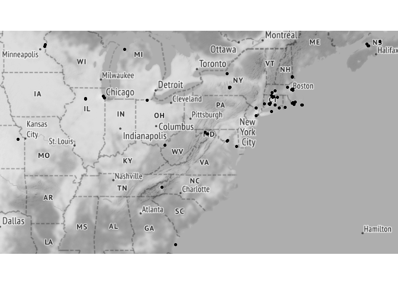

Andrena asteris
================
Mark Buckner
2022-03-04

## Load Pkgs and functions

Project directory structure:

Andrena_asteris_SDM -

occ - occurrence datasets

pred - .txt/s containing URLs to environmental data

R - code

### Pkgs

``` r
if(!require(pacman)) install.packages("pacman")
library(pacman)

pacman::p_load(tidyverse, lubridate, ggmap, spThin, 
               CoordinateCleaner, curl, raster, sf, 
               RStoolbox, rgdal, ENMeval, rJava, rasterVis, tmap, 
               rnaturalearth, grid)

pacman::p_load_gh("SEEG-Oxford/seegSDM", "ropensci/rnaturalearthhires", "ropensci/rnaturalearthdata")
```

### Functions

``` r
#envLoad(): Downloads and processes environmental raster data from source. 
#--paths = urls for data sources read in from .txt file;
#--filedir = path to dir where the processed raw files are or will be stored.
#--ref = anticipated path of a reference .tif with the correct resolution and projection (eg. worldclim layer) in the paths .txt ["../pred/env/NAME.tif"]
#--bb = bounding box for study area (any object an extent can be extracted from)

envLoad <- function(paths, filedir, ref, bb, type = "cont") {
  
  savepaths <- sapply(paths, function (x) gsub("\\?.*", "", x))
  dest <- sapply(savepaths, function(x) paste(filedir,"/", gsub(".*/(\\w+)", "\\1", x), sep = "")) %>% 
    sort()
  names <- sapply(savepaths, function(x) paste( gsub(".*/(\\w+)", "\\1", x), sep = "")) %>% 
    sort() %>% 
    sapply(function(x) paste("../pred/env/",x, sep = ""))
  
  names <- str_replace(names, ".zip$", ".tif")
  
  for (i in 1:length(paths)) {
    if(file.exists(dest[i]) | file.exists(names[i])){
      if (file.exists(names[i])) {
        print(paste("File exists:",names[i]))
      } else {
        unproc_cont <- TRUE
        print(paste("File exists but is unprocessed:",dest[i]))
      }
      
    } else {
      
      print(paste("Downloading: ", paths[i]))
      
      unproc_cont <- TRUE
      
      file <- try(curl::curl_download(url = paths[i], destfile = dest[i]))
      
      if(class(file) == "try-error") {
        download.file(url = paths[i], destfile = dest[i], method = "curl")
      }
      
      if(grepl(".*zip", dest[i])) {
        unzip(dest[i], exdir = filedir)
        
      }
    }
  }
  
  if(!all(file.exists(names))) {
    print("Processing files")
    env.files <- list.files(filedir, recursive = TRUE, pattern = ".*tif$") %>% 
      sapply(function(x) paste(filedir, "/", x, sep = ""))
    
    r <- raster(ref) %>% 
      raster::crop(extent(bb)) %>% 
      projectRaster(crs = "+init=epsg:4326")
    
    method <- ifelse(type == "cont", "bilinear", "ngb")
    print(paste("Method:", method))
    
    env.stack <- lapply(env.files, raster) %>% 
      lapply(projectRaster, to = r, method = "ngb") %>% 
      stack()
    
    print("Saving stack")
    
    bylayer <- ifelse(nlayers(env.stack) > 1, TRUE, FALSE)
    writeRaster(env.stack, names, format = "GTiff", bylayer = bylayer, overwrite = TRUE)
    
  } else {
    print("Loading processed files")
    env.stack <- stack(names)
  }
  return(env.stack)
  
}
```

## Load and process occ Data

### Load and filter by date

``` r
gbif <- read_tsv("../occ/Aa_GBIF.txt")
scan <- read_csv("../occ/Aa_SCAN.csv")
amnh <- read_tsv("../occ/Aa_AMNH.txt")

t_scan <- scan %>% 
  dplyr::select(id, date = eventDate, lat = decimalLatitude, lon = decimalLongitude) %>% 
  drop_na() %>% 
  mutate(lat = round(lat,5), lon = round(lon,5)) %>%
  mutate(source = "SCAN")


t_gbif <- gbif %>% 
  dplyr::select(gbifID, eventDate, verbatimEventDate, lat = decimalLatitude, lon = decimalLongitude) %>% 
  separate(eventDate, c("date", NA), sep = " ") %>% 
  mutate(verbatimEventDate = ifelse(is.na(date), verbatimEventDate, NA)) %>% 
  unite(date, date, verbatimEventDate, na.rm = TRUE) %>% 
  mutate(date = parse_date_time(date, orders = c("mdy", "ymd", "dmy"))) %>% 
  drop_na() %>% 
  mutate(lat = round(lat,5), lon = round(lon,5)) %>%
  mutate(source = "GBIF")

t_amnh <- amnh %>% 
  mutate(date = parse_date_time(amnh$Start_Date, orders = c("mdy", "dmy"))) %>%
  filter(year(date) <= Det_Date) %>%    
  dplyr::select(PBIUSI, date, lat = Lat, lon = Lon) %>% 
  drop_na() %>% 
  mutate(lat = round(lat,5), lon = round(lon,5)) %>%
  mutate(source = "AMNH")

#Parsing errors for year only (old data) or "no date provided"

occ.joined <- full_join(t_scan, t_gbif, by = c("date", "lat", "lon")) %>% 
  full_join(t_amnh, by = c("date", "lat", "lon")) %>%
  filter(!duplicated(.[c("date", "lat", "lon")])) %>% 
  unite(data_source, source.x, source.y, source, sep = "/", na.rm = TRUE) %>% 
  dplyr::select(date, lat, lon, data_source, scanID = id, gbifID, PBIUSI)

date_start <- as.Date("1971-01-01")
date_end <- as.Date("2010-12-31")

occ <- occ.joined %>% 
  filter(date >= date_start & date <= date_end) %>%
  mutate(lat = floor(lat*10000)/10000, lon = floor(lon*10000)/10000) %>% 
  distinct(lat, lon, .keep_all = TRUE) %>% 
  mutate("spp" = "Aasteris")

qmplot(x = lon, y = lat, data = occ, maptype = "toner-lite", mapcolor = "bw", source = "stamen", force = T)
```

<!-- -->

### Check for georeferencing errors

``` r
flags <- clean_coordinates(x = occ, lon = "lon", 
                           lat = "lat", species = "spp",
                           tests = c("capitals", "centroids", 
                                     "equal", "gbif", "institutions", 
                                     "outliers", "seas", "zeros"))
```

    ## Testing coordinate validity

    ## Flagged 0 records.

    ## Testing equal lat/lon

    ## Flagged 0 records.

    ## Testing zero coordinates

    ## Flagged 0 records.

    ## Testing country capitals

    ## Flagged 0 records.

    ## Testing country centroids

    ## Flagged 0 records.

    ## Testing sea coordinates

    ## OGR data source with driver: ESRI Shapefile 
    ## Source: "C:\Users\mabuc\AppData\Local\Temp\RtmpQF9pXn", layer: "ne_50m_land"
    ## with 1420 features
    ## It has 3 fields
    ## Integer64 fields read as strings:  scalerank

    ## Flagged 22 records.

    ## Testing geographic outliers

    ## Flagged 0 records.

    ## Testing GBIF headquarters, flagging records around Copenhagen

    ## Flagged 0 records.

    ## Testing biodiversity institutions

    ## Flagged 2 records.

    ## Flagged 24 of 86 records, EQ = 0.28.

``` r
summary(flags)
```

    ##     .val     .equ     .zer     .cap     .cen     .sea     .otl     .gbf 
    ##        0        0        0        0        0       22        0        0 
    ##    .inst .summary 
    ##        2       24

``` r
plot(flags, lon = "lon", lat = "lat")
```

<!-- -->

``` r
occ.flagged <- occ[!flags$.summary,]

write_csv(occ.flagged, file = "../occ/Aa_flagged.csv")
```

22 occurrences were flagged for potentially being in the sea. These
points are located on various Island which matches the metadata. The
georeferencing is sufficiently accurate for this analysis.

Two points match research institutions. The [occurrence
remarks](https://bugguide.net/node/view/370287) for 34630476 - Cornell
University provide no additional details this observation was excluded.
The metadata for 56951087 - Connecticut Agricultural Exp. list the
address of the station.

``` r
occs <- occ %>% 
  filter(is.na(scanID) | scanID != 56951087 & scanID != 34630476) %>% 
  write_csv(file = "../occ/Aa_combined.csv") %>% 
  dplyr::select(spp, lat, lon)
```

### Spatial Thinning w/ spThin

``` r
thinned <-
  thin( loc.data = occs, 
        lat.col = "lat", long.col = "lon", 
        spec.col = "spp", 
        thin.par = 10, reps = 100, 
        locs.thinned.list.return = TRUE, 
        write.files = TRUE, 
        max.files = 5, 
        out.dir = "../occ/Aa_thinned_full/", out.base = "Aa_thinned", 
        write.log.file = TRUE,
        log.file = "../occ/Aa_thinned_full_log_file.txt" )
```

    ## ********************************************** 
    ##  Beginning Spatial Thinning.
    ##  Script Started at: Fri Mar 04 20:33:38 2022
    ## lat.long.thin.count
    ##  49 
    ## 100 
    ## [1] "Maximum number of records after thinning: 49"
    ## [1] "Number of data.frames with max records: 100"
    ## [1] "Writing new *.csv files"

    ## Warning in thin(loc.data = occs, lat.col = "lat", long.col = "lon", spec.col =
    ## "spp", : Created new output directory: ../occ/Aa_thinned_full/

    ## [1] "Writing file: ../occ/Aa_thinned_full/Aa_thinned_thin1.csv"
    ## [1] "Writing file: ../occ/Aa_thinned_full/Aa_thinned_thin2.csv"
    ## [1] "Writing file: ../occ/Aa_thinned_full/Aa_thinned_thin3.csv"
    ## [1] "Writing file: ../occ/Aa_thinned_full/Aa_thinned_thin4.csv"
    ## [1] "Writing file: ../occ/Aa_thinned_full/Aa_thinned_thin5.csv"

``` r
plotThin(thinned)
```

<!-- --><!-- --><!-- -->

#### Load thinned occ data

``` r
occt <- read_csv("../occ/Aa_thinned_full/Aa_thinned_thin1.csv") %>% 
  dplyr::select(lon, lat)


qmplot(x = lon, y = lat, data = occt, maptype = "toner-lite", mapcolor = "bw", source = "stamen", force = T)
```

<!-- -->

Retained 49 after spatial thinning.

## Environmental Covariates

Bioclimatic Variables - [CHELSA Climate
v2.1](https://chelsa-climate.org/)

-   Bio 1 : Mean Annual Temperature
-   Bio 2 : Annual Mean Diurnal Range
-   Bio 3 : Isothermality
-   Bio 4 : Temperature Seasonality
-   Bio 5 : Max Temperature of Warmest Month
-   Bio 7 : Annual Temperature Range
-   Bio 8 : Mean Temperature of Wettest Quarter
-   Bio 9 : Mean Temperature of Driest Quarter
-   Bio 10 : Mean Temperature of Warmest Quarter
-   Bio 11 : Mean Temperature of Coldest Quarter
-   Bio 12 : Annual Precipitation
-   Bio 13 : Precipitation of Wettest Month
-   Bio 14 : Precipitation of Driest Month
-   Bio 15 : Precipitation Seasonality
-   Bio 16 : Precipitation of Wettest Quarter
-   Bio 17 : Precipitation of Driest Quarter
-   Bio 18 : Precipitation of Warmest Quarter
-   Bio 19 : Precipitation of Coldest Quarter

Other Climatologies - [CHELSA Climate v2.1](https://chelsa-climate.org/)

-   gddlgd0 : Last growing degree day above 0C

Topography - [WorldClim SRTM 5
arc-min](https://www.worldclim.org/data/worldclim21.html)

-   DEM

Other

-   [Soil sand at 0cm](https://zenodo.org/record/2525662#.YiISa3rMJOQ)
-   [Soil clay at 0cm](https://zenodo.org/record/2525663#.YiISZnrMJOQ)
-   [Land
    use](http://www.cec.org/north-american-environmental-atlas/land-cover-30m-2015-landsat-and-rapideye/)
    (excluded)

### Define study area

``` r
proj.res <- c(0.08333333,0.08333333)
proj.crs <- st_crs(4326)

occs.sf <- sf::st_as_sf(occt, coords = c("lon", "lat"), crs = proj.crs) %>% 
  st_cast("MULTIPOINT") %>% 
  st_union()

sa.bb <- st_bbox(occs.sf)
sa.bb[1:2] <- sa.bb[1:2] - 7
sa.bb[3:4] <- sa.bb[3:4] + 7
```

### Download and process env

``` r
dir.create("../pred/cat")
dir.create("../pred/cont")
dir.create("../pred/env")
```

    ## Warning in dir.create("../pred/env"): '..\pred\env' already exists

``` r
# Download and process continuous data
paths.cont <- read_delim("../pred/cov_paths_cont.txt", delim = "\\n", col_names = FALSE) %>% 
  pull()
```

    ## Rows: 23 Columns: 1
    ## -- Column specification --------------------------------------------------------
    ## Delimiter: "\\n"
    ## chr (1): X1
    ## 
    ## i Use `spec()` to retrieve the full column specification for this data.
    ## i Specify the column types or set `show_col_types = FALSE` to quiet this message.

``` r
env.cont <- envLoad(paths.cont, filedir = "../pred/cont", ref = "../pred/cont/wc2.1_5m_elev.tif", bb = sa.bb)
```

    ## [1] "File exists: ../pred/env/CHELSA_bio1_1981-2010_V.2.1.tif "
    ## [1] "File exists: ../pred/env/CHELSA_bio10_1981-2010_V.2.1.tif "
    ## [1] "File exists: ../pred/env/CHELSA_bio11_1981-2010_V.2.1.tif "
    ## [1] "File exists: ../pred/env/CHELSA_bio12_1981-2010_V.2.1.tif "
    ## [1] "File exists: ../pred/env/CHELSA_bio13_1981-2010_V.2.1.tif "
    ## [1] "File exists: ../pred/env/CHELSA_bio14_1981-2010_V.2.1.tif "
    ## [1] "File exists: ../pred/env/CHELSA_bio15_1981-2010_V.2.1.tif "
    ## [1] "File exists: ../pred/env/CHELSA_bio16_1981-2010_V.2.1.tif "
    ## [1] "File exists: ../pred/env/CHELSA_bio17_1981-2010_V.2.1.tif "
    ## [1] "File exists: ../pred/env/CHELSA_bio18_1981-2010_V.2.1.tif "
    ## [1] "File exists: ../pred/env/CHELSA_bio19_1981-2010_V.2.1.tif "
    ## [1] "File exists: ../pred/env/CHELSA_bio2_1981-2010_V.2.1.tif "
    ## [1] "File exists: ../pred/env/CHELSA_bio3_1981-2010_V.2.1.tif "
    ## [1] "File exists: ../pred/env/CHELSA_bio4_1981-2010_V.2.1.tif "
    ## [1] "File exists: ../pred/env/CHELSA_bio5_1981-2010_V.2.1.tif "
    ## [1] "File exists: ../pred/env/CHELSA_bio6_1981-2010_V.2.1.tif "
    ## [1] "File exists: ../pred/env/CHELSA_bio7_1981-2010_V.2.1.tif "
    ## [1] "File exists: ../pred/env/CHELSA_bio8_1981-2010_V.2.1.tif "
    ## [1] "File exists: ../pred/env/CHELSA_bio9_1981-2010_V.2.1.tif "
    ## [1] "File exists: ../pred/env/CHELSA_gddlgd0_1981-2010_V.2.1.tif "
    ## [1] "File exists: ../pred/env/sol_clay.wfraction_usda.3a1a1a_m_250m_b0..0cm_1950..2017_v0.2.tif"
    ## [1] "File exists: ../pred/env/sol_sand.wfraction_usda.3a1a1a_m_250m_b0..0cm_1950..2017_v0.2.tif"
    ## [1] "File exists: ../pred/env/wc2.1_5m_elev.tif"
    ## [1] "Loading processed files"

``` r
# Download and process categorical data
paths.cat <- read_delim("../pred/cov_paths_cat.txt", delim = "\\n", col_names = FALSE) %>% 
  pull()
```

    ## Rows: 1 Columns: 1
    ## -- Column specification --------------------------------------------------------
    ## Delimiter: "\\n"
    ## chr (1): X1
    ## 
    ## i Use `spec()` to retrieve the full column specification for this data.
    ## i Specify the column types or set `show_col_types = FALSE` to quiet this message.

``` r
env.cat <- envLoad(paths.cat, filedir = "../pred/cat", ref = "../pred/cont/wc2.1_5m_elev.tif", bb = sa.bb, type = "cat")%>% 
  `names<-`("LU")
```

    ## [1] "File exists: ../pred/env/north_america_2015_v2.tif"
    ## [1] "Loading processed files"

``` r
unlink("../pred/cat", recursive = TRUE)
unlink("../pred/cont", recursive = TRUE)
```

### PCA

``` r
#GDD data modification to allow proper masking
env.cont$CHELSA_gddlgd0_1981.2010_V.2.1[is.na(env.cont$CHELSA_gddlgd0_1981.2010_V.2.1)] <- 0

mmask <- masterMask(env.cont)

env.m <- mask(env.cont, mmask)
env.cat.m <- mask(env.cat, mmask)

dir.create("../pred/PCA")
pca <- rasterPCA(env.m, spca = TRUE, maskCheck = FALSE, filename = "../pred/PCA/envPCA.tif", overwrite = TRUE)

summary(pca$model)
```

    ## Importance of components:
    ##                          Comp.1    Comp.2     Comp.3     Comp.4     Comp.5
    ## Standard deviation     3.273579 2.4283101 1.40026590 1.15590054 0.98093012
    ## Proportion of Variance 0.465927 0.2563778 0.08524977 0.05809157 0.04183582
    ## Cumulative Proportion  0.465927 0.7223048 0.80755458 0.86564614 0.90748197
    ##                            Comp.6     Comp.7    Comp.8     Comp.9     Comp.10
    ## Standard deviation     0.75240800 0.71645352 0.6015950 0.55287585 0.335507138
    ## Proportion of Variance 0.02461382 0.02231764 0.0157355 0.01329007 0.004894132
    ## Cumulative Proportion  0.93209578 0.95441342 0.9701489 0.98343899 0.988333127
    ##                            Comp.11     Comp.12     Comp.13     Comp.14
    ## Standard deviation     0.302936735 0.258285028 0.212672731 0.154748337
    ## Proportion of Variance 0.003990029 0.002900485 0.001966508 0.001041176
    ## Cumulative Proportion  0.992323156 0.995223641 0.997190149 0.998231325
    ##                             Comp.15      Comp.16      Comp.17      Comp.18
    ## Standard deviation     0.1174087452 0.0954031748 0.0855662141 0.0713953354
    ## Proportion of Variance 0.0005993397 0.0003957289 0.0003183294 0.0002216215
    ## Cumulative Proportion  0.9988306646 0.9992263936 0.9995447230 0.9997663445
    ##                             Comp.19      Comp.20      Comp.21      Comp.22
    ## Standard deviation     0.0572040760 4.254521e-02 1.466703e-02 8.749498e-03
    ## Proportion of Variance 0.0001422742 7.869977e-05 9.353122e-06 3.328422e-06
    ## Cumulative Proportion  0.9999086187 9.999873e-01 9.999967e-01 1.000000e+00
    ##                             Comp.23
    ## Standard deviation     1.046154e-07
    ## Proportion of Variance 4.758424e-16
    ## Cumulative Proportion  1.000000e+00

``` r
loadings(pca$model)
```

    ## 
    ## Loadings:
    ##                                                               Comp.1 Comp.2
    ## CHELSA_bio1_1981.2010_V.2.1                                    0.271  0.184
    ## CHELSA_bio10_1981.2010_V.2.1                                   0.237  0.246
    ## CHELSA_bio11_1981.2010_V.2.1                                   0.282  0.145
    ## CHELSA_bio12_1981.2010_V.2.1                                   0.210 -0.282
    ## CHELSA_bio13_1981.2010_V.2.1                                   0.193 -0.185
    ## CHELSA_bio14_1981.2010_V.2.1                                   0.193 -0.282
    ## CHELSA_bio15_1981.2010_V.2.1                                  -0.140  0.248
    ## CHELSA_bio16_1981.2010_V.2.1                                   0.186 -0.219
    ## CHELSA_bio17_1981.2010_V.2.1                                   0.203 -0.276
    ## CHELSA_bio18_1981.2010_V.2.1                                   0.125 -0.214
    ## CHELSA_bio19_1981.2010_V.2.1                                   0.211 -0.258
    ## CHELSA_bio2_1981.2010_V.2.1                                           0.292
    ## CHELSA_bio3_1981.2010_V.2.1                                    0.245  0.194
    ## CHELSA_bio4_1981.2010_V.2.1                                   -0.290       
    ## CHELSA_bio5_1981.2010_V.2.1                                    0.208  0.285
    ## CHELSA_bio6_1981.2010_V.2.1                                    0.280  0.148
    ## CHELSA_bio7_1981.2010_V.2.1                                   -0.286       
    ## CHELSA_bio8_1981.2010_V.2.1                                           0.256
    ## CHELSA_bio9_1981.2010_V.2.1                                    0.280       
    ## CHELSA_gddlgd0_1981.2010_V.2.1                                -0.246       
    ## sol_clay.wfraction_usda.3a1a1a_m_250m_b0..0cm_1950..2017_v0.2         0.251
    ## sol_sand.wfraction_usda.3a1a1a_m_250m_b0..0cm_1950..2017_v0.2        -0.136
    ## wc2.1_5m_elev                                                 -0.156       
    ##                                                               Comp.3 Comp.4
    ## CHELSA_bio1_1981.2010_V.2.1                                                
    ## CHELSA_bio10_1981.2010_V.2.1                                               
    ## CHELSA_bio11_1981.2010_V.2.1                                               
    ## CHELSA_bio12_1981.2010_V.2.1                                         -0.175
    ## CHELSA_bio13_1981.2010_V.2.1                                   0.349 -0.281
    ## CHELSA_bio14_1981.2010_V.2.1                                  -0.201       
    ## CHELSA_bio15_1981.2010_V.2.1                                   0.388       
    ## CHELSA_bio16_1981.2010_V.2.1                                   0.340 -0.266
    ## CHELSA_bio17_1981.2010_V.2.1                                  -0.186       
    ## CHELSA_bio18_1981.2010_V.2.1                                   0.480 -0.200
    ## CHELSA_bio19_1981.2010_V.2.1                                  -0.200       
    ## CHELSA_bio2_1981.2010_V.2.1                                          -0.170
    ## CHELSA_bio3_1981.2010_V.2.1                                                
    ## CHELSA_bio4_1981.2010_V.2.1                                          -0.137
    ## CHELSA_bio5_1981.2010_V.2.1                                                
    ## CHELSA_bio6_1981.2010_V.2.1                                                
    ## CHELSA_bio7_1981.2010_V.2.1                                          -0.139
    ## CHELSA_bio8_1981.2010_V.2.1                                    0.328       
    ## CHELSA_bio9_1981.2010_V.2.1                                   -0.138       
    ## CHELSA_gddlgd0_1981.2010_V.2.1                                       -0.105
    ## sol_clay.wfraction_usda.3a1a1a_m_250m_b0..0cm_1950..2017_v0.2 -0.185 -0.458
    ## sol_sand.wfraction_usda.3a1a1a_m_250m_b0..0cm_1950..2017_v0.2  0.294  0.665
    ## wc2.1_5m_elev                                                        -0.145
    ##                                                               Comp.5 Comp.6
    ## CHELSA_bio1_1981.2010_V.2.1                                                
    ## CHELSA_bio10_1981.2010_V.2.1                                               
    ## CHELSA_bio11_1981.2010_V.2.1                                               
    ## CHELSA_bio12_1981.2010_V.2.1                                               
    ## CHELSA_bio13_1981.2010_V.2.1                                          0.181
    ## CHELSA_bio14_1981.2010_V.2.1                                         -0.202
    ## CHELSA_bio15_1981.2010_V.2.1                                          0.414
    ## CHELSA_bio16_1981.2010_V.2.1                                          0.139
    ## CHELSA_bio17_1981.2010_V.2.1                                         -0.180
    ## CHELSA_bio18_1981.2010_V.2.1                                         -0.156
    ## CHELSA_bio19_1981.2010_V.2.1                                  -0.108       
    ## CHELSA_bio2_1981.2010_V.2.1                                   -0.534 -0.133
    ## CHELSA_bio3_1981.2010_V.2.1                                   -0.261       
    ## CHELSA_bio4_1981.2010_V.2.1                                                
    ## CHELSA_bio5_1981.2010_V.2.1                                                
    ## CHELSA_bio6_1981.2010_V.2.1                                                
    ## CHELSA_bio7_1981.2010_V.2.1                                                
    ## CHELSA_bio8_1981.2010_V.2.1                                    0.153 -0.747
    ## CHELSA_bio9_1981.2010_V.2.1                                           0.262
    ## CHELSA_gddlgd0_1981.2010_V.2.1                                       -0.112
    ## sol_clay.wfraction_usda.3a1a1a_m_250m_b0..0cm_1950..2017_v0.2  0.250       
    ## sol_sand.wfraction_usda.3a1a1a_m_250m_b0..0cm_1950..2017_v0.2 -0.143       
    ## wc2.1_5m_elev                                                 -0.694       
    ##                                                               Comp.7 Comp.8
    ## CHELSA_bio1_1981.2010_V.2.1                                           0.101
    ## CHELSA_bio10_1981.2010_V.2.1                                          0.198
    ## CHELSA_bio11_1981.2010_V.2.1                                   0.120       
    ## CHELSA_bio12_1981.2010_V.2.1                                               
    ## CHELSA_bio13_1981.2010_V.2.1                                               
    ## CHELSA_bio14_1981.2010_V.2.1                                               
    ## CHELSA_bio15_1981.2010_V.2.1                                               
    ## CHELSA_bio16_1981.2010_V.2.1                                               
    ## CHELSA_bio17_1981.2010_V.2.1                                               
    ## CHELSA_bio18_1981.2010_V.2.1                                               
    ## CHELSA_bio19_1981.2010_V.2.1                                         -0.110
    ## CHELSA_bio2_1981.2010_V.2.1                                   -0.507       
    ## CHELSA_bio3_1981.2010_V.2.1                                          -0.184
    ## CHELSA_bio4_1981.2010_V.2.1                                   -0.266       
    ## CHELSA_bio5_1981.2010_V.2.1                                   -0.179  0.212
    ## CHELSA_bio6_1981.2010_V.2.1                                    0.155       
    ## CHELSA_bio7_1981.2010_V.2.1                                   -0.380       
    ## CHELSA_bio8_1981.2010_V.2.1                                                
    ## CHELSA_bio9_1981.2010_V.2.1                                                
    ## CHELSA_gddlgd0_1981.2010_V.2.1                                 0.140  0.305
    ## sol_clay.wfraction_usda.3a1a1a_m_250m_b0..0cm_1950..2017_v0.2  0.178 -0.718
    ## sol_sand.wfraction_usda.3a1a1a_m_250m_b0..0cm_1950..2017_v0.2 -0.112 -0.454
    ## wc2.1_5m_elev                                                  0.599       
    ##                                                               Comp.9 Comp.10
    ## CHELSA_bio1_1981.2010_V.2.1                                                 
    ## CHELSA_bio10_1981.2010_V.2.1                                          0.168 
    ## CHELSA_bio11_1981.2010_V.2.1                                                
    ## CHELSA_bio12_1981.2010_V.2.1                                          0.103 
    ## CHELSA_bio13_1981.2010_V.2.1                                  -0.120        
    ## CHELSA_bio14_1981.2010_V.2.1                                                
    ## CHELSA_bio15_1981.2010_V.2.1                                          0.149 
    ## CHELSA_bio16_1981.2010_V.2.1                                                
    ## CHELSA_bio17_1981.2010_V.2.1                                          0.108 
    ## CHELSA_bio18_1981.2010_V.2.1                                         -0.186 
    ## CHELSA_bio19_1981.2010_V.2.1                                          0.252 
    ## CHELSA_bio2_1981.2010_V.2.1                                    0.215        
    ## CHELSA_bio3_1981.2010_V.2.1                                    0.239 -0.314 
    ## CHELSA_bio4_1981.2010_V.2.1                                   -0.186  0.234 
    ## CHELSA_bio5_1981.2010_V.2.1                                           0.202 
    ## CHELSA_bio6_1981.2010_V.2.1                                                 
    ## CHELSA_bio7_1981.2010_V.2.1                                   -0.117  0.185 
    ## CHELSA_bio8_1981.2010_V.2.1                                   -0.213  0.312 
    ## CHELSA_bio9_1981.2010_V.2.1                                           0.519 
    ## CHELSA_gddlgd0_1981.2010_V.2.1                                 0.823  0.300 
    ## sol_clay.wfraction_usda.3a1a1a_m_250m_b0..0cm_1950..2017_v0.2  0.166  0.116 
    ## sol_sand.wfraction_usda.3a1a1a_m_250m_b0..0cm_1950..2017_v0.2  0.151  0.295 
    ## wc2.1_5m_elev                                                 -0.182  0.174 
    ##                                                               Comp.11 Comp.12
    ## CHELSA_bio1_1981.2010_V.2.1                                    0.153         
    ## CHELSA_bio10_1981.2010_V.2.1                                   0.336   0.153 
    ## CHELSA_bio11_1981.2010_V.2.1                                                 
    ## CHELSA_bio12_1981.2010_V.2.1                                   0.122         
    ## CHELSA_bio13_1981.2010_V.2.1                                   0.125  -0.595 
    ## CHELSA_bio14_1981.2010_V.2.1                                                 
    ## CHELSA_bio15_1981.2010_V.2.1                                  -0.136         
    ## CHELSA_bio16_1981.2010_V.2.1                                                 
    ## CHELSA_bio17_1981.2010_V.2.1                                   0.103         
    ## CHELSA_bio18_1981.2010_V.2.1                                           0.669 
    ## CHELSA_bio19_1981.2010_V.2.1                                  -0.116   0.227 
    ## CHELSA_bio2_1981.2010_V.2.1                                                  
    ## CHELSA_bio3_1981.2010_V.2.1                                   -0.259  -0.138 
    ## CHELSA_bio4_1981.2010_V.2.1                                    0.122   0.114 
    ## CHELSA_bio5_1981.2010_V.2.1                                    0.359   0.130 
    ## CHELSA_bio6_1981.2010_V.2.1                                    0.116         
    ## CHELSA_bio7_1981.2010_V.2.1                                                  
    ## CHELSA_bio8_1981.2010_V.2.1                                   -0.201  -0.157 
    ## CHELSA_bio9_1981.2010_V.2.1                                   -0.609         
    ## CHELSA_gddlgd0_1981.2010_V.2.1                                               
    ## sol_clay.wfraction_usda.3a1a1a_m_250m_b0..0cm_1950..2017_v0.2  0.166         
    ## sol_sand.wfraction_usda.3a1a1a_m_250m_b0..0cm_1950..2017_v0.2  0.282         
    ## wc2.1_5m_elev                                                  0.132         
    ##                                                               Comp.13 Comp.14
    ## CHELSA_bio1_1981.2010_V.2.1                                                  
    ## CHELSA_bio10_1981.2010_V.2.1                                                 
    ## CHELSA_bio11_1981.2010_V.2.1                                                 
    ## CHELSA_bio12_1981.2010_V.2.1                                   0.124   0.210 
    ## CHELSA_bio13_1981.2010_V.2.1                                                 
    ## CHELSA_bio14_1981.2010_V.2.1                                  -0.455  -0.476 
    ## CHELSA_bio15_1981.2010_V.2.1                                  -0.689         
    ## CHELSA_bio16_1981.2010_V.2.1                                   0.193         
    ## CHELSA_bio17_1981.2010_V.2.1                                  -0.278  -0.189 
    ## CHELSA_bio18_1981.2010_V.2.1                                          -0.209 
    ## CHELSA_bio19_1981.2010_V.2.1                                  -0.251   0.705 
    ## CHELSA_bio2_1981.2010_V.2.1                                                  
    ## CHELSA_bio3_1981.2010_V.2.1                                            0.150 
    ## CHELSA_bio4_1981.2010_V.2.1                                                  
    ## CHELSA_bio5_1981.2010_V.2.1                                                  
    ## CHELSA_bio6_1981.2010_V.2.1                                                  
    ## CHELSA_bio7_1981.2010_V.2.1                                                  
    ## CHELSA_bio8_1981.2010_V.2.1                                            0.125 
    ## CHELSA_bio9_1981.2010_V.2.1                                    0.271  -0.318 
    ## CHELSA_gddlgd0_1981.2010_V.2.1                                               
    ## sol_clay.wfraction_usda.3a1a1a_m_250m_b0..0cm_1950..2017_v0.2                
    ## sol_sand.wfraction_usda.3a1a1a_m_250m_b0..0cm_1950..2017_v0.2  0.111         
    ## wc2.1_5m_elev                                                                
    ##                                                               Comp.15 Comp.16
    ## CHELSA_bio1_1981.2010_V.2.1                                                  
    ## CHELSA_bio10_1981.2010_V.2.1                                   0.145   0.229 
    ## CHELSA_bio11_1981.2010_V.2.1                                                 
    ## CHELSA_bio12_1981.2010_V.2.1                                  -0.286  -0.248 
    ## CHELSA_bio13_1981.2010_V.2.1                                   0.502  -0.152 
    ## CHELSA_bio14_1981.2010_V.2.1                                           0.290 
    ## CHELSA_bio15_1981.2010_V.2.1                                  -0.146  -0.108 
    ## CHELSA_bio16_1981.2010_V.2.1                                  -0.626   0.390 
    ## CHELSA_bio17_1981.2010_V.2.1                                          -0.180 
    ## CHELSA_bio18_1981.2010_V.2.1                                   0.280  -0.114 
    ## CHELSA_bio19_1981.2010_V.2.1                                   0.119         
    ## CHELSA_bio2_1981.2010_V.2.1                                   -0.151  -0.338 
    ## CHELSA_bio3_1981.2010_V.2.1                                    0.213   0.536 
    ## CHELSA_bio4_1981.2010_V.2.1                                    0.172   0.345 
    ## CHELSA_bio5_1981.2010_V.2.1                                                  
    ## CHELSA_bio6_1981.2010_V.2.1                                                  
    ## CHELSA_bio7_1981.2010_V.2.1                                            0.127 
    ## CHELSA_bio8_1981.2010_V.2.1                                                  
    ## CHELSA_bio9_1981.2010_V.2.1                                                  
    ## CHELSA_gddlgd0_1981.2010_V.2.1                                               
    ## sol_clay.wfraction_usda.3a1a1a_m_250m_b0..0cm_1950..2017_v0.2                
    ## sol_sand.wfraction_usda.3a1a1a_m_250m_b0..0cm_1950..2017_v0.2                
    ## wc2.1_5m_elev                                                                
    ##                                                               Comp.17 Comp.18
    ## CHELSA_bio1_1981.2010_V.2.1                                                  
    ## CHELSA_bio10_1981.2010_V.2.1                                                 
    ## CHELSA_bio11_1981.2010_V.2.1                                                 
    ## CHELSA_bio12_1981.2010_V.2.1                                   0.753         
    ## CHELSA_bio13_1981.2010_V.2.1                                           0.114 
    ## CHELSA_bio14_1981.2010_V.2.1                                           0.492 
    ## CHELSA_bio15_1981.2010_V.2.1                                   0.173         
    ## CHELSA_bio16_1981.2010_V.2.1                                  -0.310  -0.130 
    ## CHELSA_bio17_1981.2010_V.2.1                                          -0.778 
    ## CHELSA_bio18_1981.2010_V.2.1                                                 
    ## CHELSA_bio19_1981.2010_V.2.1                                  -0.283   0.160 
    ## CHELSA_bio2_1981.2010_V.2.1                                   -0.215         
    ## CHELSA_bio3_1981.2010_V.2.1                                    0.337  -0.192 
    ## CHELSA_bio4_1981.2010_V.2.1                                           -0.166 
    ## CHELSA_bio5_1981.2010_V.2.1                                                  
    ## CHELSA_bio6_1981.2010_V.2.1                                   -0.112         
    ## CHELSA_bio7_1981.2010_V.2.1                                    0.188         
    ## CHELSA_bio8_1981.2010_V.2.1                                                  
    ## CHELSA_bio9_1981.2010_V.2.1                                                  
    ## CHELSA_gddlgd0_1981.2010_V.2.1                                               
    ## sol_clay.wfraction_usda.3a1a1a_m_250m_b0..0cm_1950..2017_v0.2                
    ## sol_sand.wfraction_usda.3a1a1a_m_250m_b0..0cm_1950..2017_v0.2                
    ## wc2.1_5m_elev                                                                
    ##                                                               Comp.19 Comp.20
    ## CHELSA_bio1_1981.2010_V.2.1                                    0.214   0.451 
    ## CHELSA_bio10_1981.2010_V.2.1                                   0.429   0.128 
    ## CHELSA_bio11_1981.2010_V.2.1                                           0.278 
    ## CHELSA_bio12_1981.2010_V.2.1                                   0.147  -0.125 
    ## CHELSA_bio13_1981.2010_V.2.1                                                 
    ## CHELSA_bio14_1981.2010_V.2.1                                                 
    ## CHELSA_bio15_1981.2010_V.2.1                                                 
    ## CHELSA_bio16_1981.2010_V.2.1                                                 
    ## CHELSA_bio17_1981.2010_V.2.1                                           0.120 
    ## CHELSA_bio18_1981.2010_V.2.1                                                 
    ## CHELSA_bio19_1981.2010_V.2.1                                                 
    ## CHELSA_bio2_1981.2010_V.2.1                                    0.256         
    ## CHELSA_bio3_1981.2010_V.2.1                                   -0.155         
    ## CHELSA_bio4_1981.2010_V.2.1                                    0.340  -0.409 
    ## CHELSA_bio5_1981.2010_V.2.1                                   -0.616  -0.275 
    ## CHELSA_bio6_1981.2010_V.2.1                                           -0.429 
    ## CHELSA_bio7_1981.2010_V.2.1                                   -0.381   0.471 
    ## CHELSA_bio8_1981.2010_V.2.1                                                  
    ## CHELSA_bio9_1981.2010_V.2.1                                                  
    ## CHELSA_gddlgd0_1981.2010_V.2.1                                               
    ## sol_clay.wfraction_usda.3a1a1a_m_250m_b0..0cm_1950..2017_v0.2                
    ## sol_sand.wfraction_usda.3a1a1a_m_250m_b0..0cm_1950..2017_v0.2                
    ## wc2.1_5m_elev                                                                
    ##                                                               Comp.21 Comp.22
    ## CHELSA_bio1_1981.2010_V.2.1                                    0.758         
    ## CHELSA_bio10_1981.2010_V.2.1                                  -0.510   0.353 
    ## CHELSA_bio11_1981.2010_V.2.1                                  -0.297  -0.821 
    ## CHELSA_bio12_1981.2010_V.2.1                                                 
    ## CHELSA_bio13_1981.2010_V.2.1                                                 
    ## CHELSA_bio14_1981.2010_V.2.1                                                 
    ## CHELSA_bio15_1981.2010_V.2.1                                                 
    ## CHELSA_bio16_1981.2010_V.2.1                                                 
    ## CHELSA_bio17_1981.2010_V.2.1                                                 
    ## CHELSA_bio18_1981.2010_V.2.1                                                 
    ## CHELSA_bio19_1981.2010_V.2.1                                                 
    ## CHELSA_bio2_1981.2010_V.2.1                                                  
    ## CHELSA_bio3_1981.2010_V.2.1                                                  
    ## CHELSA_bio4_1981.2010_V.2.1                                    0.212  -0.447 
    ## CHELSA_bio5_1981.2010_V.2.1                                                  
    ## CHELSA_bio6_1981.2010_V.2.1                                    0.102         
    ## CHELSA_bio7_1981.2010_V.2.1                                                  
    ## CHELSA_bio8_1981.2010_V.2.1                                                  
    ## CHELSA_bio9_1981.2010_V.2.1                                                  
    ## CHELSA_gddlgd0_1981.2010_V.2.1                                               
    ## sol_clay.wfraction_usda.3a1a1a_m_250m_b0..0cm_1950..2017_v0.2                
    ## sol_sand.wfraction_usda.3a1a1a_m_250m_b0..0cm_1950..2017_v0.2                
    ## wc2.1_5m_elev                                                                
    ##                                                               Comp.23
    ## CHELSA_bio1_1981.2010_V.2.1                                          
    ## CHELSA_bio10_1981.2010_V.2.1                                         
    ## CHELSA_bio11_1981.2010_V.2.1                                         
    ## CHELSA_bio12_1981.2010_V.2.1                                         
    ## CHELSA_bio13_1981.2010_V.2.1                                         
    ## CHELSA_bio14_1981.2010_V.2.1                                         
    ## CHELSA_bio15_1981.2010_V.2.1                                         
    ## CHELSA_bio16_1981.2010_V.2.1                                         
    ## CHELSA_bio17_1981.2010_V.2.1                                         
    ## CHELSA_bio18_1981.2010_V.2.1                                         
    ## CHELSA_bio19_1981.2010_V.2.1                                         
    ## CHELSA_bio2_1981.2010_V.2.1                                          
    ## CHELSA_bio3_1981.2010_V.2.1                                          
    ## CHELSA_bio4_1981.2010_V.2.1                                          
    ## CHELSA_bio5_1981.2010_V.2.1                                   -0.373 
    ## CHELSA_bio6_1981.2010_V.2.1                                    0.784 
    ## CHELSA_bio7_1981.2010_V.2.1                                    0.496 
    ## CHELSA_bio8_1981.2010_V.2.1                                          
    ## CHELSA_bio9_1981.2010_V.2.1                                          
    ## CHELSA_gddlgd0_1981.2010_V.2.1                                       
    ## sol_clay.wfraction_usda.3a1a1a_m_250m_b0..0cm_1950..2017_v0.2        
    ## sol_sand.wfraction_usda.3a1a1a_m_250m_b0..0cm_1950..2017_v0.2        
    ## wc2.1_5m_elev                                                        
    ## 
    ##                Comp.1 Comp.2 Comp.3 Comp.4 Comp.5 Comp.6 Comp.7 Comp.8 Comp.9
    ## SS loadings     1.000  1.000  1.000  1.000  1.000  1.000  1.000  1.000  1.000
    ## Proportion Var  0.043  0.043  0.043  0.043  0.043  0.043  0.043  0.043  0.043
    ## Cumulative Var  0.043  0.087  0.130  0.174  0.217  0.261  0.304  0.348  0.391
    ##                Comp.10 Comp.11 Comp.12 Comp.13 Comp.14 Comp.15 Comp.16 Comp.17
    ## SS loadings      1.000   1.000   1.000   1.000   1.000   1.000   1.000   1.000
    ## Proportion Var   0.043   0.043   0.043   0.043   0.043   0.043   0.043   0.043
    ## Cumulative Var   0.435   0.478   0.522   0.565   0.609   0.652   0.696   0.739
    ##                Comp.18 Comp.19 Comp.20 Comp.21 Comp.22 Comp.23
    ## SS loadings      1.000   1.000   1.000   1.000   1.000   1.000
    ## Proportion Var   0.043   0.043   0.043   0.043   0.043   0.043
    ## Cumulative Var   0.783   0.826   0.870   0.913   0.957   1.000

``` r
propvar <- summary(pca$model)$sdev^2/sum(summary(pca$model)$sdev^2)
cumprop <- cumsum(propvar)
plot(1:23,cumprop, type = "o", xlab = "PCs", ylim = c(0,1))
points(1:23, propvar, type = "o", col = "red")
```

<!-- -->

``` r
features <- cumprop < 0.96
env.pca <- subset(pca$map, which(features))

plot(env.pca)
```

<!-- -->

``` r
env <- env.pca #addLayer(env.pca, env.cat.m)

plot(env[[1]], main = "PC 1 | A. asteris occ.")
points(occt, pch = 16, cex = 0.5)
```

<!-- -->

### Extract env. and MESS

``` r
occp <- st_as_sf(occt, coords = c("lon", "lat"), crs = proj.crs)
occe <- raster::extract(env, occp)


occ.sim <- similarity(env, occe)
occ.mess <- occ.sim$similarity_min
occ.sp <- as_Spatial(occp)

myScale <- seq(cellStats(occ.mess, min), cellStats(occ.mess, max), length.out = 100)
rasterVis::levelplot(occ.mess, main = "Environmental similarity", at = myScale, margin = FALSE) + 
  latticeExtra::layer(sp.points(occ.sp, col="black"))
```

<!-- -->

``` r
### Remove occ which correspond to NA env
occ.nna <- raster::extract(env, occp, sp = TRUE) %>% 
  as.data.frame() %>% 
  filter(!is.na(PC1))

occe <- occ.nna[,1:(ncol(occ.nna)-2)]
occp <- occ.nna[,(ncol(occ.nna)-1):ncol(occ.nna)]
```

In total 0 observations fall occur where the environmental data is NA.
These correspond to islands and shoreline sites which are lost during
masking due to the resolution used.

## SDM Model

### Assign random background points

Model performance improved using background points sampled from full
study area over buffered convex hull.

``` r
 # crs(env) <- crs(proj.crs)
 # sa.bg <- st_convex_hull(occs.sf) %>% 
 #   st_buffer(occs.sf, dist = 100000) %>% 
 #   st_sf()
 # 
 # env.bg <- raster::mask(env, sa.bg)

(points <- sum(!is.na(getValues(env[[1]])))*0.3)
```

    ## [1] 24664.5

``` r
bg <- dismo::randomPoints(env, n = points) %>% 
  as.data.frame()
colnames(bg) <- colnames(occp)

plot(env[[1]], main="PC1 | Background Points")
points(bg, pch = 20, cex = 0.05)
```

<!-- -->

### Partition for Model Evaluation

Use block partitioning since n = 38.

``` r
block <- get.block(occp, bg)
evalplot.grps(pts = occp, pts.grp = block$occs.grp, envs = env)
```

    ## Plotting first raster in stack...

<!-- -->

### Tune Model

``` r
e.mx <- ENMevaluate(occs = occp, envs = env, bg = bg, #categoricals = names(env.cat), 
                    algorithm = 'maxent.jar', partitions = 'jackknife', parallel = TRUE, 
                    tune.args = list(fc = c("L","Q","LQ","LQH","H"), rm = 1:5))
```

    ## Package ecospat is not installed, so Continuous Boyce Index (CBI) cannot be calculated.

    ## *** Running initial checks... ***

    ## * Clamping predictor variable rasters...

    ## * Model evaluations with k-1 jackknife (leave-one-out) cross validation...

    ## 
    ## *** Running ENMeval v2.0.3 with maxent.jar v3.4.3 from dismo package v1.3.5 ***

    ##   |                                                                              |                                                                      |   0%

    ## 
    ## Of 16 total cores using 16...

    ## Running in parallel using doSNOW...

    ##   |                                                                              |===                                                                   |   4%  |                                                                              |======                                                                |   8%  |                                                                              |========                                                              |  12%  |                                                                              |===========                                                           |  16%  |                                                                              |==============                                                        |  20%  |                                                                              |=================                                                     |  24%  |                                                                              |====================                                                  |  28%  |                                                                              |======================                                                |  32%  |                                                                              |=========================                                             |  36%  |                                                                              |============================                                          |  40%  |                                                                              |===============================                                       |  44%  |                                                                              |==================================                                    |  48%  |                                                                              |====================================                                  |  52%  |                                                                              |=======================================                               |  56%  |                                                                              |==========================================                            |  60%  |                                                                              |=============================================                         |  64%  |                                                                              |================================================                      |  68%  |                                                                              |==================================================                    |  72%  |                                                                              |=====================================================                 |  76%  |                                                                              |========================================================              |  80%  |                                                                              |===========================================================           |  84%  |                                                                              |==============================================================        |  88%  |                                                                              |================================================================      |  92%  |                                                                              |===================================================================   |  96%  |                                                                              |======================================================================| 100%

    ## ENMevaluate completed in 15 minutes 56.2 seconds.

``` r
e.mx
```

    ## An object of class:  ENMevaluation 
    ##  occurrence/background points:  38 / 24664 
    ##  partition method:  jackknife 
    ##  partition settings:  none 
    ##  clamp:  left: PC1, PC2, PC3, PC4, PC5, PC6, PC7
    ##          right: PC1, PC2, PC3, PC4, PC5, PC6, PC7 
    ##  categoricals:   
    ##  algorithm:  maxent.jar 
    ##  tune settings:  fc: L,Q,LQ,LQH,H
    ##                  rm: 1,2,3,4,5 
    ##  overlap:  TRUE 
    ## Refer to ?ENMevaluation for information on slots.

### Model Selection

AUC: Radosavljevic and Anderson 2013

``` r
evalplot.stats(e = e.mx, stats = c("auc.val"), color = "fc", x.var = "rm", 
               error.bars = FALSE)
```

<!-- -->

``` r
res <- eval.results(e.mx)
kable(res)
```

| fc  | rm  | tune.args   | auc.train | cbi.train | auc.diff.avg | auc.diff.sd | auc.val.avg | auc.val.sd | cbi.val.avg | cbi.val.sd | or.10p.avg | or.10p.sd | or.mtp.avg | or.mtp.sd |      AICc | delta.AICc |     w.AIC | ncoef |
|:----|:----|:------------|----------:|:----------|-------------:|------------:|------------:|-----------:|------------:|-----------:|-----------:|----------:|-----------:|----------:|----------:|-----------:|----------:|------:|
| L   | 1   | fc.L_rm.1   | 0.8153008 | NA        |    0.1929296 |   1.0927799 |   0.7928912 |  1.5589818 |          NA |         NA |  0.1315789 |  2.056171 |  0.0526316 | 1.3582619 |  820.9918 |  39.780856 | 0.0000000 |     7 |
| Q   | 1   | fc.Q_rm.1   | 0.8238782 | NA        |    0.1209159 |   0.5180377 |   0.8002778 |  0.8658671 |          NA |         NA |  0.1315789 |  2.056171 |  0.0526316 | 1.3582619 |  816.7075 |  35.496472 | 0.0000000 |     6 |
| LQ  | 1   | fc.LQ_rm.1  | 0.9033153 | NA        |    0.1211406 |   0.7527769 |   0.8770304 |  1.0164399 |          NA |         NA |  0.1315789 |  2.056171 |  0.0526316 | 1.3582619 |  791.1737 |   9.962717 | 0.0026767 |    14 |
| LQH | 1   | fc.LQH_rm.1 | 0.9076440 | NA        |    0.1214585 |   0.7654385 |   0.8722803 |  1.0171964 |          NA |         NA |  0.1315789 |  2.056171 |  0.0789474 | 1.6402571 | 1062.9129 | 281.701908 | 0.0000000 |    30 |
| H   | 1   | fc.H_rm.1   | 0.9069259 | NA        |    0.1236873 |   0.7739250 |   0.8735222 |  1.0404461 |          NA |         NA |  0.1315789 |  2.056171 |  0.0789474 | 1.6402571 |        NA |         NA |        NA |    68 |
| L   | 2   | fc.L_rm.2   | 0.8157212 | NA        |    0.1931578 |   1.0955042 |   0.7914796 |  1.5598659 |          NA |         NA |  0.1315789 |  2.056171 |  0.0526316 | 1.3582619 |  822.0608 |  40.849766 | 0.0000000 |     7 |
| Q   | 2   | fc.Q_rm.2   | 0.8190736 | NA        |    0.1222303 |   0.5068641 |   0.7997977 |  0.8677640 |          NA |         NA |  0.1315789 |  2.056171 |  0.0263158 | 0.9736842 |  815.2136 |  34.002634 | 0.0000000 |     5 |
| LQ  | 2   | fc.LQ_rm.2  | 0.9032097 | NA        |    0.1167838 |   0.7484647 |   0.8801321 |  0.9974668 |          NA |         NA |  0.1052632 |  1.866752 |  0.0526316 | 1.3582619 |  781.2110 |   0.000000 | 0.3899261 |    11 |
| LQH | 2   | fc.LQH_rm.2 | 0.9031766 | NA        |    0.1165269 |   0.7496036 |   0.8792028 |  0.9964724 |          NA |         NA |  0.1052632 |  1.866752 |  0.0526316 | 1.3582619 |  790.1707 |   8.959687 | 0.0044199 |    13 |
| H   | 2   | fc.H_rm.2   | 0.9005102 | NA        |    0.1261275 |   0.7403565 |   0.8733782 |  1.0338526 |          NA |         NA |  0.1315789 |  2.056171 |  0.0526316 | 1.3582619 |        NA |         NA |        NA |    57 |
| L   | 3   | fc.L_rm.3   | 0.8150042 | NA        |    0.1941352 |   1.0956719 |   0.7891717 |  1.5619294 |          NA |         NA |  0.1315789 |  2.056171 |  0.0526316 | 1.3582619 |  823.7436 |  42.532628 | 0.0000000 |     7 |
| Q   | 3   | fc.Q_rm.3   | 0.8172310 | NA        |    0.1225181 |   0.4987558 |   0.7982869 |  0.8652427 |          NA |         NA |  0.1578947 |  2.218032 |  0.0263158 | 0.9736842 |  813.4018 |  32.190856 | 0.0000000 |     4 |
| LQ  | 3   | fc.LQ_rm.3  | 0.9026367 | NA        |    0.1143041 |   0.7414145 |   0.8804480 |  0.9817869 |          NA |         NA |  0.1052632 |  1.866752 |  0.0526316 | 1.3582619 |  782.5444 |   1.333365 | 0.2001916 |    10 |
| LQH | 3   | fc.LQH_rm.3 | 0.9026292 | NA        |    0.1142967 |   0.7413870 |   0.8804576 |  0.9817483 |          NA |         NA |  0.1052632 |  1.866752 |  0.0526316 | 1.3582619 |  782.5448 |   1.333803 | 0.2001477 |    10 |
| H   | 3   | fc.H_rm.3   | 0.8955830 | NA        |    0.1288705 |   0.7412007 |   0.8668355 |  1.0458449 |          NA |         NA |  0.1578947 |  2.218032 |  0.0263158 | 0.9736842 | 1254.2001 | 472.989104 | 0.0000000 |    32 |
| L   | 4   | fc.L_rm.4   | 0.8132992 | NA        |    0.1941290 |   1.1000059 |   0.7862237 |  1.5624477 |          NA |         NA |  0.1315789 |  2.056171 |  0.0526316 | 1.3582619 |  825.9615 |  44.750534 | 0.0000000 |     7 |
| Q   | 4   | fc.Q_rm.4   | 0.8144760 | NA        |    0.1231572 |   0.4926320 |   0.7940499 |  0.8654370 |          NA |         NA |  0.1578947 |  2.218032 |  0.0263158 | 0.9736842 |  814.5678 |  33.356829 | 0.0000000 |     4 |
| LQ  | 4   | fc.LQ_rm.4  | 0.9014107 | NA        |    0.1130852 |   0.7308148 |   0.8803786 |  0.9699647 |          NA |         NA |  0.1052632 |  1.866752 |  0.0526316 | 1.3582619 |  784.8021 |   3.591121 | 0.0647411 |     9 |
| LQH | 4   | fc.LQH_rm.4 | 0.9014140 | NA        |    0.1130832 |   0.7308061 |   0.8803829 |  0.9699541 |          NA |         NA |  0.1052632 |  1.866752 |  0.0526316 | 1.3582619 |  784.8026 |   3.591623 | 0.0647249 |     9 |
| H   | 4   | fc.H_rm.4   | 0.8882219 | NA        |    0.1316972 |   0.7658465 |   0.8603793 |  1.0762326 |          NA |         NA |  0.1315789 |  2.056171 |  0.0263158 | 0.9736842 |        NA |         NA |        NA |    43 |
| L   | 5   | fc.L_rm.5   | 0.8121906 | NA        |    0.1938553 |   1.0895860 |   0.7867572 |  1.5539653 |          NA |         NA |  0.1315789 |  2.056171 |  0.0526316 | 1.3582619 |  824.9988 |  43.787799 | 0.0000000 |     6 |
| Q   | 5   | fc.Q_rm.5   | 0.8094879 | NA        |    0.1252425 |   0.4731572 |   0.7947509 |  0.8665593 |          NA |         NA |  0.1315789 |  2.056171 |  0.0263158 | 0.9736842 |  816.1661 |  34.955087 | 0.0000000 |     4 |
| LQ  | 5   | fc.LQ_rm.5  | 0.9008815 | NA        |    0.1111617 |   0.7186562 |   0.8806261 |  0.9538566 |          NA |         NA |  0.1052632 |  1.866752 |  0.0526316 | 1.3582619 |  785.9459 |   4.734883 | 0.0365439 |     8 |
| LQH | 5   | fc.LQH_rm.5 | 0.9008794 | NA        |    0.1111625 |   0.7186665 |   0.8806229 |  0.9538633 |          NA |         NA |  0.1052632 |  1.866752 |  0.0526316 | 1.3582619 |  785.9413 |   4.730285 | 0.0366281 |     8 |
| H   | 5   | fc.H_rm.5   | 0.8830194 | NA        |    0.1389072 |   0.7814998 |   0.8487557 |  1.1137829 |          NA |         NA |  0.1842105 |  2.358018 |  0.0263158 | 0.9736842 |        NA |         NA |        NA |    39 |

``` r
opt.auc <- res %>% 
  slice_max(auc.val.avg)
kable(opt.auc)
```

| fc  | rm  | tune.args  | auc.train | cbi.train | auc.diff.avg | auc.diff.sd | auc.val.avg | auc.val.sd | cbi.val.avg | cbi.val.sd | or.10p.avg | or.10p.sd | or.mtp.avg | or.mtp.sd |     AICc | delta.AICc |     w.AIC | ncoef |
|:----|:----|:-----------|----------:|:----------|-------------:|------------:|------------:|-----------:|------------:|-----------:|-----------:|----------:|-----------:|----------:|---------:|-----------:|----------:|------:|
| LQ  | 5   | fc.LQ_rm.5 | 0.9008815 | NA        |    0.1111617 |   0.7186562 |   0.8806261 |  0.9538566 |          NA |         NA |  0.1052632 |  1.866752 |  0.0526316 |  1.358262 | 785.9459 |   4.734883 | 0.0365439 |     8 |

``` r
dismo::response(eval.models(e.mx)[[opt.auc$tune.args]])
```

<!-- -->

``` r
plot(eval.models(e.mx)[[opt.auc$tune.args]])
```

<!-- -->

## Predictions

``` r
dir.create("../pred/dist")
pred <- eval.predictions(e.mx)[[opt.auc$tune.args]]
plot(pred)
```

<!-- -->

``` r
writeRaster(pred, "../pred/dist/Aa_dist.tif", overwrite = TRUE)
```

### Threshold

``` r
pred.vals <- raster::extract(pred, occp)
or.min.threshold <- pred > min(pred.vals)
writeRaster(or.min.threshold, "../pred/dist/Aa_dist_min.tif", overwrite = TRUE)
plot(or.min.threshold)
```

<!-- -->

``` r
n10 <- ceiling(length(pred.vals) * 0.1)
or.10.threshold <- pred > sort(pred.vals)[n10]
writeRaster(or.10.threshold, "../pred/dist/Aa_dist_p10.tif", overwrite = TRUE)
plot(or.10.threshold)
```

<!-- -->

### ENM Null

``` r
mod.null <- ENMnulls(e.mx, mod.settings = list(fc = as.character(opt.auc$fc), rm = as.numeric(opt.auc$rm)), no.iter = 100, parallel = TRUE, quiet = TRUE)
null.results(mod.null)
```

    ##     fc rm  tune.args auc.train cbi.train auc.diff.avg auc.diff.sd auc.val.avg
    ## 1   LQ  5 fc.LQ_rm.5 0.5742025        NA    0.2458587  0.15746097   0.3808998
    ## 2   LQ  5 fc.LQ_rm.5 0.6010988        NA    0.1619119  0.13229281   0.5016922
    ## 3   LQ  5 fc.LQ_rm.5 0.6338537        NA    0.3461387  0.19047015   0.3453030
    ## 4   LQ  5 fc.LQ_rm.5 0.5828514        NA    0.2882287  0.15148777   0.4895917
    ## 5   LQ  5 fc.LQ_rm.5 0.6259635        NA    0.2176856  0.15200850   0.5644462
    ## 6   LQ  5 fc.LQ_rm.5 0.6000201        NA    0.2065832  0.10967756   0.5995218
    ## 7   LQ  5 fc.LQ_rm.5 0.6077028        NA    0.3146031  0.15684014   0.5700179
    ## 8   LQ  5 fc.LQ_rm.5 0.5571875        NA    0.2209102  0.13081228   0.5958247
    ## 9   LQ  5 fc.LQ_rm.5 0.5837226        NA    0.2777520  0.15948383   0.3591907
    ## 10  LQ  5 fc.LQ_rm.5 0.6579780        NA    0.3256150  0.19239954   0.4760908
    ## 11  LQ  5 fc.LQ_rm.5 0.5897174        NA    0.2009648  0.14582102   0.6434944
    ## 12  LQ  5 fc.LQ_rm.5 0.6144503        NA    0.2659100  0.18197757   0.4460897
    ## 13  LQ  5 fc.LQ_rm.5 0.6848390        NA    0.2313268  0.13563569   0.6325595
    ## 14  LQ  5 fc.LQ_rm.5 0.5941981        NA    0.2945778  0.16817554   0.3354644
    ## 15  LQ  5 fc.LQ_rm.5 0.5573812        NA    0.2622610  0.12206760   0.7845982
    ## 16  LQ  5 fc.LQ_rm.5 0.6208698        NA    0.3152898  0.14907284   0.4431437
    ## 17  LQ  5 fc.LQ_rm.5 0.6440764        NA    0.2036195  0.11967220   0.6857699
    ## 18  LQ  5 fc.LQ_rm.5 0.6085286        NA    0.1852757  0.10335339   0.6290812
    ## 19  LQ  5 fc.LQ_rm.5 0.6100800        NA    0.2117422  0.10550871   0.4336509
    ## 20  LQ  5 fc.LQ_rm.5 0.6821134        NA    0.2061795  0.14859459   0.6229674
    ## 21  LQ  5 fc.LQ_rm.5 0.6422849        NA    0.4115502  0.19280384   0.2442853
    ## 22  LQ  5 fc.LQ_rm.5 0.6304010        NA    0.1903871  0.15574960   0.6439484
    ## 23  LQ  5 fc.LQ_rm.5 0.4962347        NA    0.2590297  0.15909090   0.4314332
    ## 24  LQ  5 fc.LQ_rm.5 0.5986853        NA    0.1799211  0.11942923   0.6108722
    ## 25  LQ  5 fc.LQ_rm.5 0.6657919        NA    0.1865072  0.16736721   0.5799642
    ## 26  LQ  5 fc.LQ_rm.5 0.6680913        NA    0.3222816  0.18681177   0.4038381
    ## 27  LQ  5 fc.LQ_rm.5 0.6561940        NA    0.2729047  0.21273377   0.4604868
    ## 28  LQ  5 fc.LQ_rm.5 0.6152351        NA    0.1925201  0.12384753   0.6037822
    ## 29  LQ  5 fc.LQ_rm.5 0.6580804        NA    0.2083388  0.11967775   0.6583333
    ## 30  LQ  5 fc.LQ_rm.5 0.5644648        NA    0.1259440  0.14505951   0.5825900
    ## 31  LQ  5 fc.LQ_rm.5 0.6460396        NA    0.2029707  0.16136993   0.5083800
    ## 32  LQ  5 fc.LQ_rm.5 0.5998344        NA    0.3315979  0.14852378   0.3413723
    ## 33  LQ  5 fc.LQ_rm.5 0.5844113        NA    0.3454570  0.14327385   0.2788498
    ## 34  LQ  5 fc.LQ_rm.5 0.6105505        NA    0.2425124  0.15398449   0.6293719
    ## 35  LQ  5 fc.LQ_rm.5 0.5806668        NA    0.2950939  0.15830944   0.5207094
    ## 36  LQ  5 fc.LQ_rm.5 0.6154159        NA    0.2264344  0.14421460   0.6520579
    ## 37  LQ  5 fc.LQ_rm.5 0.5859350        NA    0.3053980  0.16098174   0.3386429
    ## 38  LQ  5 fc.LQ_rm.5 0.6548245        NA    0.2519769  0.15597038   0.4417924
    ## 39  LQ  5 fc.LQ_rm.5 0.5543105        NA    0.2747299  0.17356474   0.4185927
    ## 40  LQ  5 fc.LQ_rm.5 0.6646444        NA    0.2320833  0.15036650   0.4974339
    ## 41  LQ  5 fc.LQ_rm.5 0.6274034        NA    0.3624621  0.14601136   0.3283840
    ## 42  LQ  5 fc.LQ_rm.5 0.5278410        NA    0.2682940  0.15605112   0.4459744
    ## 43  LQ  5 fc.LQ_rm.5 0.6277400        NA    0.3291478  0.16654923   0.3511308
    ## 44  LQ  5 fc.LQ_rm.5 0.7051685        NA    0.3275865  0.20843190   0.3962669
    ## 45  LQ  5 fc.LQ_rm.5 0.6314771        NA    0.2846977  0.21119595   0.4125979
    ## 46  LQ  5 fc.LQ_rm.5 0.6147112        NA    0.2901428  0.17873682   0.4877405
    ## 47  LQ  5 fc.LQ_rm.5 0.6578659        NA    0.4045150  0.18068372   0.2662249
    ## 48  LQ  5 fc.LQ_rm.5 0.6762744        NA    0.3104904  0.23153304   0.4826276
    ## 49  LQ  5 fc.LQ_rm.5 0.6571180        NA    0.2953402  0.18442406   0.4164812
    ## 50  LQ  5 fc.LQ_rm.5 0.5835065        NA    0.3578252  0.16096985   0.3188026
    ## 51  LQ  5 fc.LQ_rm.5 0.5489735        NA    0.2846828  0.16430437   0.4497499
    ## 52  LQ  5 fc.LQ_rm.5 0.6031036        NA    0.2938430  0.18273428   0.3882358
    ## 53  LQ  5 fc.LQ_rm.5 0.5949669        NA    0.3215032  0.16420884   0.3412736
    ## 54  LQ  5 fc.LQ_rm.5 0.4836417        NA    0.2521901  0.14467802   0.5655366
    ## 55  LQ  5 fc.LQ_rm.5 0.6625126        NA    0.3235681  0.19636627   0.3799945
    ## 56  LQ  5 fc.LQ_rm.5 0.5821323        NA    0.2338142  0.13848061   0.5523083
    ## 57  LQ  5 fc.LQ_rm.5 0.5586205        NA    0.2060369  0.13195774   0.6537512
    ## 58  LQ  5 fc.LQ_rm.5 0.4777782        NA    0.2681583  0.12747734   0.5152172
    ## 59  LQ  5 fc.LQ_rm.5 0.5425370        NA    0.2509149  0.11332973   0.6466227
    ## 60  LQ  5 fc.LQ_rm.5 0.6163442        NA    0.3078577  0.21621455   0.3940310
    ## 61  LQ  5 fc.LQ_rm.5 0.5630538        NA    0.2079407  0.14677457   0.6108450
    ## 62  LQ  5 fc.LQ_rm.5 0.6478791        NA    0.2512950  0.14944028   0.5614576
    ## 63  LQ  5 fc.LQ_rm.5 0.6196972        NA    0.3182846  0.14716829   0.3766389
    ## 64  LQ  5 fc.LQ_rm.5 0.6738460        NA    0.3032343  0.19518174   0.4409869
    ## 65  LQ  5 fc.LQ_rm.5 0.5933376        NA    0.2703162  0.15688444   0.4871686
    ## 66  LQ  5 fc.LQ_rm.5 0.6758764        NA    0.1494982  0.16489845   0.5723492
    ## 67  LQ  5 fc.LQ_rm.5 0.6714431        NA    0.3277080  0.17824461   0.3674629
    ## 68  LQ  5 fc.LQ_rm.5 0.6485230        NA    0.3273633  0.19317285   0.3655797
    ## 69  LQ  5 fc.LQ_rm.5 0.6607990        NA    0.2454151  0.14807645   0.5878155
    ## 70  LQ  5 fc.LQ_rm.5 0.6676661        NA    0.2377448  0.20010748   0.4871281
    ## 71  LQ  5 fc.LQ_rm.5 0.6007840        NA    0.1047316  0.11433344   0.5254131
    ## 72  LQ  5 fc.LQ_rm.5 0.6512614        NA    0.3487046  0.15687657   0.3518456
    ## 73  LQ  5 fc.LQ_rm.5 0.6656345        NA    0.3092556  0.19185101   0.4463377
    ## 74  LQ  5 fc.LQ_rm.5 0.4783917        NA    0.2620272  0.13710557   0.3635231
    ## 75  LQ  5 fc.LQ_rm.5 0.6488233        NA    0.1798795  0.09250594   0.7620002
    ## 76  LQ  5 fc.LQ_rm.5 0.5852409        NA    0.2787337  0.17213658   0.4594268
    ## 77  LQ  5 fc.LQ_rm.5 0.6257479        NA    0.2325327  0.15595084   0.6128979
    ## 78  LQ  5 fc.LQ_rm.5 0.6294866        NA    0.3630801  0.15492921   0.3244832
    ## 79  LQ  5 fc.LQ_rm.5 0.6035731        NA    0.2658050  0.15012391   0.5832057
    ## 80  LQ  5 fc.LQ_rm.5 0.6110723        NA    0.2232464  0.11813151   0.4070070
    ## 81  LQ  5 fc.LQ_rm.5 0.6916174        NA    0.2725412  0.16956170   0.5607171
    ## 82  LQ  5 fc.LQ_rm.5 0.6119141        NA    0.2309763  0.15242773   0.5945492
    ## 83  LQ  5 fc.LQ_rm.5 0.6025402        NA    0.2829862  0.15124063   0.4256982
    ## 84  LQ  5 fc.LQ_rm.5 0.5985076        NA    0.2910866  0.15792194   0.4349510
    ## 85  LQ  5 fc.LQ_rm.5 0.5752642        NA    0.2224280  0.14452865   0.4655891
    ## 86  LQ  5 fc.LQ_rm.5 0.5927881        NA    0.3382949  0.15697583   0.3211307
    ## 87  LQ  5 fc.LQ_rm.5 0.6661339        NA    0.2267060  0.15270990   0.4742572
    ## 88  LQ  5 fc.LQ_rm.5 0.6219853        NA    0.2104082  0.12429241   0.6752405
    ## 89  LQ  5 fc.LQ_rm.5 0.5901058        NA    0.2169112  0.15587536   0.5736274
    ## 90  LQ  5 fc.LQ_rm.5 0.5951616        NA    0.2484075  0.17016637   0.4620500
    ## 91  LQ  5 fc.LQ_rm.5 0.5435463        NA    0.2208529  0.13516088   0.4705959
    ## 92  LQ  5 fc.LQ_rm.5 0.6585685        NA    0.2227616  0.16992327   0.6305589
    ## 93  LQ  5 fc.LQ_rm.5 0.5939565        NA    0.2562188  0.15801756   0.4998213
    ## 94  LQ  5 fc.LQ_rm.5 0.5868494        NA    0.2811200  0.16553956   0.4198240
    ## 95  LQ  5 fc.LQ_rm.5 0.7267096        NA    0.4412052  0.16042744   0.2899351
    ## 96  LQ  5 fc.LQ_rm.5 0.6899583        NA    0.3792094  0.20100671   0.3422386
    ## 97  LQ  5 fc.LQ_rm.5 0.6352195        NA    0.3220130  0.19101908   0.3746522
    ## 98  LQ  5 fc.LQ_rm.5 0.5294313        NA    0.2692161  0.15864986   0.4488921
    ## 99  LQ  5 fc.LQ_rm.5 0.6486761        NA    0.3028645  0.19753809   0.3740568
    ## 100 LQ  5 fc.LQ_rm.5 0.6864570        NA    0.2518447  0.16914047   0.6433797
    ##     auc.val.sd cbi.val.avg cbi.val.sd or.10p.avg or.10p.sd or.mtp.avg or.mtp.sd
    ## 1    0.2169974          NA         NA 0.34210526 0.4807829 0.07894737 0.2732763
    ## 2    0.1856912          NA         NA 0.00000000 0.0000000 0.00000000 0.0000000
    ## 3    0.2709330          NA         NA 0.57894737 0.5003555 0.23684211 0.4308515
    ## 4    0.3169425          NA         NA 0.28947368 0.4596059 0.05263158 0.2262943
    ## 5    0.2598668          NA         NA 0.13157895 0.3425700 0.07894737 0.2732763
    ## 6    0.2430167          NA         NA 0.07894737 0.2732763 0.00000000 0.0000000
    ## 7    0.3526066          NA         NA 0.23684211 0.4308515 0.10526316 0.3110117
    ## 8    0.2582584          NA         NA 0.07894737 0.2732763 0.00000000 0.0000000
    ## 9    0.2274024          NA         NA 0.34210526 0.4807829 0.13157895 0.3425700
    ## 10   0.3348821          NA         NA 0.26315789 0.4462583 0.13157895 0.3425700
    ## 11   0.2436605          NA         NA 0.10526316 0.3110117 0.02631579 0.1622214
    ## 12   0.2877245          NA         NA 0.26315789 0.4462583 0.07894737 0.2732763
    ## 13   0.2651138          NA         NA 0.15789474 0.3695370 0.00000000 0.0000000
    ## 14   0.2194685          NA         NA 0.36842105 0.4888515 0.10526316 0.3110117
    ## 15   0.1936762          NA         NA 0.00000000 0.0000000 0.00000000 0.0000000
    ## 16   0.3019059          NA         NA 0.36842105 0.4888515 0.18421053 0.3928595
    ## 17   0.2350588          NA         NA 0.05263158 0.2262943 0.00000000 0.0000000
    ## 18   0.2100767          NA         NA 0.00000000 0.0000000 0.00000000 0.0000000
    ## 19   0.1532598          NA         NA 0.00000000 0.0000000 0.00000000 0.0000000
    ## 20   0.2470418          NA         NA 0.13157895 0.3425700 0.02631579 0.1622214
    ## 21   0.2191044          NA         NA 0.57894737 0.5003555 0.31578947 0.4710691
    ## 22   0.2455754          NA         NA 0.10526316 0.3110117 0.02631579 0.1622214
    ## 23   0.2946630          NA         NA 0.18421053 0.3928595 0.07894737 0.2732763
    ## 24   0.2230123          NA         NA 0.00000000 0.0000000 0.00000000 0.0000000
    ## 25   0.2371165          NA         NA 0.18421053 0.3928595 0.02631579 0.1622214
    ## 26   0.2621810          NA         NA 0.34210526 0.4807829 0.07894737 0.2732763
    ## 27   0.2865490          NA         NA 0.28947368 0.4596059 0.18421053 0.3928595
    ## 28   0.2316404          NA         NA 0.02631579 0.1622214 0.00000000 0.0000000
    ## 29   0.2416034          NA         NA 0.05263158 0.2262943 0.00000000 0.0000000
    ## 30   0.1990417          NA         NA 0.00000000 0.0000000 0.00000000 0.0000000
    ## 31   0.2200588          NA         NA 0.21052632 0.4131550 0.05263158 0.2262943
    ## 32   0.2575859          NA         NA 0.36842105 0.4888515 0.10526316 0.3110117
    ## 33   0.2183856          NA         NA 0.36842105 0.4888515 0.05263158 0.2262943
    ## 34   0.2862580          NA         NA 0.10526316 0.3110117 0.00000000 0.0000000
    ## 35   0.3321875          NA         NA 0.23684211 0.4308515 0.07894737 0.2732763
    ## 36   0.2689578          NA         NA 0.07894737 0.2732763 0.00000000 0.0000000
    ## 37   0.2417042          NA         NA 0.23684211 0.4308515 0.10526316 0.3110117
    ## 38   0.2065798          NA         NA 0.07894737 0.2732763 0.02631579 0.1622214
    ## 39   0.2824888          NA         NA 0.28947368 0.4596059 0.07894737 0.2732763
    ## 40   0.2188681          NA         NA 0.18421053 0.3928595 0.02631579 0.1622214
    ## 41   0.2593173          NA         NA 0.39473684 0.4953554 0.05263158 0.2262943
    ## 42   0.3039011          NA         NA 0.18421053 0.3928595 0.05263158 0.2262943
    ## 43   0.2416628          NA         NA 0.34210526 0.4807829 0.00000000 0.0000000
    ## 44   0.2381003          NA         NA 0.50000000 0.5067117 0.18421053 0.3928595
    ## 45   0.2766210          NA         NA 0.44736842 0.5038966 0.26315789 0.4462583
    ## 46   0.3194652          NA         NA 0.21052632 0.4131550 0.00000000 0.0000000
    ## 47   0.2096428          NA         NA 0.52631579 0.5060094 0.21052632 0.4131550
    ## 48   0.3378533          NA         NA 0.34210526 0.4807829 0.28947368 0.4596059
    ## 49   0.2512948          NA         NA 0.44736842 0.5038966 0.15789474 0.3695370
    ## 50   0.2886150          NA         NA 0.47368421 0.5060094 0.07894737 0.2732763
    ## 51   0.3169118          NA         NA 0.26315789 0.4462583 0.21052632 0.4131550
    ## 52   0.2705585          NA         NA 0.44736842 0.5038966 0.21052632 0.4131550
    ## 53   0.2545082          NA         NA 0.21052632 0.4131550 0.05263158 0.2262943
    ## 54   0.3002922          NA         NA 0.05263158 0.2262943 0.00000000 0.0000000
    ## 55   0.2533887          NA         NA 0.39473684 0.4953554 0.15789474 0.3695370
    ## 56   0.2733101          NA         NA 0.07894737 0.2732763 0.00000000 0.0000000
    ## 57   0.2270804          NA         NA 0.05263158 0.2262943 0.00000000 0.0000000
    ## 58   0.2895709          NA         NA 0.05263158 0.2262943 0.00000000 0.0000000
    ## 59   0.2585426          NA         NA 0.00000000 0.0000000 0.00000000 0.0000000
    ## 60   0.3065913          NA         NA 0.39473684 0.4953554 0.28947368 0.4596059
    ## 61   0.2519848          NA         NA 0.07894737 0.2732763 0.00000000 0.0000000
    ## 62   0.2859154          NA         NA 0.18421053 0.3928595 0.05263158 0.2262943
    ## 63   0.2552540          NA         NA 0.34210526 0.4807829 0.10526316 0.3110117
    ## 64   0.2755485          NA         NA 0.31578947 0.4710691 0.02631579 0.1622214
    ## 65   0.2977476          NA         NA 0.15789474 0.3695370 0.02631579 0.1622214
    ## 66   0.1958082          NA         NA 0.10526316 0.3110117 0.02631579 0.1622214
    ## 67   0.2190535          NA         NA 0.47368421 0.5060094 0.02631579 0.1622214
    ## 68   0.2552428          NA         NA 0.39473684 0.4953554 0.18421053 0.3928595
    ## 69   0.2804422          NA         NA 0.21052632 0.4131550 0.05263158 0.2262943
    ## 70   0.2521835          NA         NA 0.21052632 0.4131550 0.05263158 0.2262943
    ## 71   0.1345803          NA         NA 0.00000000 0.0000000 0.00000000 0.0000000
    ## 72   0.2365732          NA         NA 0.21052632 0.4131550 0.07894737 0.2732763
    ## 73   0.2903733          NA         NA 0.28947368 0.4596059 0.15789474 0.3695370
    ## 74   0.2683540          NA         NA 0.44736842 0.5038966 0.31578947 0.4710691
    ## 75   0.1692124          NA         NA 0.02631579 0.1622214 0.00000000 0.0000000
    ## 76   0.3043490          NA         NA 0.21052632 0.4131550 0.05263158 0.2262943
    ## 77   0.2805174          NA         NA 0.15789474 0.3695370 0.00000000 0.0000000
    ## 78   0.2464286          NA         NA 0.47368421 0.5060094 0.13157895 0.3425700
    ## 79   0.3070380          NA         NA 0.21052632 0.4131550 0.05263158 0.2262943
    ## 80   0.1470805          NA         NA 0.07894737 0.2732763 0.00000000 0.0000000
    ## 81   0.2953113          NA         NA 0.15789474 0.3695370 0.13157895 0.3425700
    ## 82   0.2802024          NA         NA 0.13157895 0.3425700 0.02631579 0.1622214
    ## 83   0.2648695          NA         NA 0.36842105 0.4888515 0.05263158 0.2262943
    ## 84   0.2847701          NA         NA 0.23684211 0.4308515 0.10526316 0.3110117
    ## 85   0.2398090          NA         NA 0.13157895 0.3425700 0.02631579 0.1622214
    ## 86   0.2583960          NA         NA 0.21052632 0.4131550 0.07894737 0.2732763
    ## 87   0.1967794          NA         NA 0.15789474 0.3695370 0.02631579 0.1622214
    ## 88   0.2429685          NA         NA 0.02631579 0.1622214 0.00000000 0.0000000
    ## 89   0.2679920          NA         NA 0.10526316 0.3110117 0.07894737 0.2732763
    ## 90   0.2732931          NA         NA 0.31578947 0.4710691 0.07894737 0.2732763
    ## 91   0.2455681          NA         NA 0.10526316 0.3110117 0.02631579 0.1622214
    ## 92   0.2808798          NA         NA 0.15789474 0.3695370 0.00000000 0.0000000
    ## 93   0.2880240          NA         NA 0.28947368 0.4596059 0.00000000 0.0000000
    ## 94   0.2792389          NA         NA 0.21052632 0.4131550 0.05263158 0.2262943
    ## 95   0.1862390          NA         NA 0.78947368 0.4131550 0.18421053 0.3928595
    ## 96   0.2521058          NA         NA 0.57894737 0.5003555 0.55263158 0.5038966
    ## 97   0.2668579          NA         NA 0.42105263 0.5003555 0.23684211 0.4308515
    ## 98   0.2945376          NA         NA 0.26315789 0.4462583 0.21052632 0.4131550
    ## 99   0.2324809          NA         NA 0.31578947 0.4710691 0.23684211 0.4308515
    ## 100  0.3010462          NA         NA 0.18421053 0.3928595 0.13157895 0.3425700
    ##     ncoef
    ## 1       2
    ## 2       3
    ## 3       2
    ## 4       4
    ## 5       4
    ## 6       4
    ## 7       2
    ## 8       2
    ## 9       3
    ## 10      3
    ## 11      3
    ## 12      4
    ## 13      5
    ## 14      6
    ## 15      2
    ## 16      7
    ## 17      6
    ## 18      2
    ## 19      3
    ## 20      6
    ## 21      4
    ## 22      4
    ## 23      1
    ## 24      2
    ## 25      5
    ## 26      5
    ## 27      4
    ## 28      3
    ## 29      3
    ## 30      1
    ## 31      5
    ## 32      4
    ## 33      2
    ## 34      4
    ## 35      1
    ## 36      3
    ## 37      2
    ## 38      4
    ## 39      3
    ## 40      4
    ## 41      3
    ## 42      1
    ## 43      4
    ## 44      6
    ## 45      3
    ## 46      4
    ## 47      5
    ## 48      7
    ## 49      5
    ## 50      2
    ## 51      1
    ## 52      4
    ## 53      2
    ## 54      1
    ## 55      5
    ## 56      3
    ## 57      1
    ## 58      1
    ## 59      1
    ## 60      5
    ## 61      1
    ## 62      4
    ## 63      5
    ## 64      4
    ## 65      4
    ## 66      5
    ## 67      4
    ## 68      6
    ## 69      4
    ## 70      6
    ## 71      4
    ## 72      2
    ## 73      4
    ## 74      1
    ## 75      4
    ## 76      2
    ## 77      4
    ## 78      3
    ## 79      4
    ## 80      4
    ## 81      6
    ## 82      4
    ## 83      4
    ## 84      4
    ## 85      1
    ## 86      2
    ## 87      4
    ## 88      3
    ## 89      3
    ## 90      4
    ## 91      1
    ## 92      2
    ## 93      2
    ## 94      2
    ## 95      7
    ## 96      5
    ## 97      4
    ## 98      3
    ## 99      4
    ## 100     4

``` r
evalplot.nulls(mod.null, stats = "auc.val", plot.type = "histogram")
```

    ## `stat_bin()` using `bins = 30`. Pick better value with `binwidth`.

<!-- -->

## Visualize

``` r
pal <- c("#ffffff","#dad7cd","#a3b18a","#588157","#3a5a40","#344e41")

ref <- ne_countries(continent = c("North America", "South America"), scale = 50, returnclass = "sf") %>% 
  st_crop(xmin = -170, ymin = 0, xmax = -11, ymax = 83)
```

    ## Warning: attribute variables are assumed to be spatially constant throughout all
    ## geometries

``` r
adm <- ne_states(country = c("United States of America", "Canada"), returnclass = "sf") %>% 
  st_crop(xmin = -102, ymin = 24, xmax = -56, ymax = 52) 
```

    ## Warning: attribute variables are assumed to be spatially constant throughout all
    ## geometries

``` r
bb <- sa.bb %>% 
  st_as_sfc()

refmap <- tm_shape(ref) +
  tm_polygons(alpha = 0.3, col = "#405F63", border.alpha = 0) +
  tm_shape(bb) +
  tm_polygons(alpha = 0, border.col = "#EC4E20", lwd = 3) +
  tm_layout(inner.margins = 0, bg.color = NA, frame = FALSE)


names(pred) <- "Suitability"

predmap <- tm_shape(pred) +
    tm_raster(palette = pal, style = "cont", colorNA = "#E9EBEC", showNA = FALSE, 
            alpha = 1, legend.reverse = TRUE, breaks = c(0, 0.25, 0.50, 0.75, 1)) +
  tm_shape(adm) +
    tm_polygons(alpha = 0.1, border.col = "#405F63", border.alpha = 0.2, col = "#EAEAEC") +
  tm_compass(type = "arrow", show.labels = 0, color.light = "#000000", position = c(0.875, 0.1)) +
  tm_scale_bar(breaks = c(0, 200), color.light = "#000000", text.size = 0.7,
               position = c(0.872, 0.01)) +
  tm_layout(inner.margins = 0, bg.color = "#ffffff", frame = "#D3D7D9",
            legend.outside = T, legend.outside.position = "right")


predmap
print(refmap, vp = grid::viewport(0.54, 0.243, width = 0.25, height = 0.3))
```

<!-- -->

``` r
ext <- extent(pred)
asp <- (ext[4] - ext[3])/(abs(ext[1]) - abs(ext[2]))
vp <- grid::viewport(0.54, 0.225, width = 0.25, height = 0.3)

tmap_save(predmap, filename = "../pred/dist/Aa_figure.png",
          dpi = 600, insets_tm = refmap, insets_vp = vp,
          height = asp*200, width = 200, units = "mm")
```

    ## Map saved to Z:\Github\Andrena_asteris_SDM\pred\dist\Aa_figure.png

    ## Resolution: 4724.409 by 2724.562 pixels

    ## Size: 7.874016 by 4.540937 inches (600 dpi)

## Session Info

``` r
sessionInfo()
```

    ## R version 4.1.2 (2021-11-01)
    ## Platform: x86_64-w64-mingw32/x64 (64-bit)
    ## Running under: Windows 10 x64 (build 22000)
    ## 
    ## Matrix products: default
    ## 
    ## locale:
    ## [1] LC_COLLATE=English_United States.1252 
    ## [2] LC_CTYPE=English_United States.1252   
    ## [3] LC_MONETARY=English_United States.1252
    ## [4] LC_NUMERIC=C                          
    ## [5] LC_TIME=English_United States.1252    
    ## 
    ## attached base packages:
    ## [1] grid      stats     graphics  grDevices utils     datasets  methods  
    ## [8] base     
    ## 
    ## other attached packages:
    ##  [1] rnaturalearthdata_0.2.0  rnaturalearthhires_0.2.0 seegSDM_0.1-9           
    ##  [4] snowfall_1.84-6.1        snow_0.4-4               rgeos_0.5-9             
    ##  [7] rnaturalearth_0.1.0      tmap_3.3-3               rasterVis_0.51.2        
    ## [10] lattice_0.20-45          rJava_1.0-6              ENMeval_2.0.3           
    ## [13] magrittr_2.0.2           rgdal_1.5-28             RStoolbox_0.2.6         
    ## [16] sf_1.0-6                 raster_3.5-15            sp_1.4-6                
    ## [19] curl_4.3.2               CoordinateCleaner_2.0-20 spThin_0.2.0            
    ## [22] knitr_1.37               fields_13.3              viridis_0.6.2           
    ## [25] viridisLite_0.4.0        spam_2.8-0               ggmap_3.0.0             
    ## [28] lubridate_1.8.0          forcats_0.5.1            stringr_1.4.0           
    ## [31] dplyr_1.0.8              purrr_0.3.4              readr_2.1.2             
    ## [34] tidyr_1.2.0              tibble_3.1.6             ggplot2_3.3.5           
    ## [37] tidyverse_1.3.1          pacman_0.5.1            
    ## 
    ## loaded via a namespace (and not attached):
    ##   [1] utf8_1.2.2               tidyselect_1.1.2         rgbif_3.7.0             
    ##   [4] htmlwidgets_1.5.4        pROC_1.18.0              munsell_0.5.0           
    ##   [7] codetools_0.2-18         units_0.8-0              future_1.24.0           
    ##  [10] withr_2.5.0              colorspace_2.0-3         highr_0.9               
    ##  [13] uuid_1.0-3               rstudioapi_0.13          stats4_4.1.2            
    ##  [16] wk_0.6.0                 listenv_0.8.0            labeling_0.4.2          
    ##  [19] conditionz_0.1.0         RgoogleMaps_1.4.5.3      oai_0.3.2               
    ##  [22] bit64_4.0.5              farver_2.1.0             parallelly_1.30.0       
    ##  [25] vctrs_0.3.8              generics_0.1.2           ipred_0.9-12            
    ##  [28] xfun_0.29                R6_2.5.1                 doParallel_1.0.17       
    ##  [31] bitops_1.0-7             assertthat_0.2.1         scales_1.1.1            
    ##  [34] vroom_1.5.7              nnet_7.3-16              gtable_0.3.0            
    ##  [37] wellknown_0.7.4          globals_0.14.0           lwgeom_0.2-8            
    ##  [40] timeDate_3043.102        rlang_1.0.1              splines_4.1.2           
    ##  [43] lazyeval_0.2.2           ModelMetrics_1.2.2.2     dichromat_2.0-0         
    ##  [46] hexbin_1.28.2            broom_0.7.12             s2_1.0.7                
    ##  [49] yaml_2.3.5               reshape2_1.4.4           abind_1.4-5             
    ##  [52] modelr_0.1.8             crosstalk_1.2.0          backports_1.4.1         
    ##  [55] caret_6.0-90             tools_4.1.2              lava_1.6.10             
    ##  [58] ellipsis_0.3.2           RColorBrewer_1.1-2       proxy_0.4-26            
    ##  [61] Rcpp_1.0.8               plyr_1.8.6               base64enc_0.1-3         
    ##  [64] classInt_0.4-3           rpart_4.1-15             tmaptools_3.1-1         
    ##  [67] zoo_1.8-9                haven_2.4.3              fs_1.5.2                
    ##  [70] leafem_0.1.6             data.table_1.14.2        reprex_2.0.1            
    ##  [73] whisker_0.4              hms_1.1.1                evaluate_0.15           
    ##  [76] XML_3.99-0.9             leaflet_2.1.0            jpeg_0.1-9              
    ##  [79] readxl_1.3.1             gridExtra_2.3            compiler_4.1.2          
    ##  [82] maps_3.4.0               KernSmooth_2.23-20       crayon_1.5.0            
    ##  [85] rangeModelMetadata_0.1.4 htmltools_0.5.2          tzdb_0.2.0              
    ##  [88] DBI_1.1.2                dbplyr_2.1.1             MASS_7.3-54             
    ##  [91] Matrix_1.3-4             cli_3.2.0                parallel_4.1.2          
    ##  [94] dotCall64_1.0-1          gower_1.0.0              pkgconfig_2.0.3         
    ##  [97] geosphere_1.5-14         terra_1.5-21             recipes_0.2.0           
    ## [100] xml2_1.3.3               foreach_1.5.2            hardhat_0.2.0           
    ## [103] prodlim_2019.11.13       rvest_1.0.2              digest_0.6.29           
    ## [106] rmarkdown_2.12           cellranger_1.1.0         leafsync_0.1.0          
    ## [109] PresenceAbsence_1.1.10   gtools_3.9.2             rjson_0.2.21            
    ## [112] lifecycle_1.0.1          nlme_3.1-153             dismo_1.3-5             
    ## [115] jsonlite_1.8.0           fansi_1.0.2              pillar_1.7.0            
    ## [118] fastmap_1.1.0            httr_1.4.2               survival_3.2-13         
    ## [121] glue_1.6.2               gbm_2.1.8                png_0.1-7               
    ## [124] iterators_1.0.14         bit_4.0.4                class_7.3-19            
    ## [127] stringi_1.7.6            doSNOW_1.0.20            latticeExtra_0.6-29     
    ## [130] stars_0.5-5              e1071_1.7-9              future.apply_1.8.1
