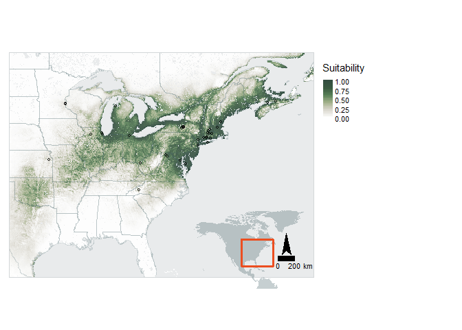

Andrena asteris
================
Mark Buckner
2022-03-07

-   [Load Pkgs and functions](#load-pkgs-and-functions)
    -   [Pkgs](#pkgs)
    -   [Functions](#functions)
-   [Load and process occ Data](#load-and-process-occ-data)
    -   [Load and filter by date](#load-and-filter-by-date)
    -   [Check for georeferencing
        errors](#check-for-georeferencing-errors)
    -   [Spatial Thinning w/ spThin](#spatial-thinning-w-spthin)
-   [Environmental Covariates](#environmental-covariates)
    -   [Define study area](#define-study-area)
    -   [Download and process env](#download-and-process-env)
    -   [PCA](#pca)
    -   [Extract env. and MESS](#extract-env-and-mess)
-   [SDM Model](#sdm-model)
    -   [Assign random background
        points](#assign-random-background-points)
    -   [Partition for Model
        Evaluation](#partition-for-model-evaluation)
    -   [Tune Model](#tune-model)
    -   [Model Selection](#model-selection)
-   [Predictions](#predictions)
    -   [Threshold](#threshold)
    -   [ENM Null](#enm-null)
-   [Visualize](#visualize)
-   [Session Info](#session-info)

## Load Pkgs and functions

Project directory structure:

Andrena_asteris_SDM -

 occ - occurrence datasets  
 pred - .txt/s containing URLs to environmental data  
 R - code

### Pkgs

``` r
if(!require(pacman)) install.packages("pacman")
library(pacman)

pacman::p_load(tidyverse, lubridate, ggmap, spThin, 
               CoordinateCleaner, curl, raster, sf, 
               RStoolbox, rgdal, ENMeval, rJava, rasterVis, tmap, 
               rnaturalearth, grid)

pacman::p_load_gh("SEEG-Oxford/seegSDM", "ropensci/rnaturalearthhires", "ropensci/rnaturalearthdata")
```

### Functions

``` r
#envLoad(): Downloads and processes environmental raster data from source. 
#--paths = urls for data sources read in from .txt file;
#--filedir = path to dir where the processed raw files are or will be stored.
#--ref = anticipated path of a reference .tif with the correct resolution and projection (eg. worldclim layer) in the paths .txt ["../pred/env/NAME.tif"]
#--bb = bounding box for study area (any object an extent can be extracted from)

envLoad <- function(paths, filedir, ref, bb, type = "cont") {
  
  savepaths <- sapply(paths, function (x) gsub("\\?.*", "", x))
  dest <- sapply(savepaths, function(x) paste(filedir,"/", gsub(".*/(\\w+)", "\\1", x), sep = "")) %>% 
    sort()
  names <- sapply(savepaths, function(x) paste( gsub(".*/(\\w+)", "\\1", x), sep = "")) %>% 
    sort() %>% 
    sapply(function(x) paste("../pred/env/",x, sep = ""))
  
  names <- str_replace(names, ".zip$", ".tif")
  
  for (i in 1:length(paths)) {
    if(file.exists(dest[i]) | file.exists(names[i])){
      if (file.exists(names[i])) {
        print(paste("File exists:",names[i]))
      } else {
        unproc_cont <- TRUE
        print(paste("File exists but is unprocessed:",dest[i]))
      }
      
    } else {
      
      print(paste("Downloading: ", paths[i]))
      
      unproc_cont <- TRUE
      
      file <- try(curl::curl_download(url = paths[i], destfile = dest[i]))
      
      if(class(file) == "try-error") {
        download.file(url = paths[i], destfile = dest[i], method = "curl")
      }
      
      if(grepl(".*zip", dest[i])) {
        unzip(dest[i], exdir = filedir)
        
      }
    }
  }
  
  if(!all(file.exists(names))) {
    print("Processing files")
    env.files <- list.files(filedir, recursive = TRUE, pattern = ".*tif$") %>% 
      sapply(function(x) paste(filedir, "/", x, sep = ""))
    
    r <- raster(ref) %>% 
      raster::crop(extent(bb)) %>% 
      projectRaster(crs = "+init=epsg:4326")
    
    method <- ifelse(type == "cont", "bilinear", "ngb")
    print(paste("Method:", method))
    
    env.stack <- lapply(env.files, raster) %>% 
      lapply(projectRaster, to = r, method = "ngb") %>% 
      stack()
    
    print("Saving stack")
    
    bylayer <- ifelse(nlayers(env.stack) > 1, TRUE, FALSE)
    writeRaster(env.stack, names, format = "GTiff", bylayer = bylayer, overwrite = TRUE)
    
  } else {
    print("Loading processed files")
    env.stack <- stack(names)
  }
  return(env.stack)
  
}
```

## Load and process occ Data

### Load and filter by date

``` r
gbif <- read_tsv("../occ/Aa_GBIF.txt")
scan <- read_csv("../occ/Aa_SCAN.csv")
amnh <- read_tsv("../occ/Aa_AMNH.txt")

t_scan <- scan %>% 
  dplyr::select(id, date = eventDate, lat = decimalLatitude, lon = decimalLongitude) %>% 
  drop_na() %>% 
  mutate(lat = round(lat,5), lon = round(lon,5)) %>%
  mutate(source = "SCAN")


t_gbif <- gbif %>% 
  dplyr::select(gbifID, eventDate, verbatimEventDate, lat = decimalLatitude, lon = decimalLongitude) %>% 
  separate(eventDate, c("date", NA), sep = " ") %>% 
  mutate(verbatimEventDate = ifelse(is.na(date), verbatimEventDate, NA)) %>% 
  unite(date, date, verbatimEventDate, na.rm = TRUE) %>% 
  mutate(date = parse_date_time(date, orders = c("mdy", "ymd", "dmy"))) %>% 
  drop_na() %>% 
  mutate(lat = round(lat,5), lon = round(lon,5)) %>%
  mutate(source = "GBIF")

t_amnh <- amnh %>% 
  mutate(date = parse_date_time(amnh$Start_Date, orders = c("mdy", "dmy"))) %>%
  filter(year(date) <= Det_Date) %>%    
  dplyr::select(PBIUSI, date, lat = Lat, lon = Lon) %>% 
  drop_na() %>% 
  mutate(lat = round(lat,5), lon = round(lon,5)) %>%
  mutate(source = "AMNH")

#Parsing errors for year only (old data) or "no date provided"

occ.joined <- full_join(t_scan, t_gbif, by = c("date", "lat", "lon")) %>% 
  full_join(t_amnh, by = c("date", "lat", "lon")) %>%
  filter(!duplicated(.[c("date", "lat", "lon")])) %>% 
  unite(data_source, source.x, source.y, source, sep = "/", na.rm = TRUE) %>% 
  dplyr::select(date, lat, lon, data_source, scanID = id, gbifID, PBIUSI)

date_start <- as.Date("1981-01-01")
date_end <- as.Date("2010-12-31")

occ <- occ.joined %>% 
  filter(date >= date_start & date <= date_end) %>%
  mutate(lat = floor(lat*10000)/10000, lon = floor(lon*10000)/10000) %>% 
  distinct(lat, lon, .keep_all = TRUE) %>% 
  mutate("spp" = "Aasteris")

qmplot(x = lon, y = lat, data = occ, maptype = "toner-lite", mapcolor = "bw", source = "stamen", force = T)
```

<!-- -->

### Check for georeferencing errors

``` r
flags <- clean_coordinates(x = occ, lon = "lon", 
                           lat = "lat", species = "spp",
                           tests = c("capitals", "centroids", 
                                     "equal", "gbif", "institutions", 
                                     "outliers", "seas", "zeros"))
```

    ## Testing coordinate validity

    ## Flagged 0 records.

    ## Testing equal lat/lon

    ## Flagged 0 records.

    ## Testing zero coordinates

    ## Flagged 0 records.

    ## Testing country capitals

    ## Flagged 0 records.

    ## Testing country centroids

    ## Flagged 0 records.

    ## Testing sea coordinates

    ## OGR data source with driver: ESRI Shapefile 
    ## Source: "C:\Users\mabuc\AppData\Local\Temp\RtmporjalR", layer: "ne_50m_land"
    ## with 1420 features
    ## It has 3 fields
    ## Integer64 fields read as strings:  scalerank

    ## Flagged 17 records.

    ## Testing geographic outliers

    ## Flagged 0 records.

    ## Testing GBIF headquarters, flagging records around Copenhagen

    ## Flagged 0 records.

    ## Testing biodiversity institutions

    ## Flagged 2 records.

    ## Flagged 19 of 69 records, EQ = 0.28.

``` r
summary(flags)
```

    ##     .val     .equ     .zer     .cap     .cen     .sea     .otl     .gbf 
    ##        0        0        0        0        0       17        0        0 
    ##    .inst .summary 
    ##        2       19

``` r
plot(flags, lon = "lon", lat = "lat")
```

<!-- -->

``` r
occ.flagged <- occ[!flags$.summary,]

write_csv(occ.flagged, file = "../occ/Aa_flagged.csv")
```

17 occurrences were flagged for potentially being in the sea. These
points are located on various Island which matches the metadata. The
georeferencing is sufficiently accurate for this analysis.

Two points match research institutions. The [occurrence
remarks](https://bugguide.net/node/view/370287) for 34630476 - Cornell
University provide no additional details this observation was excluded.
The metadata for 56951087 - Connecticut Agricultural Exp. list the
address of the station.

``` r
occs <- occ %>% 
  filter(is.na(scanID) | scanID != 56951087 & scanID != 34630476) %>% 
  write_csv(file = "../occ/Aa_combined.csv") %>% 
  dplyr::select(spp, lat, lon)
```

### Spatial Thinning w/ spThin

``` r
thinned <-
  thin( loc.data = occs, 
        lat.col = "lat", long.col = "lon", 
        spec.col = "spp", 
        thin.par = 10, reps = 100, 
        locs.thinned.list.return = TRUE, 
        write.files = TRUE, 
        max.files = 5, 
        out.dir = "../occ/Aa_thinned_full/", out.base = "Aa_thinned", 
        write.log.file = TRUE,
        log.file = "../occ/Aa_thinned_full_log_file.txt" )
```

    ## ********************************************** 
    ##  Beginning Spatial Thinning.
    ##  Script Started at: Mon Mar 07 11:33:16 2022
    ## lat.long.thin.count
    ##  42 
    ## 100 
    ## [1] "Maximum number of records after thinning: 42"
    ## [1] "Number of data.frames with max records: 100"
    ## [1] "Writing new *.csv files"

    ## Warning in thin(loc.data = occs, lat.col = "lat", long.col = "lon", spec.col =
    ## "spp", : Created new output directory: ../occ/Aa_thinned_full/

    ## [1] "Writing file: ../occ/Aa_thinned_full/Aa_thinned_thin1.csv"
    ## [1] "Writing file: ../occ/Aa_thinned_full/Aa_thinned_thin2.csv"
    ## [1] "Writing file: ../occ/Aa_thinned_full/Aa_thinned_thin3.csv"
    ## [1] "Writing file: ../occ/Aa_thinned_full/Aa_thinned_thin4.csv"
    ## [1] "Writing file: ../occ/Aa_thinned_full/Aa_thinned_thin5.csv"

``` r
plotThin(thinned)
```

<!-- --><!-- --><!-- -->

#### Load thinned occ data

``` r
occt <- read_csv("../occ/Aa_thinned_full/Aa_thinned_thin1.csv") %>% 
  dplyr::select(lon, lat)


qmplot(x = lon, y = lat, data = occt, maptype = "toner-lite", mapcolor = "bw", source = "stamen", force = T)
```

<!-- -->

Retained 42 after spatial thinning.

## Environmental Covariates

Bioclimatic Variables - [CHELSA Climate
v2.1](https://chelsa-climate.org/)

-   Bio 1 : Mean Annual Temperature
-   Bio 2 : Annual Mean Diurnal Range
-   Bio 3 : Isothermality
-   Bio 4 : Temperature Seasonality
-   Bio 5 : Max Temperature of Warmest Month
-   Bio 7 : Annual Temperature Range
-   Bio 8 : Mean Temperature of Wettest Quarter
-   Bio 9 : Mean Temperature of Driest Quarter
-   Bio 10 : Mean Temperature of Warmest Quarter
-   Bio 11 : Mean Temperature of Coldest Quarter
-   Bio 12 : Annual Precipitation
-   Bio 13 : Precipitation of Wettest Month
-   Bio 14 : Precipitation of Driest Month
-   Bio 15 : Precipitation Seasonality
-   Bio 16 : Precipitation of Wettest Quarter
-   Bio 17 : Precipitation of Driest Quarter
-   Bio 18 : Precipitation of Warmest Quarter
-   Bio 19 : Precipitation of Coldest Quarter

Other Climatologies - [CHELSA Climate v2.1](https://chelsa-climate.org/)

-   gddlgd0 : Last growing degree day above 0C

Topography - [WorldClim SRTM 5
arc-min](https://www.worldclim.org/data/worldclim21.html)

-   DEM

Other

-   [Soil sand at 0cm](https://zenodo.org/record/2525662#.YiISa3rMJOQ)
-   [Soil clay at 0cm](https://zenodo.org/record/2525663#.YiISZnrMJOQ)
-   [Land
    use](http://www.cec.org/north-american-environmental-atlas/land-cover-30m-2015-landsat-and-rapideye/)
    (excluded)

### Define study area

``` r
proj.res <- c(0.08333333,0.08333333)
proj.crs <- st_crs(4326)

occs.sf <- sf::st_as_sf(occt, coords = c("lon", "lat"), crs = proj.crs) %>% 
  st_cast("MULTIPOINT") %>% 
  st_union()

sa.bb <- st_bbox(occs.sf)
sa.bb[1:2] <- sa.bb[1:2] - 7
sa.bb[3:4] <- sa.bb[3:4] + 7
```

### Download and process env

``` r
dir.create("../pred/cat")
dir.create("../pred/cont")
dir.create("../pred/env")
```

    ## Warning in dir.create("../pred/env"): '..\pred\env' already exists

``` r
# Download and process continuous data
paths.cont <- read_delim("../pred/cov_paths_cont.txt", delim = "\\n", col_names = FALSE) %>% 
  pull()
```

    ## Rows: 23 Columns: 1
    ## -- Column specification --------------------------------------------------------
    ## Delimiter: "\\n"
    ## chr (1): X1
    ## 
    ## i Use `spec()` to retrieve the full column specification for this data.
    ## i Specify the column types or set `show_col_types = FALSE` to quiet this message.

``` r
env.cont <- envLoad(paths.cont, filedir = "../pred/cont", ref = "../pred/cont/wc2.1_5m_elev.tif", bb = sa.bb)
```

    ## [1] "File exists: ../pred/env/CHELSA_bio1_1981-2010_V.2.1.tif "
    ## [1] "File exists: ../pred/env/CHELSA_bio10_1981-2010_V.2.1.tif "
    ## [1] "File exists: ../pred/env/CHELSA_bio11_1981-2010_V.2.1.tif "
    ## [1] "File exists: ../pred/env/CHELSA_bio12_1981-2010_V.2.1.tif "
    ## [1] "File exists: ../pred/env/CHELSA_bio13_1981-2010_V.2.1.tif "
    ## [1] "File exists: ../pred/env/CHELSA_bio14_1981-2010_V.2.1.tif "
    ## [1] "File exists: ../pred/env/CHELSA_bio15_1981-2010_V.2.1.tif "
    ## [1] "File exists: ../pred/env/CHELSA_bio16_1981-2010_V.2.1.tif "
    ## [1] "File exists: ../pred/env/CHELSA_bio17_1981-2010_V.2.1.tif "
    ## [1] "File exists: ../pred/env/CHELSA_bio18_1981-2010_V.2.1.tif "
    ## [1] "File exists: ../pred/env/CHELSA_bio19_1981-2010_V.2.1.tif "
    ## [1] "File exists: ../pred/env/CHELSA_bio2_1981-2010_V.2.1.tif "
    ## [1] "File exists: ../pred/env/CHELSA_bio3_1981-2010_V.2.1.tif "
    ## [1] "File exists: ../pred/env/CHELSA_bio4_1981-2010_V.2.1.tif "
    ## [1] "File exists: ../pred/env/CHELSA_bio5_1981-2010_V.2.1.tif "
    ## [1] "File exists: ../pred/env/CHELSA_bio6_1981-2010_V.2.1.tif "
    ## [1] "File exists: ../pred/env/CHELSA_bio7_1981-2010_V.2.1.tif "
    ## [1] "File exists: ../pred/env/CHELSA_bio8_1981-2010_V.2.1.tif "
    ## [1] "File exists: ../pred/env/CHELSA_bio9_1981-2010_V.2.1.tif "
    ## [1] "File exists: ../pred/env/CHELSA_gddlgd0_1981-2010_V.2.1.tif "
    ## [1] "File exists: ../pred/env/sol_clay.wfraction_usda.3a1a1a_m_250m_b0..0cm_1950..2017_v0.2.tif"
    ## [1] "File exists: ../pred/env/sol_sand.wfraction_usda.3a1a1a_m_250m_b0..0cm_1950..2017_v0.2.tif"
    ## [1] "File exists: ../pred/env/wc2.1_5m_elev.tif"
    ## [1] "Loading processed files"

``` r
# Download and process categorical data
paths.cat <- read_delim("../pred/cov_paths_cat.txt", delim = "\\n", col_names = FALSE) %>% 
  pull()
```

    ## Rows: 1 Columns: 1
    ## -- Column specification --------------------------------------------------------
    ## Delimiter: "\\n"
    ## chr (1): X1
    ## 
    ## i Use `spec()` to retrieve the full column specification for this data.
    ## i Specify the column types or set `show_col_types = FALSE` to quiet this message.

``` r
env.cat <- envLoad(paths.cat, filedir = "../pred/cat", ref = "../pred/cont/wc2.1_5m_elev.tif", bb = sa.bb, type = "cat")%>% 
  `names<-`("LU")
```

    ## [1] "File exists: ../pred/env/north_america_2015_v2.tif"
    ## [1] "Loading processed files"

``` r
unlink("../pred/cat", recursive = TRUE)
unlink("../pred/cont", recursive = TRUE)
```

### PCA

``` r
#GDD data modification to allow proper masking
env.cont$CHELSA_gddlgd0_1981.2010_V.2.1[is.na(env.cont$CHELSA_gddlgd0_1981.2010_V.2.1)] <- 0

mmask <- masterMask(env.cont)

env.m <- mask(env.cont, mmask)
env.cat.m <- mask(env.cat, mmask)

dir.create("../pred/PCA")
pca <- rasterPCA(env.m, spca = TRUE, maskCheck = FALSE, filename = "../pred/PCA/envPCA.tif", overwrite = TRUE)

summary(pca$model)
```

    ## Importance of components:
    ##                          Comp.1    Comp.2     Comp.3     Comp.4     Comp.5
    ## Standard deviation     3.273579 2.4283101 1.40026590 1.15590054 0.98093012
    ## Proportion of Variance 0.465927 0.2563778 0.08524977 0.05809157 0.04183582
    ## Cumulative Proportion  0.465927 0.7223048 0.80755458 0.86564614 0.90748197
    ##                            Comp.6     Comp.7    Comp.8     Comp.9     Comp.10
    ## Standard deviation     0.75240800 0.71645352 0.6015950 0.55287585 0.335507138
    ## Proportion of Variance 0.02461382 0.02231764 0.0157355 0.01329007 0.004894132
    ## Cumulative Proportion  0.93209578 0.95441342 0.9701489 0.98343899 0.988333127
    ##                            Comp.11     Comp.12     Comp.13     Comp.14
    ## Standard deviation     0.302936735 0.258285028 0.212672731 0.154748337
    ## Proportion of Variance 0.003990029 0.002900485 0.001966508 0.001041176
    ## Cumulative Proportion  0.992323156 0.995223641 0.997190149 0.998231325
    ##                             Comp.15      Comp.16      Comp.17      Comp.18
    ## Standard deviation     0.1174087452 0.0954031748 0.0855662141 0.0713953354
    ## Proportion of Variance 0.0005993397 0.0003957289 0.0003183294 0.0002216215
    ## Cumulative Proportion  0.9988306646 0.9992263936 0.9995447230 0.9997663445
    ##                             Comp.19      Comp.20      Comp.21      Comp.22
    ## Standard deviation     0.0572040760 4.254521e-02 1.466703e-02 8.749498e-03
    ## Proportion of Variance 0.0001422742 7.869977e-05 9.353122e-06 3.328422e-06
    ## Cumulative Proportion  0.9999086187 9.999873e-01 9.999967e-01 1.000000e+00
    ##                             Comp.23
    ## Standard deviation     1.046154e-07
    ## Proportion of Variance 4.758424e-16
    ## Cumulative Proportion  1.000000e+00

``` r
loadings(pca$model)
```

    ## 
    ## Loadings:
    ##                                                               Comp.1 Comp.2
    ## CHELSA_bio1_1981.2010_V.2.1                                    0.271  0.184
    ## CHELSA_bio10_1981.2010_V.2.1                                   0.237  0.246
    ## CHELSA_bio11_1981.2010_V.2.1                                   0.282  0.145
    ## CHELSA_bio12_1981.2010_V.2.1                                   0.210 -0.282
    ## CHELSA_bio13_1981.2010_V.2.1                                   0.193 -0.185
    ## CHELSA_bio14_1981.2010_V.2.1                                   0.193 -0.282
    ## CHELSA_bio15_1981.2010_V.2.1                                  -0.140  0.248
    ## CHELSA_bio16_1981.2010_V.2.1                                   0.186 -0.219
    ## CHELSA_bio17_1981.2010_V.2.1                                   0.203 -0.276
    ## CHELSA_bio18_1981.2010_V.2.1                                   0.125 -0.214
    ## CHELSA_bio19_1981.2010_V.2.1                                   0.211 -0.258
    ## CHELSA_bio2_1981.2010_V.2.1                                           0.292
    ## CHELSA_bio3_1981.2010_V.2.1                                    0.245  0.194
    ## CHELSA_bio4_1981.2010_V.2.1                                   -0.290       
    ## CHELSA_bio5_1981.2010_V.2.1                                    0.208  0.285
    ## CHELSA_bio6_1981.2010_V.2.1                                    0.280  0.148
    ## CHELSA_bio7_1981.2010_V.2.1                                   -0.286       
    ## CHELSA_bio8_1981.2010_V.2.1                                           0.256
    ## CHELSA_bio9_1981.2010_V.2.1                                    0.280       
    ## CHELSA_gddlgd0_1981.2010_V.2.1                                -0.246       
    ## sol_clay.wfraction_usda.3a1a1a_m_250m_b0..0cm_1950..2017_v0.2         0.251
    ## sol_sand.wfraction_usda.3a1a1a_m_250m_b0..0cm_1950..2017_v0.2        -0.136
    ## wc2.1_5m_elev                                                 -0.156       
    ##                                                               Comp.3 Comp.4
    ## CHELSA_bio1_1981.2010_V.2.1                                                
    ## CHELSA_bio10_1981.2010_V.2.1                                               
    ## CHELSA_bio11_1981.2010_V.2.1                                               
    ## CHELSA_bio12_1981.2010_V.2.1                                         -0.175
    ## CHELSA_bio13_1981.2010_V.2.1                                   0.349 -0.281
    ## CHELSA_bio14_1981.2010_V.2.1                                  -0.201       
    ## CHELSA_bio15_1981.2010_V.2.1                                   0.388       
    ## CHELSA_bio16_1981.2010_V.2.1                                   0.340 -0.266
    ## CHELSA_bio17_1981.2010_V.2.1                                  -0.186       
    ## CHELSA_bio18_1981.2010_V.2.1                                   0.480 -0.200
    ## CHELSA_bio19_1981.2010_V.2.1                                  -0.200       
    ## CHELSA_bio2_1981.2010_V.2.1                                          -0.170
    ## CHELSA_bio3_1981.2010_V.2.1                                                
    ## CHELSA_bio4_1981.2010_V.2.1                                          -0.137
    ## CHELSA_bio5_1981.2010_V.2.1                                                
    ## CHELSA_bio6_1981.2010_V.2.1                                                
    ## CHELSA_bio7_1981.2010_V.2.1                                          -0.139
    ## CHELSA_bio8_1981.2010_V.2.1                                    0.328       
    ## CHELSA_bio9_1981.2010_V.2.1                                   -0.138       
    ## CHELSA_gddlgd0_1981.2010_V.2.1                                       -0.105
    ## sol_clay.wfraction_usda.3a1a1a_m_250m_b0..0cm_1950..2017_v0.2 -0.185 -0.458
    ## sol_sand.wfraction_usda.3a1a1a_m_250m_b0..0cm_1950..2017_v0.2  0.294  0.665
    ## wc2.1_5m_elev                                                        -0.145
    ##                                                               Comp.5 Comp.6
    ## CHELSA_bio1_1981.2010_V.2.1                                                
    ## CHELSA_bio10_1981.2010_V.2.1                                               
    ## CHELSA_bio11_1981.2010_V.2.1                                               
    ## CHELSA_bio12_1981.2010_V.2.1                                               
    ## CHELSA_bio13_1981.2010_V.2.1                                          0.181
    ## CHELSA_bio14_1981.2010_V.2.1                                         -0.202
    ## CHELSA_bio15_1981.2010_V.2.1                                          0.414
    ## CHELSA_bio16_1981.2010_V.2.1                                          0.139
    ## CHELSA_bio17_1981.2010_V.2.1                                         -0.180
    ## CHELSA_bio18_1981.2010_V.2.1                                         -0.156
    ## CHELSA_bio19_1981.2010_V.2.1                                  -0.108       
    ## CHELSA_bio2_1981.2010_V.2.1                                   -0.534 -0.133
    ## CHELSA_bio3_1981.2010_V.2.1                                   -0.261       
    ## CHELSA_bio4_1981.2010_V.2.1                                                
    ## CHELSA_bio5_1981.2010_V.2.1                                                
    ## CHELSA_bio6_1981.2010_V.2.1                                                
    ## CHELSA_bio7_1981.2010_V.2.1                                                
    ## CHELSA_bio8_1981.2010_V.2.1                                    0.153 -0.747
    ## CHELSA_bio9_1981.2010_V.2.1                                           0.262
    ## CHELSA_gddlgd0_1981.2010_V.2.1                                       -0.112
    ## sol_clay.wfraction_usda.3a1a1a_m_250m_b0..0cm_1950..2017_v0.2  0.250       
    ## sol_sand.wfraction_usda.3a1a1a_m_250m_b0..0cm_1950..2017_v0.2 -0.143       
    ## wc2.1_5m_elev                                                 -0.694       
    ##                                                               Comp.7 Comp.8
    ## CHELSA_bio1_1981.2010_V.2.1                                           0.101
    ## CHELSA_bio10_1981.2010_V.2.1                                          0.198
    ## CHELSA_bio11_1981.2010_V.2.1                                   0.120       
    ## CHELSA_bio12_1981.2010_V.2.1                                               
    ## CHELSA_bio13_1981.2010_V.2.1                                               
    ## CHELSA_bio14_1981.2010_V.2.1                                               
    ## CHELSA_bio15_1981.2010_V.2.1                                               
    ## CHELSA_bio16_1981.2010_V.2.1                                               
    ## CHELSA_bio17_1981.2010_V.2.1                                               
    ## CHELSA_bio18_1981.2010_V.2.1                                               
    ## CHELSA_bio19_1981.2010_V.2.1                                         -0.110
    ## CHELSA_bio2_1981.2010_V.2.1                                   -0.507       
    ## CHELSA_bio3_1981.2010_V.2.1                                          -0.184
    ## CHELSA_bio4_1981.2010_V.2.1                                   -0.266       
    ## CHELSA_bio5_1981.2010_V.2.1                                   -0.179  0.212
    ## CHELSA_bio6_1981.2010_V.2.1                                    0.155       
    ## CHELSA_bio7_1981.2010_V.2.1                                   -0.380       
    ## CHELSA_bio8_1981.2010_V.2.1                                                
    ## CHELSA_bio9_1981.2010_V.2.1                                                
    ## CHELSA_gddlgd0_1981.2010_V.2.1                                 0.140  0.305
    ## sol_clay.wfraction_usda.3a1a1a_m_250m_b0..0cm_1950..2017_v0.2  0.178 -0.718
    ## sol_sand.wfraction_usda.3a1a1a_m_250m_b0..0cm_1950..2017_v0.2 -0.112 -0.454
    ## wc2.1_5m_elev                                                  0.599       
    ##                                                               Comp.9 Comp.10
    ## CHELSA_bio1_1981.2010_V.2.1                                                 
    ## CHELSA_bio10_1981.2010_V.2.1                                          0.168 
    ## CHELSA_bio11_1981.2010_V.2.1                                                
    ## CHELSA_bio12_1981.2010_V.2.1                                          0.103 
    ## CHELSA_bio13_1981.2010_V.2.1                                  -0.120        
    ## CHELSA_bio14_1981.2010_V.2.1                                                
    ## CHELSA_bio15_1981.2010_V.2.1                                          0.149 
    ## CHELSA_bio16_1981.2010_V.2.1                                                
    ## CHELSA_bio17_1981.2010_V.2.1                                          0.108 
    ## CHELSA_bio18_1981.2010_V.2.1                                         -0.186 
    ## CHELSA_bio19_1981.2010_V.2.1                                          0.252 
    ## CHELSA_bio2_1981.2010_V.2.1                                    0.215        
    ## CHELSA_bio3_1981.2010_V.2.1                                    0.239 -0.314 
    ## CHELSA_bio4_1981.2010_V.2.1                                   -0.186  0.234 
    ## CHELSA_bio5_1981.2010_V.2.1                                           0.202 
    ## CHELSA_bio6_1981.2010_V.2.1                                                 
    ## CHELSA_bio7_1981.2010_V.2.1                                   -0.117  0.185 
    ## CHELSA_bio8_1981.2010_V.2.1                                   -0.213  0.312 
    ## CHELSA_bio9_1981.2010_V.2.1                                           0.519 
    ## CHELSA_gddlgd0_1981.2010_V.2.1                                 0.823  0.300 
    ## sol_clay.wfraction_usda.3a1a1a_m_250m_b0..0cm_1950..2017_v0.2  0.166  0.116 
    ## sol_sand.wfraction_usda.3a1a1a_m_250m_b0..0cm_1950..2017_v0.2  0.151  0.295 
    ## wc2.1_5m_elev                                                 -0.182  0.174 
    ##                                                               Comp.11 Comp.12
    ## CHELSA_bio1_1981.2010_V.2.1                                    0.153         
    ## CHELSA_bio10_1981.2010_V.2.1                                   0.336   0.153 
    ## CHELSA_bio11_1981.2010_V.2.1                                                 
    ## CHELSA_bio12_1981.2010_V.2.1                                   0.122         
    ## CHELSA_bio13_1981.2010_V.2.1                                   0.125  -0.595 
    ## CHELSA_bio14_1981.2010_V.2.1                                                 
    ## CHELSA_bio15_1981.2010_V.2.1                                  -0.136         
    ## CHELSA_bio16_1981.2010_V.2.1                                                 
    ## CHELSA_bio17_1981.2010_V.2.1                                   0.103         
    ## CHELSA_bio18_1981.2010_V.2.1                                           0.669 
    ## CHELSA_bio19_1981.2010_V.2.1                                  -0.116   0.227 
    ## CHELSA_bio2_1981.2010_V.2.1                                                  
    ## CHELSA_bio3_1981.2010_V.2.1                                   -0.259  -0.138 
    ## CHELSA_bio4_1981.2010_V.2.1                                    0.122   0.114 
    ## CHELSA_bio5_1981.2010_V.2.1                                    0.359   0.130 
    ## CHELSA_bio6_1981.2010_V.2.1                                    0.116         
    ## CHELSA_bio7_1981.2010_V.2.1                                                  
    ## CHELSA_bio8_1981.2010_V.2.1                                   -0.201  -0.157 
    ## CHELSA_bio9_1981.2010_V.2.1                                   -0.609         
    ## CHELSA_gddlgd0_1981.2010_V.2.1                                               
    ## sol_clay.wfraction_usda.3a1a1a_m_250m_b0..0cm_1950..2017_v0.2  0.166         
    ## sol_sand.wfraction_usda.3a1a1a_m_250m_b0..0cm_1950..2017_v0.2  0.282         
    ## wc2.1_5m_elev                                                  0.132         
    ##                                                               Comp.13 Comp.14
    ## CHELSA_bio1_1981.2010_V.2.1                                                  
    ## CHELSA_bio10_1981.2010_V.2.1                                                 
    ## CHELSA_bio11_1981.2010_V.2.1                                                 
    ## CHELSA_bio12_1981.2010_V.2.1                                   0.124   0.210 
    ## CHELSA_bio13_1981.2010_V.2.1                                                 
    ## CHELSA_bio14_1981.2010_V.2.1                                  -0.455  -0.476 
    ## CHELSA_bio15_1981.2010_V.2.1                                  -0.689         
    ## CHELSA_bio16_1981.2010_V.2.1                                   0.193         
    ## CHELSA_bio17_1981.2010_V.2.1                                  -0.278  -0.189 
    ## CHELSA_bio18_1981.2010_V.2.1                                          -0.209 
    ## CHELSA_bio19_1981.2010_V.2.1                                  -0.251   0.705 
    ## CHELSA_bio2_1981.2010_V.2.1                                                  
    ## CHELSA_bio3_1981.2010_V.2.1                                            0.150 
    ## CHELSA_bio4_1981.2010_V.2.1                                                  
    ## CHELSA_bio5_1981.2010_V.2.1                                                  
    ## CHELSA_bio6_1981.2010_V.2.1                                                  
    ## CHELSA_bio7_1981.2010_V.2.1                                                  
    ## CHELSA_bio8_1981.2010_V.2.1                                            0.125 
    ## CHELSA_bio9_1981.2010_V.2.1                                    0.271  -0.318 
    ## CHELSA_gddlgd0_1981.2010_V.2.1                                               
    ## sol_clay.wfraction_usda.3a1a1a_m_250m_b0..0cm_1950..2017_v0.2                
    ## sol_sand.wfraction_usda.3a1a1a_m_250m_b0..0cm_1950..2017_v0.2  0.111         
    ## wc2.1_5m_elev                                                                
    ##                                                               Comp.15 Comp.16
    ## CHELSA_bio1_1981.2010_V.2.1                                                  
    ## CHELSA_bio10_1981.2010_V.2.1                                   0.145   0.229 
    ## CHELSA_bio11_1981.2010_V.2.1                                                 
    ## CHELSA_bio12_1981.2010_V.2.1                                  -0.286  -0.248 
    ## CHELSA_bio13_1981.2010_V.2.1                                   0.502  -0.152 
    ## CHELSA_bio14_1981.2010_V.2.1                                           0.290 
    ## CHELSA_bio15_1981.2010_V.2.1                                  -0.146  -0.108 
    ## CHELSA_bio16_1981.2010_V.2.1                                  -0.626   0.390 
    ## CHELSA_bio17_1981.2010_V.2.1                                          -0.180 
    ## CHELSA_bio18_1981.2010_V.2.1                                   0.280  -0.114 
    ## CHELSA_bio19_1981.2010_V.2.1                                   0.119         
    ## CHELSA_bio2_1981.2010_V.2.1                                   -0.151  -0.338 
    ## CHELSA_bio3_1981.2010_V.2.1                                    0.213   0.536 
    ## CHELSA_bio4_1981.2010_V.2.1                                    0.172   0.345 
    ## CHELSA_bio5_1981.2010_V.2.1                                                  
    ## CHELSA_bio6_1981.2010_V.2.1                                                  
    ## CHELSA_bio7_1981.2010_V.2.1                                            0.127 
    ## CHELSA_bio8_1981.2010_V.2.1                                                  
    ## CHELSA_bio9_1981.2010_V.2.1                                                  
    ## CHELSA_gddlgd0_1981.2010_V.2.1                                               
    ## sol_clay.wfraction_usda.3a1a1a_m_250m_b0..0cm_1950..2017_v0.2                
    ## sol_sand.wfraction_usda.3a1a1a_m_250m_b0..0cm_1950..2017_v0.2                
    ## wc2.1_5m_elev                                                                
    ##                                                               Comp.17 Comp.18
    ## CHELSA_bio1_1981.2010_V.2.1                                                  
    ## CHELSA_bio10_1981.2010_V.2.1                                                 
    ## CHELSA_bio11_1981.2010_V.2.1                                                 
    ## CHELSA_bio12_1981.2010_V.2.1                                   0.753         
    ## CHELSA_bio13_1981.2010_V.2.1                                           0.114 
    ## CHELSA_bio14_1981.2010_V.2.1                                           0.492 
    ## CHELSA_bio15_1981.2010_V.2.1                                   0.173         
    ## CHELSA_bio16_1981.2010_V.2.1                                  -0.310  -0.130 
    ## CHELSA_bio17_1981.2010_V.2.1                                          -0.778 
    ## CHELSA_bio18_1981.2010_V.2.1                                                 
    ## CHELSA_bio19_1981.2010_V.2.1                                  -0.283   0.160 
    ## CHELSA_bio2_1981.2010_V.2.1                                   -0.215         
    ## CHELSA_bio3_1981.2010_V.2.1                                    0.337  -0.192 
    ## CHELSA_bio4_1981.2010_V.2.1                                           -0.166 
    ## CHELSA_bio5_1981.2010_V.2.1                                                  
    ## CHELSA_bio6_1981.2010_V.2.1                                   -0.112         
    ## CHELSA_bio7_1981.2010_V.2.1                                    0.188         
    ## CHELSA_bio8_1981.2010_V.2.1                                                  
    ## CHELSA_bio9_1981.2010_V.2.1                                                  
    ## CHELSA_gddlgd0_1981.2010_V.2.1                                               
    ## sol_clay.wfraction_usda.3a1a1a_m_250m_b0..0cm_1950..2017_v0.2                
    ## sol_sand.wfraction_usda.3a1a1a_m_250m_b0..0cm_1950..2017_v0.2                
    ## wc2.1_5m_elev                                                                
    ##                                                               Comp.19 Comp.20
    ## CHELSA_bio1_1981.2010_V.2.1                                    0.214   0.451 
    ## CHELSA_bio10_1981.2010_V.2.1                                   0.429   0.128 
    ## CHELSA_bio11_1981.2010_V.2.1                                           0.278 
    ## CHELSA_bio12_1981.2010_V.2.1                                   0.147  -0.125 
    ## CHELSA_bio13_1981.2010_V.2.1                                                 
    ## CHELSA_bio14_1981.2010_V.2.1                                                 
    ## CHELSA_bio15_1981.2010_V.2.1                                                 
    ## CHELSA_bio16_1981.2010_V.2.1                                                 
    ## CHELSA_bio17_1981.2010_V.2.1                                           0.120 
    ## CHELSA_bio18_1981.2010_V.2.1                                                 
    ## CHELSA_bio19_1981.2010_V.2.1                                                 
    ## CHELSA_bio2_1981.2010_V.2.1                                    0.256         
    ## CHELSA_bio3_1981.2010_V.2.1                                   -0.155         
    ## CHELSA_bio4_1981.2010_V.2.1                                    0.340  -0.409 
    ## CHELSA_bio5_1981.2010_V.2.1                                   -0.616  -0.275 
    ## CHELSA_bio6_1981.2010_V.2.1                                           -0.429 
    ## CHELSA_bio7_1981.2010_V.2.1                                   -0.381   0.471 
    ## CHELSA_bio8_1981.2010_V.2.1                                                  
    ## CHELSA_bio9_1981.2010_V.2.1                                                  
    ## CHELSA_gddlgd0_1981.2010_V.2.1                                               
    ## sol_clay.wfraction_usda.3a1a1a_m_250m_b0..0cm_1950..2017_v0.2                
    ## sol_sand.wfraction_usda.3a1a1a_m_250m_b0..0cm_1950..2017_v0.2                
    ## wc2.1_5m_elev                                                                
    ##                                                               Comp.21 Comp.22
    ## CHELSA_bio1_1981.2010_V.2.1                                    0.758         
    ## CHELSA_bio10_1981.2010_V.2.1                                  -0.510   0.353 
    ## CHELSA_bio11_1981.2010_V.2.1                                  -0.297  -0.821 
    ## CHELSA_bio12_1981.2010_V.2.1                                                 
    ## CHELSA_bio13_1981.2010_V.2.1                                                 
    ## CHELSA_bio14_1981.2010_V.2.1                                                 
    ## CHELSA_bio15_1981.2010_V.2.1                                                 
    ## CHELSA_bio16_1981.2010_V.2.1                                                 
    ## CHELSA_bio17_1981.2010_V.2.1                                                 
    ## CHELSA_bio18_1981.2010_V.2.1                                                 
    ## CHELSA_bio19_1981.2010_V.2.1                                                 
    ## CHELSA_bio2_1981.2010_V.2.1                                                  
    ## CHELSA_bio3_1981.2010_V.2.1                                                  
    ## CHELSA_bio4_1981.2010_V.2.1                                    0.212  -0.447 
    ## CHELSA_bio5_1981.2010_V.2.1                                                  
    ## CHELSA_bio6_1981.2010_V.2.1                                    0.102         
    ## CHELSA_bio7_1981.2010_V.2.1                                                  
    ## CHELSA_bio8_1981.2010_V.2.1                                                  
    ## CHELSA_bio9_1981.2010_V.2.1                                                  
    ## CHELSA_gddlgd0_1981.2010_V.2.1                                               
    ## sol_clay.wfraction_usda.3a1a1a_m_250m_b0..0cm_1950..2017_v0.2                
    ## sol_sand.wfraction_usda.3a1a1a_m_250m_b0..0cm_1950..2017_v0.2                
    ## wc2.1_5m_elev                                                                
    ##                                                               Comp.23
    ## CHELSA_bio1_1981.2010_V.2.1                                          
    ## CHELSA_bio10_1981.2010_V.2.1                                         
    ## CHELSA_bio11_1981.2010_V.2.1                                         
    ## CHELSA_bio12_1981.2010_V.2.1                                         
    ## CHELSA_bio13_1981.2010_V.2.1                                         
    ## CHELSA_bio14_1981.2010_V.2.1                                         
    ## CHELSA_bio15_1981.2010_V.2.1                                         
    ## CHELSA_bio16_1981.2010_V.2.1                                         
    ## CHELSA_bio17_1981.2010_V.2.1                                         
    ## CHELSA_bio18_1981.2010_V.2.1                                         
    ## CHELSA_bio19_1981.2010_V.2.1                                         
    ## CHELSA_bio2_1981.2010_V.2.1                                          
    ## CHELSA_bio3_1981.2010_V.2.1                                          
    ## CHELSA_bio4_1981.2010_V.2.1                                          
    ## CHELSA_bio5_1981.2010_V.2.1                                   -0.373 
    ## CHELSA_bio6_1981.2010_V.2.1                                    0.784 
    ## CHELSA_bio7_1981.2010_V.2.1                                    0.496 
    ## CHELSA_bio8_1981.2010_V.2.1                                          
    ## CHELSA_bio9_1981.2010_V.2.1                                          
    ## CHELSA_gddlgd0_1981.2010_V.2.1                                       
    ## sol_clay.wfraction_usda.3a1a1a_m_250m_b0..0cm_1950..2017_v0.2        
    ## sol_sand.wfraction_usda.3a1a1a_m_250m_b0..0cm_1950..2017_v0.2        
    ## wc2.1_5m_elev                                                        
    ## 
    ##                Comp.1 Comp.2 Comp.3 Comp.4 Comp.5 Comp.6 Comp.7 Comp.8 Comp.9
    ## SS loadings     1.000  1.000  1.000  1.000  1.000  1.000  1.000  1.000  1.000
    ## Proportion Var  0.043  0.043  0.043  0.043  0.043  0.043  0.043  0.043  0.043
    ## Cumulative Var  0.043  0.087  0.130  0.174  0.217  0.261  0.304  0.348  0.391
    ##                Comp.10 Comp.11 Comp.12 Comp.13 Comp.14 Comp.15 Comp.16 Comp.17
    ## SS loadings      1.000   1.000   1.000   1.000   1.000   1.000   1.000   1.000
    ## Proportion Var   0.043   0.043   0.043   0.043   0.043   0.043   0.043   0.043
    ## Cumulative Var   0.435   0.478   0.522   0.565   0.609   0.652   0.696   0.739
    ##                Comp.18 Comp.19 Comp.20 Comp.21 Comp.22 Comp.23
    ## SS loadings      1.000   1.000   1.000   1.000   1.000   1.000
    ## Proportion Var   0.043   0.043   0.043   0.043   0.043   0.043
    ## Cumulative Var   0.783   0.826   0.870   0.913   0.957   1.000

``` r
propvar <- summary(pca$model)$sdev^2/sum(summary(pca$model)$sdev^2)
cumprop <- cumsum(propvar)
plot(1:23,cumprop, type = "o", xlab = "PCs", ylim = c(0,1))
points(1:23, propvar, type = "o", col = "red")
```

<!-- -->

``` r
features <- cumprop < 0.96
env.pca <- subset(pca$map, which(features))

plot(env.pca)
```

<!-- -->

``` r
env <- env.pca #addLayer(env.pca, env.cat.m)

plot(env[[1]], main = "PC 1 | A. asteris occ.")
points(occt, pch = 16, cex = 0.5)
```

<!-- -->

### Extract env. and MESS

``` r
occp <- st_as_sf(occt, coords = c("lon", "lat"), crs = proj.crs)
occe <- raster::extract(env, occp)


occ.sim <- similarity(env, occe)
occ.mess <- occ.sim$similarity_min
occ.sp <- as_Spatial(occp)

myScale <- seq(cellStats(occ.mess, min), cellStats(occ.mess, max), length.out = 100)
rasterVis::levelplot(occ.mess, main = "Environmental similarity", at = myScale, margin = FALSE) + 
  latticeExtra::layer(sp.points(occ.sp, col="black"))
```

<!-- -->

``` r
### Remove occ which correspond to NA env
occ.nna <- raster::extract(env, occp, sp = TRUE) %>% 
  as.data.frame() %>% 
  filter(!is.na(PC1))

occe <- occ.nna[,1:(ncol(occ.nna)-2)]
occp <- occ.nna[,(ncol(occ.nna)-1):ncol(occ.nna)]
```

In total 0 observations fall occur where the environmental data is NA.
These correspond to islands and shoreline sites which are lost during
masking due to the resolution used.

## SDM Model

### Assign random background points

Model performance improved using background points sampled from full
study area over buffered convex hull.

``` r
 # crs(env) <- crs(proj.crs)
 # sa.bg <- st_convex_hull(occs.sf) %>% 
 #   st_buffer(occs.sf, dist = 100000) %>% 
 #   st_sf()
 # 
 # env.bg <- raster::mask(env, sa.bg)

(points <- sum(!is.na(getValues(env[[1]])))*0.3)
```

    ## [1] 24664.5

``` r
bg <- dismo::randomPoints(env, n = points) %>% 
  as.data.frame()
colnames(bg) <- colnames(occp)

plot(env[[1]], main="PC1 | Background Points")
points(bg, pch = 20, cex = 0.05)
```

<!-- -->

### Partition for Model Evaluation

n = 31.

``` r
part <- get.jackknife(occp, bg)
evalplot.grps(pts = occp, pts.grp = part$occs.grp, envs = env)
```

    ## Warning: `guides(<scale> = FALSE)` is deprecated. Please use `guides(<scale> =
    ## "none")` instead.

    ## Plotting first raster in stack...

<!-- -->

### Tune Model

``` r
e.mx <- ENMevaluate(occs = occp, envs = env, bg = bg, #categoricals = names(env.cat), 
                    algorithm = 'maxent.jar', partitions = 'jackknife', parallel = TRUE, 
                    tune.args = list(fc = c("L","Q","LQ","LQH","H"), rm = 1:5))
```

    ## Package ecospat is not installed, so Continuous Boyce Index (CBI) cannot be calculated.

    ## *** Running initial checks... ***

    ## * Clamping predictor variable rasters...

    ## * Model evaluations with k-1 jackknife (leave-one-out) cross validation...

    ## 
    ## *** Running ENMeval v2.0.3 with maxent.jar v3.4.3 from dismo package v1.3.5 ***

    ##   |                                                                              |                                                                      |   0%

    ## 
    ## Of 16 total cores using 16...

    ## Running in parallel using doSNOW...

    ##   |                                                                              |===                                                                   |   4%  |                                                                              |======                                                                |   8%  |                                                                              |========                                                              |  12%  |                                                                              |===========                                                           |  16%  |                                                                              |==============                                                        |  20%  |                                                                              |=================                                                     |  24%  |                                                                              |====================                                                  |  28%  |                                                                              |======================                                                |  32%  |                                                                              |=========================                                             |  36%  |                                                                              |============================                                          |  40%  |                                                                              |===============================                                       |  44%  |                                                                              |==================================                                    |  48%  |                                                                              |====================================                                  |  52%  |                                                                              |=======================================                               |  56%  |                                                                              |==========================================                            |  60%  |                                                                              |=============================================                         |  64%  |                                                                              |================================================                      |  68%  |                                                                              |==================================================                    |  72%  |                                                                              |=====================================================                 |  76%  |                                                                              |========================================================              |  80%  |                                                                              |===========================================================           |  84%  |                                                                              |==============================================================        |  88%  |                                                                              |================================================================      |  92%  |                                                                              |===================================================================   |  96%  |                                                                              |======================================================================| 100%

    ## ENMevaluate completed in 12 minutes 21.1 seconds.

``` r
e.mx
```

    ## An object of class:  ENMevaluation 
    ##  occurrence/background points:  31 / 24664 
    ##  partition method:  jackknife 
    ##  partition settings:  none 
    ##  clamp:  left: PC1, PC2, PC3, PC4, PC5, PC6, PC7
    ##          right: PC1, PC2, PC3, PC4, PC5, PC6, PC7 
    ##  categoricals:   
    ##  algorithm:  maxent.jar 
    ##  tune settings:  fc: L,Q,LQ,LQH,H
    ##                  rm: 1,2,3,4,5 
    ##  overlap:  TRUE 
    ## Refer to ?ENMevaluation for information on slots.

### Model Selection

AUC: Radosavljevic and Anderson 2013

``` r
evalplot.stats(e = e.mx, stats = c("auc.val"), color = "fc", x.var = "rm", 
               error.bars = FALSE)
```

<!-- -->

``` r
res <- eval.results(e.mx)
kable(res)
```

| fc  | rm  | tune.args   | auc.train | cbi.train | auc.diff.avg | auc.diff.sd | auc.val.avg | auc.val.sd | cbi.val.avg | cbi.val.sd | or.10p.avg | or.10p.sd | or.mtp.avg | or.mtp.sd |      AICc |  delta.AICc |     w.AIC | ncoef |
|:----|:----|:------------|----------:|:----------|-------------:|------------:|------------:|-----------:|------------:|-----------:|-----------:|----------:|-----------:|----------:|----------:|------------:|----------:|------:|
| L   | 1   | fc.L_rm.1   | 0.8324625 | NA        |    0.1894274 |   1.0464785 |   0.8090995 |  1.4219579 |          NA |         NA |  0.1290323 |  1.836161 |  0.0645161 | 1.3455906 |  665.9577 |  28.6421524 | 0.0000002 |     7 |
| Q   | 1   | fc.Q_rm.1   | 0.8280039 | NA        |    0.1234002 |   0.5112620 |   0.7985172 |  0.8070596 |          NA |         NA |  0.1612903 |  2.014515 |  0.0645161 | 1.3455906 |  669.6097 |  32.2941885 | 0.0000000 |     6 |
| LQ  | 1   | fc.LQ_rm.1  | 0.9113341 | NA        |    0.1259418 |   0.7427085 |   0.8731526 |  0.9659735 |          NA |         NA |  0.1290323 |  1.836161 |  0.0967742 | 1.6193420 |  647.2653 |   9.9497574 | 0.0027595 |    13 |
| LQH | 1   | fc.LQH_rm.1 | 0.9144862 | NA        |    0.1229063 |   0.7502139 |   0.8723665 |  0.9543963 |          NA |         NA |  0.1290323 |  1.836161 |  0.0967742 | 1.6193420 |        NA |          NA |        NA |    35 |
| H   | 1   | fc.H_rm.1   | 0.9091486 | NA        |    0.1315272 |   0.7968048 |   0.8745023 |  1.0314873 |          NA |         NA |  0.1612903 |  2.014515 |  0.0645161 | 1.3455906 |        NA |          NA |        NA |    40 |
| L   | 2   | fc.L_rm.2   | 0.8328732 | NA        |    0.1875639 |   1.0575784 |   0.8083670 |  1.4204362 |          NA |         NA |  0.1290323 |  1.836161 |  0.0645161 | 1.3455906 |  667.2370 |  29.9215100 | 0.0000001 |     7 |
| Q   | 2   | fc.Q_rm.2   | 0.8223544 | NA        |    0.1239432 |   0.5001921 |   0.7907980 |  0.7991202 |          NA |         NA |  0.1612903 |  2.014515 |  0.0645161 | 1.3455906 |  667.8773 |  30.5617955 | 0.0000001 |     5 |
| LQ  | 2   | fc.LQ_rm.2  | 0.9075308 | NA        |    0.1215544 |   0.7218824 |   0.8777682 |  0.9399782 |          NA |         NA |  0.1290323 |  1.836161 |  0.0967742 | 1.6193420 |  637.3155 |   0.0000000 | 0.3993920 |    10 |
| LQH | 2   | fc.LQH_rm.2 | 0.9076014 | NA        |    0.1213117 |   0.7238057 |   0.8771378 |  0.9400032 |          NA |         NA |  0.1290323 |  1.836161 |  0.0967742 | 1.6193420 |  677.1443 |  39.8287559 | 0.0000000 |    16 |
| H   | 2   | fc.H_rm.2   | 0.9034396 | NA        |    0.1349340 |   0.7524612 |   0.8786654 |  1.0215944 |          NA |         NA |  0.1612903 |  2.014515 |  0.0645161 | 1.3455906 | 1010.5142 | 373.1987213 | 0.0000000 |    26 |
| L   | 3   | fc.L_rm.3   | 0.8325240 | NA        |    0.1861213 |   1.0475442 |   0.8099339 |  1.4082336 |          NA |         NA |  0.1290323 |  1.836161 |  0.0322581 | 0.9677419 |  665.3322 |  28.0167242 | 0.0000003 |     6 |
| Q   | 3   | fc.Q_rm.3   | 0.8166029 | NA        |    0.1237642 |   0.4837510 |   0.7888375 |  0.7912127 |          NA |         NA |  0.1935484 |  2.163937 |  0.0322581 | 0.9677419 |  666.6693 |  29.3538280 | 0.0000002 |     4 |
| LQ  | 3   | fc.LQ_rm.3  | 0.9064857 | NA        |    0.1199866 |   0.7083125 |   0.8792566 |  0.9262513 |          NA |         NA |  0.1290323 |  1.836161 |  0.0645161 | 1.3455906 |  638.0670 |   0.7515067 | 0.2742912 |     9 |
| LQH | 3   | fc.LQH_rm.3 | 0.9064831 | NA        |    0.1199954 |   0.7083897 |   0.8792592 |  0.9263420 |          NA |         NA |  0.1290323 |  1.836161 |  0.0645161 | 1.3455906 |  638.0679 |   0.7523800 | 0.2741714 |     9 |
| H   | 3   | fc.H_rm.3   | 0.8973076 | NA        |    0.1338946 |   0.7453166 |   0.8780232 |  1.0144303 |          NA |         NA |  0.1612903 |  2.014515 |  0.0645161 | 1.3455906 | 1490.9698 | 853.6542627 | 0.0000000 |    28 |
| L   | 4   | fc.L_rm.4   | 0.8318504 | NA        |    0.1853287 |   1.0292726 |   0.8093584 |  1.3921507 |          NA |         NA |  0.1290323 |  1.836161 |  0.0322581 | 0.9677419 |  666.9831 |  29.6675986 | 0.0000001 |     6 |
| Q   | 4   | fc.Q_rm.4   | 0.8120239 | NA        |    0.1248835 |   0.4763240 |   0.7825347 |  0.7915299 |          NA |         NA |  0.2258065 |  2.290095 |  0.0322581 | 0.9677419 |  668.0977 |  30.7822423 | 0.0000001 |     4 |
| LQ  | 4   | fc.LQ_rm.4  | 0.9047907 | NA        |    0.1188992 |   0.6978309 |   0.8777747 |  0.9138967 |          NA |         NA |  0.1290323 |  1.836161 |  0.0645161 | 1.3455906 |  643.6275 |   6.3119582 | 0.0170128 |     9 |
| LQH | 4   | fc.LQH_rm.4 | 0.9047881 | NA        |    0.1189062 |   0.6978572 |   0.8777695 |  0.9139224 |          NA |         NA |  0.1290323 |  1.836161 |  0.0645161 | 1.3455906 |  643.6269 |   6.3113707 | 0.0170178 |     9 |
| H   | 4   | fc.H_rm.4   | 0.8905372 | NA        |    0.1432053 |   0.8132151 |   0.8616771 |  1.0916349 |          NA |         NA |  0.1612903 |  2.014515 |  0.0322581 | 0.9677419 |        NA |          NA |        NA |    34 |
| L   | 5   | fc.L_rm.5   | 0.8309623 | NA        |    0.1842074 |   1.0087533 |   0.8087424 |  1.3738109 |          NA |         NA |  0.1290323 |  1.836161 |  0.0322581 | 0.9677419 |  668.9788 |  31.6633474 | 0.0000001 |     6 |
| Q   | 5   | fc.Q_rm.5   | 0.8044747 | NA        |    0.1269891 |   0.4555427 |   0.7814949 |  0.7925722 |          NA |         NA |  0.2580645 |  2.396668 |  0.0322581 | 0.9677419 |  672.9283 |  35.6128448 | 0.0000000 |     5 |
| LQ  | 5   | fc.LQ_rm.5  | 0.9021592 | NA        |    0.1177032 |   0.6778427 |   0.8777263 |  0.8964901 |          NA |         NA |  0.1290323 |  1.836161 |  0.0645161 | 1.3455906 |  645.2180 |   7.9024580 | 0.0076807 |     8 |
| LQH | 5   | fc.LQH_rm.5 | 0.9021618 | NA        |    0.1177045 |   0.6778632 |   0.8777250 |  0.8965059 |          NA |         NA |  0.1290323 |  1.836161 |  0.0645161 | 1.3455906 |  645.2199 |   7.9044008 | 0.0076733 |     8 |
| H   | 5   | fc.H_rm.5   | 0.8780441 | NA        |    0.1659195 |   0.8971049 |   0.8303855 |  1.2259701 |          NA |         NA |  0.1290323 |  1.836161 |  0.0322581 | 0.9677419 |        NA |          NA |        NA |    38 |

``` r
opt.auc <- res %>% 
  slice_max(auc.val.avg)
kable(opt.auc)
```

| fc  | rm  | tune.args   | auc.train | cbi.train | auc.diff.avg | auc.diff.sd | auc.val.avg | auc.val.sd | cbi.val.avg | cbi.val.sd | or.10p.avg | or.10p.sd | or.mtp.avg | or.mtp.sd |     AICc | delta.AICc |     w.AIC | ncoef |
|:----|:----|:------------|----------:|:----------|-------------:|------------:|------------:|-----------:|------------:|-----------:|-----------:|----------:|-----------:|----------:|---------:|-----------:|----------:|------:|
| LQH | 3   | fc.LQH_rm.3 | 0.9064831 | NA        |    0.1199954 |   0.7083897 |   0.8792592 |   0.926342 |          NA |         NA |  0.1290323 |  1.836161 |  0.0645161 |  1.345591 | 638.0679 |    0.75238 | 0.2741714 |     9 |

``` r
dismo::response(eval.models(e.mx)[[opt.auc$tune.args]])
```

<!-- -->

``` r
plot(eval.models(e.mx)[[opt.auc$tune.args]])
```

<!-- -->

## Predictions

``` r
dir.create("../pred/dist")
pred <- eval.predictions(e.mx)[[opt.auc$tune.args]]
plot(pred)
```

<!-- -->

``` r
writeRaster(pred, "../pred/dist/Aa_dist.tif", overwrite = TRUE)
```

### Threshold

``` r
pred.vals <- raster::extract(pred, occp)
or.min.threshold <- pred > min(pred.vals)
writeRaster(or.min.threshold, "../pred/dist/Aa_dist_min.tif", overwrite = TRUE)
plot(or.min.threshold)
```

<!-- -->

``` r
n10 <- ceiling(length(pred.vals) * 0.1)
or.10.threshold <- pred > sort(pred.vals)[n10]
writeRaster(or.10.threshold, "../pred/dist/Aa_dist_p10.tif", overwrite = TRUE)
plot(or.10.threshold)
```

<!-- -->

### ENM Null

``` r
mod.null <- ENMnulls(e.mx, mod.settings = list(fc = as.character(opt.auc$fc), rm = as.numeric(opt.auc$rm)), no.iter = 100, parallel = TRUE, quiet = TRUE)
null.results(mod.null)
```

    ##      fc rm   tune.args auc.train cbi.train auc.diff.avg auc.diff.sd auc.val.avg
    ## 1   LQH  3 fc.LQH_rm.3 0.7058865        NA    0.3726512   0.2228066   0.3443997
    ## 2   LQH  3 fc.LQH_rm.3 0.5884886        NA    0.2568389   0.1386704   0.4763473
    ## 3   LQH  3 fc.LQH_rm.3 0.5954630        NA    0.3045288   0.1968770   0.3750425
    ## 4   LQH  3 fc.LQH_rm.3 0.5806733        NA    0.2766569   0.1900453   0.4766402
    ## 5   LQH  3 fc.LQH_rm.3 0.6947968        NA    0.3772350   0.2087232   0.3555901
    ## 6   LQH  3 fc.LQH_rm.3 0.7124469        NA    0.2424193   0.1867410   0.5712812
    ## 7   LQH  3 fc.LQH_rm.3 0.6751652        NA    0.4066124   0.2037946   0.2734945
    ## 8   LQH  3 fc.LQH_rm.3 0.7200523        NA    0.3438431   0.1936605   0.4451774
    ## 9   LQH  3 fc.LQH_rm.3 0.7201387        NA    0.2668684   0.2227953   0.5080312
    ## 10  LQH  3 fc.LQH_rm.3 0.6046563        NA    0.2316206   0.1265955   0.7238871
    ## 11  LQH  3 fc.LQH_rm.3 0.6792053        NA    0.2322644   0.1622443   0.6666547
    ## 12  LQH  3 fc.LQH_rm.3 0.6151587        NA    0.1969606   0.1474800   0.5343448
    ## 13  LQH  3 fc.LQH_rm.3 0.6652382        NA    0.2761066   0.1649168   0.5298914
    ## 14  LQH  3 fc.LQH_rm.3 0.6327591        NA    0.3400049   0.1784132   0.3848151
    ## 15  LQH  3 fc.LQH_rm.3 0.6627480        NA    0.2862788   0.1746638   0.4472242
    ## 16  LQH  3 fc.LQH_rm.3 0.6403763        NA    0.2576451   0.1779817   0.4485263
    ## 17  LQH  3 fc.LQH_rm.3 0.6022674        NA    0.2910011   0.1585551   0.4730579
    ## 18  LQH  3 fc.LQH_rm.3 0.5729370        NA    0.2381665   0.1716060   0.4989648
    ## 19  LQH  3 fc.LQH_rm.3 0.7497345        NA    0.1940983   0.1263140   0.7912937
    ## 20  LQH  3 fc.LQH_rm.3 0.6414410        NA    0.3437954   0.1596283   0.4204018
    ## 21  LQH  3 fc.LQH_rm.3 0.6182937        NA    0.1906044   0.1419994   0.6075402
    ## 22  LQH  3 fc.LQH_rm.3 0.6825287        NA    0.1526796   0.1362518   0.6530264
    ## 23  LQH  3 fc.LQH_rm.3 0.5894591        NA    0.2750840   0.1647049   0.4732063
    ## 24  LQH  3 fc.LQH_rm.3 0.6946882        NA    0.2264555   0.1758541   0.6328376
    ## 25  LQH  3 fc.LQH_rm.3 0.6204819        NA    0.2463584   0.1871264   0.4072561
    ## 26  LQH  3 fc.LQH_rm.3 0.6002002        NA    0.3605357   0.1771680   0.2921412
    ## 27  LQH  3 fc.LQH_rm.3 0.6583430        NA    0.2250041   0.1477121   0.6723728
    ## 28  LQH  3 fc.LQH_rm.3 0.6427371        NA    0.2619974   0.1700877   0.6098578
    ## 29  LQH  3 fc.LQH_rm.3 0.5945429        NA    0.3398613   0.1673552   0.4111968
    ## 30  LQH  3 fc.LQH_rm.3 0.6397302        NA    0.3677561   0.1593964   0.2742936
    ## 31  LQH  3 fc.LQH_rm.3 0.6587020        NA    0.2288229   0.1380559   0.6459218
    ## 32  LQH  3 fc.LQH_rm.3 0.6371694        NA    0.2388341   0.1675925   0.5691729
    ## 33  LQH  3 fc.LQH_rm.3 0.7093733        NA    0.2455482   0.2128145   0.6452064
    ## 34  LQH  3 fc.LQH_rm.3 0.7129347        NA    0.3938333   0.2209754   0.3940594
    ## 35  LQH  3 fc.LQH_rm.3 0.6977827        NA    0.2162157   0.1554959   0.6018900
    ## 36  LQH  3 fc.LQH_rm.3 0.6627375        NA    0.2473525   0.1400371   0.5186932
    ## 37  LQH  3 fc.LQH_rm.3 0.6514032        NA    0.2292195   0.1566905   0.5552451
    ## 38  LQH  3 fc.LQH_rm.3 0.6896750        NA    0.2770622   0.1641211   0.5995502
    ## 39  LQH  3 fc.LQH_rm.3 0.6663918        NA    0.2009318   0.1395129   0.6062290
    ## 40  LQH  3 fc.LQH_rm.3 0.6968829        NA    0.4478784   0.1879279   0.2907143
    ## 41  LQH  3 fc.LQH_rm.3 0.5608527        NA    0.2176678   0.1381490   0.6123860
    ## 42  LQH  3 fc.LQH_rm.3 0.6774841        NA    0.2245339   0.1132789   0.6819153
    ## 43  LQH  3 fc.LQH_rm.3 0.7305522        NA    0.3300606   0.2053255   0.4770849
    ## 44  LQH  3 fc.LQH_rm.3 0.6188221        NA    0.2064341   0.1526170   0.5799592
    ## 45  LQH  3 fc.LQH_rm.3 0.6175685        NA    0.3054149   0.1750866   0.4996286
    ## 46  LQH  3 fc.LQH_rm.3 0.6254205        NA    0.2356995   0.1216787   0.7379117
    ## 47  LQH  3 fc.LQH_rm.3 0.6824907        NA    0.2486844   0.2074406   0.5304643
    ## 48  LQH  3 fc.LQH_rm.3 0.6160742        NA    0.2503023   0.1626735   0.4262599
    ## 49  LQH  3 fc.LQH_rm.3 0.7233312        NA    0.2337438   0.1979394   0.5797198
    ## 50  LQH  3 fc.LQH_rm.3 0.7089940        NA    0.4320200   0.2079189   0.3024946
    ## 51  LQH  3 fc.LQH_rm.3 0.6270253        NA    0.1938284   0.1520977   0.5611032
    ## 52  LQH  3 fc.LQH_rm.3 0.7096977        NA    0.2951927   0.2048949   0.4546191
    ## 53  LQH  3 fc.LQH_rm.3 0.6396158        NA    0.2536887   0.1598327   0.5313144
    ## 54  LQH  3 fc.LQH_rm.3 0.6412683        NA    0.3626028   0.1706305   0.3826453
    ## 55  LQH  3 fc.LQH_rm.3 0.6494689        NA    0.2770200   0.2182283   0.4818601
    ## 56  LQH  3 fc.LQH_rm.3 0.6719321        NA    0.3392164   0.2077273   0.3831201
    ## 57  LQH  3 fc.LQH_rm.3 0.7109690        NA    0.3157592   0.2183500   0.4340040
    ## 58  LQH  3 fc.LQH_rm.3 0.5591439        NA    0.2520411   0.1511960   0.6861215
    ## 59  LQH  3 fc.LQH_rm.3 0.6961256        NA    0.4444691   0.1819658   0.2522829
    ## 60  LQH  3 fc.LQH_rm.3 0.6805119        NA    0.3184962   0.1849367   0.4376413
    ## 61  LQH  3 fc.LQH_rm.3 0.6922791        NA    0.2410012   0.1524067   0.6607129
    ## 62  LQH  3 fc.LQH_rm.3 0.6314290        NA    0.2029044   0.1094454   0.7235013
    ## 63  LQH  3 fc.LQH_rm.3 0.7440955        NA    0.2169719   0.1804160   0.6252322
    ## 64  LQH  3 fc.LQH_rm.3 0.6368097        NA    0.3112537   0.1743445   0.3895053
    ## 65  LQH  3 fc.LQH_rm.3 0.7469245        NA    0.2877407   0.2400945   0.5220885
    ## 66  LQH  3 fc.LQH_rm.3 0.6417869        NA    0.2780491   0.1651930   0.5417332
    ## 67  LQH  3 fc.LQH_rm.3 0.6502209        NA    0.3000216   0.1831597   0.4255177
    ## 68  LQH  3 fc.LQH_rm.3 0.6802124        NA    0.2746972   0.1596974   0.4276201
    ## 69  LQH  3 fc.LQH_rm.3 0.6700147        NA    0.2657965   0.1885567   0.5993488
    ## 70  LQH  3 fc.LQH_rm.3 0.6825117        NA    0.1848034   0.1588117   0.5324654
    ## 71  LQH  3 fc.LQH_rm.3 0.6300112        NA    0.2631998   0.1581302   0.6642050
    ## 72  LQH  3 fc.LQH_rm.3 0.6796624        NA    0.3640059   0.1921142   0.3759999
    ## 73  LQH  3 fc.LQH_rm.3 0.6366024        NA    0.3115442   0.1848638   0.5171145
    ## 74  LQH  3 fc.LQH_rm.3 0.7131728        NA    0.2984433   0.1907408   0.4588031
    ## 75  LQH  3 fc.LQH_rm.3 0.6974034        NA    0.2210972   0.1098289   0.7617142
    ## 76  LQH  3 fc.LQH_rm.3 0.6621287        NA    0.1989085   0.1584972   0.6542989
    ## 77  LQH  3 fc.LQH_rm.3 0.7020164        NA    0.1873266   0.1176742   0.7734448
    ## 78  LQH  3 fc.LQH_rm.3 0.5000000        NA    0.1407022   0.1863455   0.4653184
    ## 79  LQH  3 fc.LQH_rm.3 0.6914969        NA    0.2437320   0.1542936   0.6864314
    ## 80  LQH  3 fc.LQH_rm.3 0.7159213        NA    0.2275560   0.1605558   0.7212360
    ## 81  LQH  3 fc.LQH_rm.3 0.6434329        NA    0.2372659   0.1255511   0.6555153
    ## 82  LQH  3 fc.LQH_rm.3 0.5444163        NA    0.2022844   0.1440277   0.5037053
    ## 83  LQH  3 fc.LQH_rm.3 0.6809343        NA    0.2114938   0.1719269   0.5576608
    ## 84  LQH  3 fc.LQH_rm.3 0.6376167        NA    0.3348338   0.1796372   0.3906772
    ## 85  LQH  3 fc.LQH_rm.3 0.6103613        NA    0.2565694   0.1257022   0.6565982
    ## 86  LQH  3 fc.LQH_rm.3 0.6947955        NA    0.3488883   0.2078921   0.3822203
    ## 87  LQH  3 fc.LQH_rm.3 0.6525424        NA    0.2686882   0.1613416   0.5042369
    ## 88  LQH  3 fc.LQH_rm.3 0.6439652        NA    0.2576987   0.1504141   0.5115651
    ## 89  LQH  3 fc.LQH_rm.3 0.6134480        NA    0.1951190   0.1403842   0.6932665
    ## 90  LQH  3 fc.LQH_rm.3 0.5722517        NA    0.1821337   0.1168382   0.6970137
    ## 91  LQH  3 fc.LQH_rm.3 0.6585051        NA    0.1884967   0.1399136   0.6495016
    ## 92  LQH  3 fc.LQH_rm.3 0.5895912        NA    0.2550522   0.1781575   0.4907100
    ## 93  LQH  3 fc.LQH_rm.3 0.5962582        NA    0.2988146   0.1543896   0.4919832
    ## 94  LQH  3 fc.LQH_rm.3 0.6846167        NA    0.4229440   0.1973026   0.2766217
    ## 95  LQH  3 fc.LQH_rm.3 0.6147879        NA    0.1968596   0.1370334   0.6255356
    ## 96  LQH  3 fc.LQH_rm.3 0.6314264        NA    0.2021783   0.1307374   0.6891179
    ## 97  LQH  3 fc.LQH_rm.3 0.7359237        NA    0.4476997   0.1908920   0.2873517
    ## 98  LQH  3 fc.LQH_rm.3 0.6463430        NA    0.2255284   0.1063645   0.7027397
    ## 99  LQH  3 fc.LQH_rm.3 0.7213498        NA    0.1758587   0.0955959   0.7136476
    ## 100 LQH  3 fc.LQH_rm.3 0.6340553        NA    0.2853822   0.1573194   0.4551292
    ##     auc.val.sd cbi.val.avg cbi.val.sd or.10p.avg or.10p.sd or.mtp.avg or.mtp.sd
    ## 1    0.2414330          NA         NA 0.51612903 0.5080005 0.29032258 0.4614144
    ## 2    0.2670841          NA         NA 0.12903226 0.3407771 0.03225806 0.1796053
    ## 3    0.2892612          NA         NA 0.35483871 0.4863735 0.32258065 0.4751910
    ## 4    0.3237191          NA         NA 0.35483871 0.4863735 0.25806452 0.4448027
    ## 5    0.2631952          NA         NA 0.61290323 0.4951376 0.32258065 0.4751910
    ## 6    0.2721096          NA         NA 0.29032258 0.4614144 0.19354839 0.4016097
    ## 7    0.2084625          NA         NA 0.70967742 0.4614144 0.19354839 0.4016097
    ## 8    0.2856564          NA         NA 0.48387097 0.5080005 0.06451613 0.2497310
    ## 9    0.2747638          NA         NA 0.35483871 0.4863735 0.22580645 0.4250237
    ## 10   0.2390341          NA         NA 0.06451613 0.2497310 0.00000000 0.0000000
    ## 11   0.2864855          NA         NA 0.12903226 0.3407771 0.03225806 0.1796053
    ## 12   0.2339303          NA         NA 0.16129032 0.3738783 0.09677419 0.3005372
    ## 13   0.2937346          NA         NA 0.16129032 0.3738783 0.03225806 0.1796053
    ## 14   0.2934781          NA         NA 0.38709677 0.4951376 0.09677419 0.3005372
    ## 15   0.2653719          NA         NA 0.32258065 0.4751910 0.19354839 0.4016097
    ## 16   0.2418920          NA         NA 0.38709677 0.4951376 0.09677419 0.3005372
    ## 17   0.3085022          NA         NA 0.19354839 0.4016097 0.06451613 0.2497310
    ## 18   0.2809177          NA         NA 0.19354839 0.4016097 0.06451613 0.2497310
    ## 19   0.2325650          NA         NA 0.09677419 0.3005372 0.03225806 0.1796053
    ## 20   0.3150183          NA         NA 0.45161290 0.5058794 0.00000000 0.0000000
    ## 21   0.2329262          NA         NA 0.06451613 0.2497310 0.03225806 0.1796053
    ## 22   0.2044827          NA         NA 0.09677419 0.3005372 0.03225806 0.1796053
    ## 23   0.3049727          NA         NA 0.19354839 0.4016097 0.03225806 0.1796053
    ## 24   0.2859460          NA         NA 0.16129032 0.3738783 0.06451613 0.2497310
    ## 25   0.2177958          NA         NA 0.35483871 0.4863735 0.16129032 0.3738783
    ## 26   0.2507773          NA         NA 0.54838710 0.5058794 0.16129032 0.3738783
    ## 27   0.2770056          NA         NA 0.09677419 0.3005372 0.06451613 0.2497310
    ## 28   0.3129498          NA         NA 0.19354839 0.4016097 0.09677419 0.3005372
    ## 29   0.3263741          NA         NA 0.51612903 0.5080005 0.06451613 0.2497310
    ## 30   0.1550487          NA         NA 0.58064516 0.5016103 0.29032258 0.4614144
    ## 31   0.2695023          NA         NA 0.16129032 0.3738783 0.03225806 0.1796053
    ## 32   0.2873841          NA         NA 0.29032258 0.4614144 0.03225806 0.1796053
    ## 33   0.3228982          NA         NA 0.22580645 0.4250237 0.19354839 0.4016097
    ## 34   0.3243569          NA         NA 0.51612903 0.5080005 0.32258065 0.4751910
    ## 35   0.2540247          NA         NA 0.16129032 0.3738783 0.03225806 0.1796053
    ## 36   0.2453594          NA         NA 0.16129032 0.3738783 0.06451613 0.2497310
    ## 37   0.2600272          NA         NA 0.19354839 0.4016097 0.06451613 0.2497310
    ## 38   0.3109727          NA         NA 0.32258065 0.4751910 0.00000000 0.0000000
    ## 39   0.2381394          NA         NA 0.09677419 0.3005372 0.06451613 0.2497310
    ## 40   0.2658423          NA         NA 0.67741935 0.4751910 0.35483871 0.4863735
    ## 41   0.2560351          NA         NA 0.09677419 0.3005372 0.00000000 0.0000000
    ## 42   0.2547544          NA         NA 0.12903226 0.3407771 0.00000000 0.0000000
    ## 43   0.2913915          NA         NA 0.48387097 0.5080005 0.35483871 0.4863735
    ## 44   0.2556417          NA         NA 0.09677419 0.3005372 0.03225806 0.1796053
    ## 45   0.3329567          NA         NA 0.38709677 0.4951376 0.25806452 0.4448027
    ## 46   0.2436190          NA         NA 0.09677419 0.3005372 0.03225806 0.1796053
    ## 47   0.2832707          NA         NA 0.29032258 0.4614144 0.22580645 0.4250237
    ## 48   0.2258849          NA         NA 0.22580645 0.4250237 0.16129032 0.3738783
    ## 49   0.2711874          NA         NA 0.32258065 0.4751910 0.22580645 0.4250237
    ## 50   0.2538653          NA         NA 0.74193548 0.4448027 0.35483871 0.4863735
    ## 51   0.2383157          NA         NA 0.16129032 0.3738783 0.00000000 0.0000000
    ## 52   0.2489801          NA         NA 0.38709677 0.4951376 0.16129032 0.3738783
    ## 53   0.2803749          NA         NA 0.16129032 0.3738783 0.06451613 0.2497310
    ## 54   0.3099946          NA         NA 0.51612903 0.5080005 0.03225806 0.1796053
    ## 55   0.3106704          NA         NA 0.35483871 0.4863735 0.19354839 0.4016097
    ## 56   0.2740291          NA         NA 0.51612903 0.5080005 0.09677419 0.3005372
    ## 57   0.2661807          NA         NA 0.48387097 0.5080005 0.29032258 0.4614144
    ## 58   0.2703810          NA         NA 0.03225806 0.1796053 0.03225806 0.1796053
    ## 59   0.1824988          NA         NA 0.70967742 0.4614144 0.64516129 0.4863735
    ## 60   0.2787803          NA         NA 0.32258065 0.4751910 0.22580645 0.4250237
    ## 61   0.2870948          NA         NA 0.22580645 0.4250237 0.00000000 0.0000000
    ## 62   0.2155933          NA         NA 0.00000000 0.0000000 0.00000000 0.0000000
    ## 63   0.2604816          NA         NA 0.16129032 0.3738783 0.09677419 0.3005372
    ## 64   0.2569945          NA         NA 0.29032258 0.4614144 0.16129032 0.3738783
    ## 65   0.2998632          NA         NA 0.35483871 0.4863735 0.03225806 0.1796053
    ## 66   0.3051541          NA         NA 0.29032258 0.4614144 0.16129032 0.3738783
    ## 67   0.2714543          NA         NA 0.35483871 0.4863735 0.09677419 0.3005372
    ## 68   0.1869724          NA         NA 0.19354839 0.4016097 0.09677419 0.3005372
    ## 69   0.3236713          NA         NA 0.22580645 0.4250237 0.12903226 0.3407771
    ## 70   0.1920322          NA         NA 0.12903226 0.3407771 0.00000000 0.0000000
    ## 71   0.3094357          NA         NA 0.16129032 0.3738783 0.06451613 0.2497310
    ## 72   0.2873842          NA         NA 0.58064516 0.5016103 0.22580645 0.4250237
    ## 73   0.3426548          NA         NA 0.35483871 0.4863735 0.09677419 0.3005372
    ## 74   0.2470305          NA         NA 0.35483871 0.4863735 0.19354839 0.4016097
    ## 75   0.2415648          NA         NA 0.19354839 0.4016097 0.03225806 0.1796053
    ## 76   0.2496211          NA         NA 0.12903226 0.3407771 0.03225806 0.1796053
    ## 77   0.2083952          NA         NA 0.06451613 0.2497310 0.00000000 0.0000000
    ## 78   0.2230504          NA         NA 0.16129032 0.3738783 0.03225806 0.1796053
    ## 79   0.2965239          NA         NA 0.16129032 0.3738783 0.09677419 0.3005372
    ## 80   0.2828002          NA         NA 0.19354839 0.4016097 0.09677419 0.3005372
    ## 81   0.2702410          NA         NA 0.12903226 0.3407771 0.00000000 0.0000000
    ## 82   0.2410776          NA         NA 0.12903226 0.3407771 0.00000000 0.0000000
    ## 83   0.2411005          NA         NA 0.12903226 0.3407771 0.03225806 0.1796053
    ## 84   0.2891136          NA         NA 0.58064516 0.5016103 0.09677419 0.3005372
    ## 85   0.2838144          NA         NA 0.19354839 0.4016097 0.06451613 0.2497310
    ## 86   0.2592878          NA         NA 0.48387097 0.5080005 0.32258065 0.4751910
    ## 87   0.2747269          NA         NA 0.29032258 0.4614144 0.12903226 0.3407771
    ## 88   0.2650997          NA         NA 0.38709677 0.4951376 0.03225806 0.1796053
    ## 89   0.2297129          NA         NA 0.06451613 0.2497310 0.00000000 0.0000000
    ## 90   0.1768366          NA         NA 0.03225806 0.1796053 0.00000000 0.0000000
    ## 91   0.2353665          NA         NA 0.03225806 0.1796053 0.03225806 0.1796053
    ## 92   0.2968660          NA         NA 0.19354839 0.4016097 0.09677419 0.3005372
    ## 93   0.3157649          NA         NA 0.32258065 0.4751910 0.12903226 0.3407771
    ## 94   0.2288506          NA         NA 0.74193548 0.4448027 0.03225806 0.1796053
    ## 95   0.2394805          NA         NA 0.03225806 0.1796053 0.03225806 0.1796053
    ## 96   0.2353040          NA         NA 0.03225806 0.1796053 0.00000000 0.0000000
    ## 97   0.1918792          NA         NA 0.64516129 0.4863735 0.29032258 0.4614144
    ## 98   0.2499039          NA         NA 0.09677419 0.3005372 0.00000000 0.0000000
    ## 99   0.2023024          NA         NA 0.03225806 0.1796053 0.00000000 0.0000000
    ## 100  0.2731044          NA         NA 0.41935484 0.5016103 0.25806452 0.4448027
    ##     ncoef
    ## 1      27
    ## 2       4
    ## 3       4
    ## 4       7
    ## 5       7
    ## 6      10
    ## 7       8
    ## 8       8
    ## 9       7
    ## 10      4
    ## 11      5
    ## 12      3
    ## 13      6
    ## 14      4
    ## 15      8
    ## 16      8
    ## 17      5
    ## 18      4
    ## 19      6
    ## 20      7
    ## 21      6
    ## 22      5
    ## 23      4
    ## 24      8
    ## 25      7
    ## 26      4
    ## 27      6
    ## 28      6
    ## 29      5
    ## 30      5
    ## 31      7
    ## 32      4
    ## 33      7
    ## 34     11
    ## 35     16
    ## 36      6
    ## 37      7
    ## 38      8
    ## 39      8
    ## 40      7
    ## 41      3
    ## 42      9
    ## 43      9
    ## 44      7
    ## 45      8
    ## 46      6
    ## 47      7
    ## 48      5
    ## 49      8
    ## 50      7
    ## 51      6
    ## 52      9
    ## 53      6
    ## 54      6
    ## 55      7
    ## 56      7
    ## 57      8
    ## 58      3
    ## 59      7
    ## 60      8
    ## 61      7
    ## 62      7
    ## 63      7
    ## 64      6
    ## 65      8
    ## 66      4
    ## 67      5
    ## 68      9
    ## 69      8
    ## 70      5
    ## 71      2
    ## 72      6
    ## 73      4
    ## 74      6
    ## 75      7
    ## 76      6
    ## 77     10
    ## 78      0
    ## 79      6
    ## 80      8
    ## 81      5
    ## 82      2
    ## 83      8
    ## 84      5
    ## 85      5
    ## 86      8
    ## 87      5
    ## 88      6
    ## 89      5
    ## 90      5
    ## 91      7
    ## 92      3
    ## 93      5
    ## 94      6
    ## 95      5
    ## 96      6
    ## 97      8
    ## 98      6
    ## 99     12
    ## 100     4

``` r
evalplot.nulls(mod.null, stats = "auc.val", plot.type = "histogram")
```

    ## `stat_bin()` using `bins = 30`. Pick better value with `binwidth`.

<!-- -->

## Visualize

``` r
pal <- c("#ffffff","#dad7cd","#a3b18a","#588157","#3a5a40","#344e41")

ref <- ne_countries(continent = c("North America", "South America"), scale = 50, returnclass = "sf") %>% 
  st_crop(xmin = -170, ymin = 0, xmax = -11, ymax = 83)
```

    ## Warning: attribute variables are assumed to be spatially constant throughout all
    ## geometries

``` r
adm <- ne_states(country = c("United States of America", "Canada"), returnclass = "sf") %>% 
  st_crop(xmin = -102, ymin = 24, xmax = -56, ymax = 52) 
```

    ## Warning: attribute variables are assumed to be spatially constant throughout all
    ## geometries

``` r
bb <- sa.bb %>% 
  st_as_sfc()

refmap <- tm_shape(ref) +
  tm_polygons(alpha = 0.3, col = "#405F63", border.alpha = 0) +
  tm_shape(bb) +
  tm_polygons(alpha = 0, border.col = "#EC4E20", lwd = 3) +
  tm_layout(inner.margins = 0, bg.color = NA, frame = FALSE)


names(pred) <- "Suitability"

predmap <- tm_shape(pred) +
    tm_raster(palette = pal, style = "cont", colorNA = "#E9EBEC", showNA = FALSE, 
            alpha = 1, legend.reverse = TRUE, breaks = c(0, 0.25, 0.50, 0.75, 1)) +
  tm_shape(adm) +
    tm_polygons(alpha = 0.1, border.col = "#405F63", border.alpha = 0.2, col = "#EAEAEC") +
  tm_compass(type = "arrow", show.labels = 0, color.light = "#000000", position = c(0.875, 0.1)) +
  tm_scale_bar(breaks = c(0, 200), color.light = "#000000", text.size = 0.7,
               position = c(0.872, 0.01)) +
  tm_layout(inner.margins = 0, bg.color = "#ffffff", frame = "#D3D7D9",
            legend.outside = T, legend.outside.position = "right")


predmap
print(refmap, vp = grid::viewport(0.54, 0.243, width = 0.25, height = 0.3))
```

<!-- -->

``` r
ext <- extent(pred)
asp <- (ext[4] - ext[3])/(abs(ext[1]) - abs(ext[2]))
vp <- grid::viewport(0.54, 0.225, width = 0.25, height = 0.3)

tmap_save(predmap, filename = "../pred/dist/Aa_figure.png",
          dpi = 600, insets_tm = refmap, insets_vp = vp,
          height = asp*200, width = 200, units = "mm")
```

    ## Map saved to Z:\Github\Andrena_asteris_SDM\pred\dist\Aa_figure.png

    ## Resolution: 4724.409 by 2724.562 pixels

    ## Size: 7.874016 by 4.540937 inches (600 dpi)

## Session Info

``` r
sessionInfo()
```

    ## R version 4.1.2 (2021-11-01)
    ## Platform: x86_64-w64-mingw32/x64 (64-bit)
    ## Running under: Windows 10 x64 (build 22000)
    ## 
    ## Matrix products: default
    ## 
    ## locale:
    ## [1] LC_COLLATE=English_United States.1252 
    ## [2] LC_CTYPE=English_United States.1252   
    ## [3] LC_MONETARY=English_United States.1252
    ## [4] LC_NUMERIC=C                          
    ## [5] LC_TIME=English_United States.1252    
    ## 
    ## attached base packages:
    ## [1] grid      stats     graphics  grDevices utils     datasets  methods  
    ## [8] base     
    ## 
    ## other attached packages:
    ##  [1] rnaturalearthdata_0.2.0  rnaturalearthhires_0.2.0 seegSDM_0.1-9           
    ##  [4] snowfall_1.84-6.1        snow_0.4-4               rgeos_0.5-9             
    ##  [7] rnaturalearth_0.1.0      tmap_3.3-3               rasterVis_0.51.2        
    ## [10] lattice_0.20-45          rJava_1.0-6              ENMeval_2.0.3           
    ## [13] magrittr_2.0.2           rgdal_1.5-28             RStoolbox_0.2.6         
    ## [16] sf_1.0-6                 raster_3.5-15            sp_1.4-6                
    ## [19] curl_4.3.2               CoordinateCleaner_2.0-20 spThin_0.2.0            
    ## [22] knitr_1.37               fields_13.3              viridis_0.6.2           
    ## [25] viridisLite_0.4.0        spam_2.8-0               ggmap_3.0.0             
    ## [28] lubridate_1.8.0          forcats_0.5.1            stringr_1.4.0           
    ## [31] dplyr_1.0.8              purrr_0.3.4              readr_2.1.2             
    ## [34] tidyr_1.2.0              tibble_3.1.6             ggplot2_3.3.5           
    ## [37] tidyverse_1.3.1          pacman_0.5.1            
    ## 
    ## loaded via a namespace (and not attached):
    ##   [1] utf8_1.2.2               tidyselect_1.1.2         rgbif_3.7.0             
    ##   [4] htmlwidgets_1.5.4        pROC_1.18.0              munsell_0.5.0           
    ##   [7] codetools_0.2-18         units_0.8-0              future_1.24.0           
    ##  [10] withr_2.5.0              colorspace_2.0-3         highr_0.9               
    ##  [13] uuid_1.0-3               rstudioapi_0.13          stats4_4.1.2            
    ##  [16] wk_0.6.0                 listenv_0.8.0            labeling_0.4.2          
    ##  [19] conditionz_0.1.0         RgoogleMaps_1.4.5.3      oai_0.3.2               
    ##  [22] bit64_4.0.5              farver_2.1.0             parallelly_1.30.0       
    ##  [25] vctrs_0.3.8              generics_0.1.2           ipred_0.9-12            
    ##  [28] xfun_0.29                R6_2.5.1                 doParallel_1.0.17       
    ##  [31] bitops_1.0-7             assertthat_0.2.1         scales_1.1.1            
    ##  [34] vroom_1.5.7              nnet_7.3-16              gtable_0.3.0            
    ##  [37] wellknown_0.7.4          globals_0.14.0           lwgeom_0.2-8            
    ##  [40] timeDate_3043.102        rlang_1.0.1              splines_4.1.2           
    ##  [43] lazyeval_0.2.2           ModelMetrics_1.2.2.2     dichromat_2.0-0         
    ##  [46] hexbin_1.28.2            broom_0.7.12             s2_1.0.7                
    ##  [49] yaml_2.3.5               reshape2_1.4.4           abind_1.4-5             
    ##  [52] modelr_0.1.8             crosstalk_1.2.0          backports_1.4.1         
    ##  [55] caret_6.0-90             tools_4.1.2              lava_1.6.10             
    ##  [58] ellipsis_0.3.2           RColorBrewer_1.1-2       proxy_0.4-26            
    ##  [61] Rcpp_1.0.8               plyr_1.8.6               base64enc_0.1-3         
    ##  [64] classInt_0.4-3           rpart_4.1-15             tmaptools_3.1-1         
    ##  [67] zoo_1.8-9                haven_2.4.3              fs_1.5.2                
    ##  [70] leafem_0.1.6             data.table_1.14.2        reprex_2.0.1            
    ##  [73] whisker_0.4              hms_1.1.1                evaluate_0.15           
    ##  [76] XML_3.99-0.9             leaflet_2.1.0            jpeg_0.1-9              
    ##  [79] readxl_1.3.1             gridExtra_2.3            compiler_4.1.2          
    ##  [82] maps_3.4.0               KernSmooth_2.23-20       crayon_1.5.0            
    ##  [85] rangeModelMetadata_0.1.4 htmltools_0.5.2          tzdb_0.2.0              
    ##  [88] DBI_1.1.2                dbplyr_2.1.1             MASS_7.3-54             
    ##  [91] Matrix_1.3-4             cli_3.2.0                parallel_4.1.2          
    ##  [94] dotCall64_1.0-1          gower_1.0.0              pkgconfig_2.0.3         
    ##  [97] geosphere_1.5-14         terra_1.5-21             recipes_0.2.0           
    ## [100] xml2_1.3.3               foreach_1.5.2            hardhat_0.2.0           
    ## [103] prodlim_2019.11.13       rvest_1.0.2              digest_0.6.29           
    ## [106] rmarkdown_2.12           cellranger_1.1.0         leafsync_0.1.0          
    ## [109] PresenceAbsence_1.1.10   gtools_3.9.2             rjson_0.2.21            
    ## [112] lifecycle_1.0.1          nlme_3.1-153             dismo_1.3-5             
    ## [115] jsonlite_1.8.0           fansi_1.0.2              pillar_1.7.0            
    ## [118] fastmap_1.1.0            httr_1.4.2               survival_3.2-13         
    ## [121] glue_1.6.2               gbm_2.1.8                png_0.1-7               
    ## [124] iterators_1.0.14         bit_4.0.4                class_7.3-19            
    ## [127] stringi_1.7.6            doSNOW_1.0.20            latticeExtra_0.6-29     
    ## [130] stars_0.5-5              e1071_1.7-9              future.apply_1.8.1
